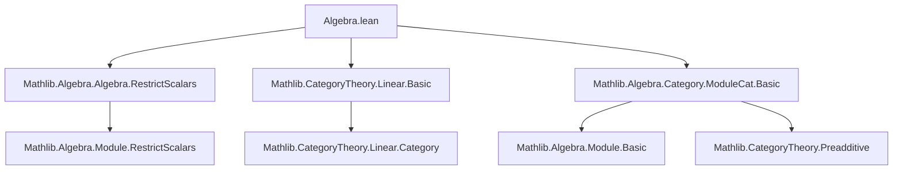

**Technical Brief: `Algebra.lean` (ModuleCat Extensions over a Field Algebra)**

---

### 1. **Key Definitions & Theorems**

| Name | Type / Signature | Purpose |
|------|------------------|---------|
| `moduleOfAlgebraModule` | `ModuleCat.{v} A → Module k M` | Converts a module over a `k`-algebra `A` into a `k`-module via restriction of scalars. |
| `isScalarTower_of_algebra_moduleCat` | `∀ (M : ModuleCat A), IsScalarTower k A M` | Proves that the scalar action of `k → A` and `A` on `M` satisfies the scalar tower law. |
| `linearOverField` | `Linear k (ModuleCat.{v} A)` | Establishes that `ModuleCat A` is a linear category over the field `k`, i.e., hom-sets are `k`-modules and composition is `k`-bilinear. |

---

### 2. **Naming Conventions**

- **Prefixes**:
  - `moduleOfAlgebraModule`: Encodes conversion *from* algebra-module *to* base-field module.
  - `isScalarTower_of_...`: Indicates a property derived *from* a bundled structure.
- **Suffixes**:
  - `_of_...`: Used to denote constructions or proofs *induced by* a bundled object (e.g., `M : ModuleCat A`).
- **Pattern**: `X_of_Y` for derived structures/properties from bundled objects.

---

### 3. **Tactic Stack**

- `inferInstance`: Used repeatedly to synthesize instances (`Module k (M ⟶ N)`, `Linear k (ModuleCat A)`).
- Implicit use of `rw`, `simp`, `exact` via `inferInstance` and attribute `instance` declarations.
- No explicit tactic scripts (e.g., `intro`, `cases`, `induction`) appear — proofs are purely instance-based.

---

### 4. **Proof Logic**

- **Strategy**: Instance-based derivation via existing infrastructure (`RestrictScalars`).
- **Flow**:
  1. Define new structures (`moduleOfAlgebraModule`, `isScalarTower_of_algebra_moduleCat`) by *delegating* to `RestrictScalars`.
  2. Register them as scoped instances via `attribute [scoped instance]`.
  3. Use `inferInstance` to prove intermediate facts (e.g., `Module k (M ⟶ N)`).
  4. Assemble the final `Linear k (ModuleCat A)` instance using `homModule _ _ := inferInstance`.

- **No manual induction or case analysis** — relies on pre-proved lemmas in `RestrictScalars`.

---

### 5. **Imports**

| Import | Role |
|--------|------|
| `Mathlib.Algebra.Algebra.RestrictScalars` | Provides `RestrictScalars.module` and `RestrictScalars.isScalarTower`. Core infrastructure for base-field restriction. |
| `Mathlib.CategoryTheory.Linear.Basic` | Supplies `Linear` typeclass and basic linear category theory. |
| `Mathlib.Algebra.Category.ModuleCat.Basic` | Defines `ModuleCat`, morphisms, and basic properties. |

→ **Scope**: This file sits at the interface between *algebra* (algebras, modules) and *category theory* (linear categories), specifically extending `ModuleCat` over algebras over a field.

---

### 8. **Mermaid Diagrams**

#### **Dependency Graph (File-Level)**



#### **Conceptual Overview of `ModuleCat A` Extension**

```mermaid
flowchart LR
  A[Field k] -->|Algebra| B[Ring A]
  B -->|ModuleCat A| C[Object M : ModuleCat A]
  C -->|moduleOfAlgebraModule| D[Module k M]
  C -->|isScalarTower_of_algebra_moduleCat| E[IsScalarTower k A M]
  D -->|Hom-sets| F[Module k (M ⟶ N)]
  F -->|linearOverField| G[Linear k (ModuleCat A)]
```

#### **Theoretical Context**

```mermaid
graph LR
  subgraph "Algebra"
    K[Field k] -->|Algebra| A[Ring A]
  end

  subgraph "Module Theory"
    A -->|ModuleCat A| M[Module M over A]
    M -->|RestrictScalars| K
  end

  subgraph "Category Theory"
    M -->|Hom k-module| Hom[Hom(M,N) is k-module]
    Hom -->|Linear| Cat[Linear k (ModuleCat A)]
  end

  K -->|Scalar tower| T[IsScalarTower k A M]
```

---

### Notes on Design Trade-offs

- **Scoped instances only**: Avoids global instance search interference.
- **No `ModuleCat' k A`**: The file acknowledges that a parallel bundled category carrying `Module k M` and `IsScalarTower k A M` explicitly would be cleaner but is not implemented here.
- **Potential inconsistency warning**: Bundling via `ModuleCat.of A M` may not preserve original `Module k M`/`IsScalarTower` instances — a known limitation without a refined category.

--- 

Let me know if you'd like a formalization of `ModuleCat' k A` or a comparison with `ModuleCat.of`.
