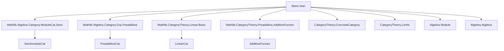

### Technical Brief: `Basic.lean` — Category of $ R $-Modules (`ModuleCat`)

---

#### **1. Key Definitions & Theorems**

| Name | Type / Signature | Purpose |
|------|------------------|---------|
| `ModuleCat.{v} R` | `Type (v + 1)` | Category of $ R $-modules with carrier in universe `v`. Bundled as `carrier : Type v` + `AddCommGroup` + `Module R`. |
| `of R X` | `X : Type v → [AddCommGroup X] → [Module R X] → ModuleCat R` | Embeds a type with module structure into `ModuleCat R`. |
| `Hom M N` | `M N : ModuleCat R → Type v` | Morphism type: bundled linear maps `M →ₗ[R] N`. |
| `Hom.hom f` | `f : Hom M N ↦ f.hom' : M →ₗ[R] N` | Projection to underlying linear map. |
| `ofHom f` | `f : M →ₗ[R] N ↦ Hom.mk f : M ⟶ N` | Inclusion of linear maps into `ModuleCat` morphisms. |
| `homEquiv` | `(M ⟶ N) ≃ (M →ₗ[R] N)` | Bundled equivalence between morphisms and linear maps. |
| `LinearEquiv.toModuleIso` | `X ≃ₗ[R] Y → of R X ≅ of R Y` | Converts linear equivalence to categorical isomorphism. |
| `Iso.toLinearEquiv` | `X ≅ Y → X ≃ₗ[R] Y` | Converts categorical isomorphism to linear equivalence. |
| `linearEquivIsoModuleIso` | `(X ≃ₗ[R] Y) ≅ (of R X ≅ of R Y)` | Categorical equivalence between linear isos and module isos. |
| `endRingEquiv` | `End M ≃+* (M →ₗ[R] M)` | Ring isomorphism between endomorphism ring and linear endomorphisms. |
| `smul` | `R →+* End ((forget₂ M).obj)` | Ring morphism from scalar multiplication. |
| `smulNatTrans` | `R →+* End (forget₂ (ModuleCat R) AddCommGrpCat)` | Natural transformation encoding scalar action across all modules. |
| `homMk` | `(φ : M → N) → (∀ r, φ ≫ N.smul r = M.smul r ≫ φ) → M ⟶ N` | Constructor for module morphisms from additive maps compatible with scalars. |
| `ofHom₂`, `Hom.hom₂` | Bilinear-to-hom and hom-to-bilinear conversions | Encodes currying of bilinear maps as morphisms into internal homs. |

---

#### **2. Naming Conventions**

- **Prefixes**:
  - `hom_`: projection or property of `Hom.hom` (e.g., `hom_add`, `hom_zero`, `hom_ext`).
  - `of_`: construction from type-theoretic data (e.g., `ofHom`, `of R X`, `of_coe`).
  - `smul_`: scalar multiplication–related (e.g., `smul_naturality`, `smulNatTrans`).
  - `isZero_`, `subsingleton_`: zero-object / triviality lemmas.
  - `forget₂_`, `forget_`: forgetful functor actions.

- **Suffixes**:
  - `_equiv`, `_iso`, `_linearEquiv`: equivalence / isomorphism constructions.
  - `_natTrans`, `_natIso`: natural transformations / isomorphisms.
  - `_congr`, `_homCongr`: congruence lemmas for homs under isos.

- **Notation**:
  - `↟ f` (`notation "↟" f:1024`) = `ofHom f`.
  - `M →ₗ[R] N` is the type of linear maps; `M ⟶ N` is the hom-type in `ModuleCat`.

---

#### **3. Tactic Stack**

Frequently used tactics in proofs:
- `rfl`, `simp`, `ext`, `aesop`, `rw`, `dsimp`, `with_reducible`, `cat_disch`, `subsingleton`, `funext`, `cases`, `apply`, `refine`, `apply_fun`, `congr`.

Most proofs are *definitionally trivial* due to `@[ext]`, `@[simps]`, and definitional roundtrips (`of R M = M`, `↑(of R M) = M`). Tactics like `simp only [hom_add, hom_zero]` or `ext x; simp` dominate.

---

#### **4. Proof Logic**

- **Structure**: Most proofs are *extensionality-based*:
  - Use `ext x` to reduce to element-wise equality.
  - Apply `simp` with `hom_*` lemmas to reduce to linear map properties.
- **Equivalence proofs** (`equiv`, `iso`, `linearEquiv`) rely on:
  - `ext` + `rfl` for definitional equality.
  - `hom_ext` to lift equality of underlying maps.
- **Universal properties** (e.g., zero object, products) use:
  - `isZero_of_subsingleton`, `subsingleton_of_isZero`.
- **Naturality** (e.g., `smul_naturality`) uses:
  - `ext x` + `rw [smul_comp, map_smul]`.
- **Reflection of isomorphisms** uses:
  - `isIso_of_reflects_iso` + `LinearEquiv.mk`.

---

#### **5. Imports & Dependencies**

| Import | Purpose |
|--------|---------|
| `Mathlib.Algebra.Category.ModuleCat.Semi` | Semi-modules, related constructions. |
| `Mathlib.Algebra.Category.Grp.Preadditive` | Preadditive categories, additive structure. |
| `Mathlib.CategoryTheory.Linear.Basic` | Linear categories, scalar actions. |
| `Mathlib.CategoryTheory.Preadditive.AdditiveFunctor` | Additive functors, hom-additive structure. |

Also uses:
- `CategoryTheory.ConcreteCategory`
- `CategoryTheory.Limits` (for `IsZero`, `WalkingParallelPair`, etc.)
- `Algebra.Module` (implicitly via `Module R X`)
- `Algebra.Algebra` (for `Algebra.instLinear`)

---

#### **6. Mermaid Diagrams**

##### **Dependency Graph (Top-Level)**



##### **Overview of `ModuleCat` Structure**

```mermaid
graph TD
  ModuleCat[ModuleCat R] --> Hom[Hom M N]
  Hom --> LinearMap[M →ₗ[R] N]
  Hom --> AddCommGroup[(M ⟶ N) is AddCommGroup]
  Hom --> Module[Module S (M ⟶ N) under SMulCommClass]

  ModuleCat --> ConcreteCategory[ConcreteCategory (· →ₗ[R] ·)]
  ModuleCat --> Preadditive[Preadditive]
  ModuleCat --> Linear[Linear S₀ under algebra]

  ModuleCat --> Forget[forget : ModuleCat R → Type v]
  ModuleCat --> Forget₂[forget₂ : ModuleCat R → AddCommGrpCat]

  ModuleCat --> ZeroObject[ZeroObject via PUnit]
  ModuleCat --> Iso[Isomorphisms ↔ LinearEquiv]
  ModuleCat --> End[End M ≃+* M →ₗ[R] M]
```

##### **Equivalence with Linear Equivalences**

```mermaid
graph LR
  LinearEquiv[X ≃ₗ[R] Y] -->|toModuleIso| Iso[of R X ≅ of R Y]
  Iso[of R X ≅ of R Y] -->|toLinearEquiv| LinearEquiv
  LinearEquiv <-->|equivalence| Iso
```

---

#### **7. Summary**

This file formalizes the **category of $ R $-modules** (`ModuleCat R`) as a **concrete preadditive category**, where:
- Objects are $ R $-modules (bundled as types with `AddCommGroup` + `Module`).
- Morphisms are linear maps, with hom-sets inheriting `AddCommGroup` and `Module` structures.
- Categorical notions (iso, mono, epi) coincide with their linear-algebraic counterparts.
- The forgetful functors to `Type v` and `AddCommGrpCat` are faithful and reflect isomorphisms.
- Scalar multiplication and internal homs are encoded via `smul`, `ofHom₂`, and `hom₂`.

The design emphasizes **definitional roundtrips** (`of R ↑M = M`, `↑(of R M) = M`) and **simp-normalization** via `@[simps]`, enabling smooth interaction with tactic-based reasoning.

--- 

Let me know if you'd like a formalized dependency graph (e.g., for `leanproject`), or a summary of how this fits into the broader `ModuleCat` hierarchy (e.g., `ModuleCat R ≌ SemimoduleCat R`, limits, exactness).
