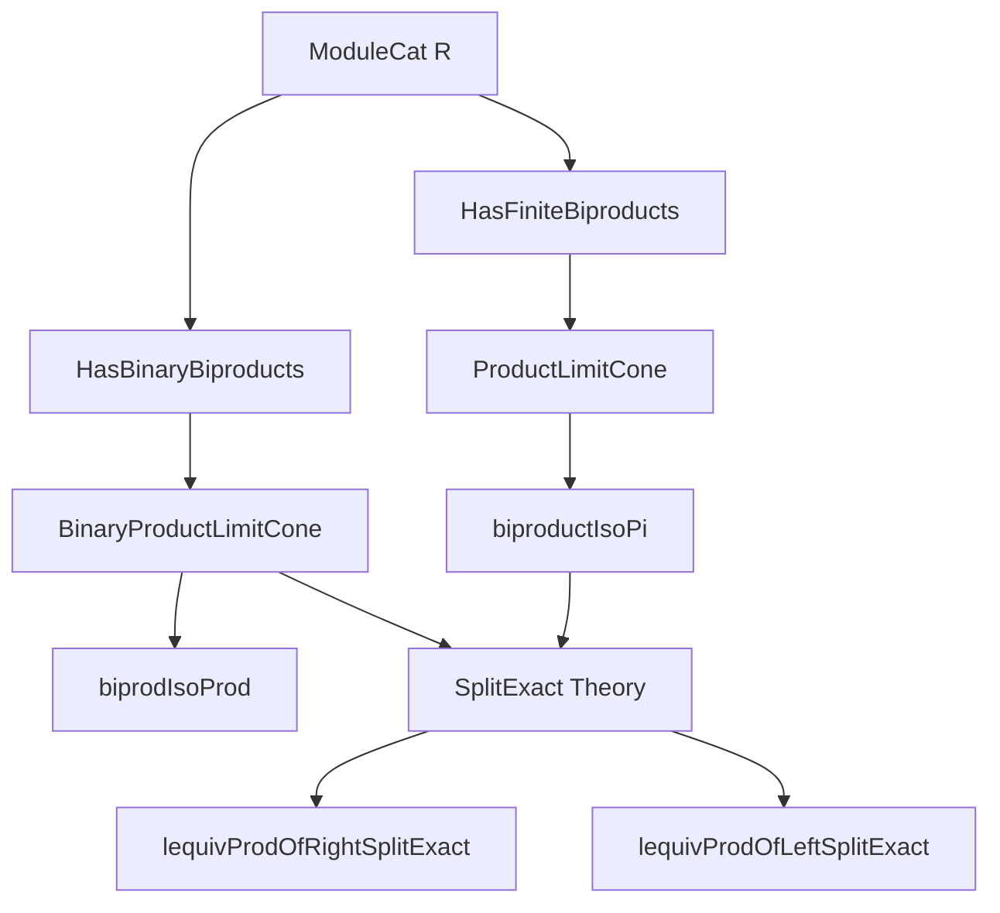
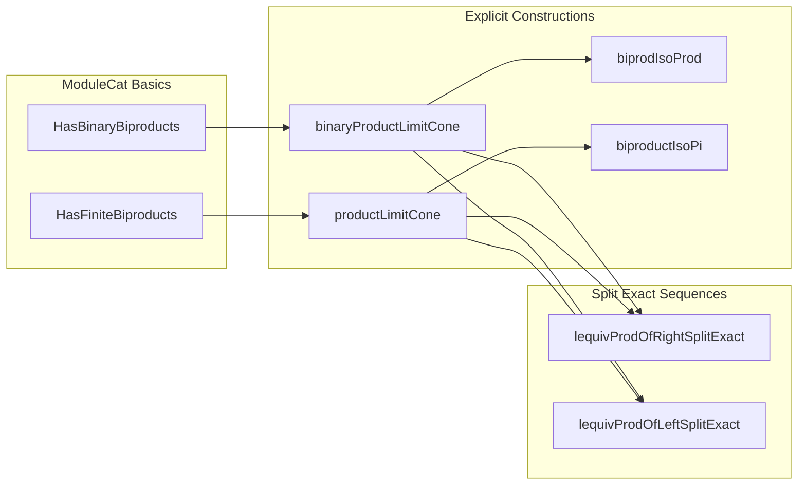
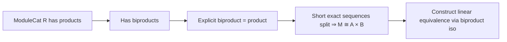

### Technical Brief: Biproducts in `ModuleCat`

---

#### **1. Key Definitions & Theorems**

| Name | Type / Signature | Purpose |
|------|------------------|---------|
| `binaryProductLimitCone` | `ModuleCat R → ModuleCat R → LimitCone (pair M N)` | Constructs an explicit limit cone for binary products in `ModuleCat R`, using the Cartesian product of underlying types. |
| `biprodIsoProd` | `M ⊞ N ≅ ModuleCat.of R (M × N)` | Shows that the biproduct (categorical) is isomorphic to the Cartesian product (concrete). |
| `lift` | `Fan f → s.pt ⟶ ModuleCat.of R (∀ j, f j)` | Universal map from any cone over a family `f : J → ModuleCat R` to the product cone over the dependent function space. |
| `productLimitCone` | `LimitCone (Discrete.functor f)` | Explicit limit cone for arbitrary (small) products in `ModuleCat R`, using `∀ j, f j`. |
| `biproductIsoPi` | `(⨁ f) ≅ ModuleCat.of R (∀ j, f j)` | Shows that the biproduct (i.e., finite direct sum) is isomorphic to the product of modules (dependent function type), for finite index sets. |
| `lequivProdOfRightSplitExact` | `(A × B) ≃ₗ[R] M` | Linear equivalence from a *right-split* short exact sequence `0 → A → M → B → 0`. |
| `lequivProdOfLeftSplitExact` | `(A × B) ≃ₗ[R] M` | Linear equivalence from a *left-split* short exact sequence `0 → A → M → B → 0`. |

---

#### **2. Naming Conventions**

- **Prefixes**:
  - `biprod_`, `biproduct_`: biproduct-related constructions.
  - `binaryProduct_`: binary product (as a cone).
  - `lequiv_`: linear equivalences (`≃ₗ[R]`).
  - `ofHom`: embedding linear maps into `ModuleCat` morphisms.
  - `of`: embedding types/sets into `ModuleCat`.

- **Suffixes**:
  - `_IsoProd`, `_IsoPi`: isomorphisms to concrete product constructions.
  - `_limitCone`: limit cone definitions.
  - `_inv_comp_π`, `_inv_comp_fst`: lemmas about composition with projections/injections.

- **Pattern**:
  - `ofHom (LinearMap.fst R M N)` — morphism in `ModuleCat` induced by a linear map.
  - `of R X` — object in `ModuleCat` from type `X` with module structure.

---

#### **3. Tactic Stack**

- **Core tactics**:
  - `rfl`, `simp`, `simp_rw`, `ext`, `congr`
  - `intro`, `rintro`, `cases`, `exact`
  - `apply`, `refine`, `rw`, `change`
- **Category-theoretic helpers**:
  - `IsLimit.conePointUniqueUpToIso`, `IsLimit.conePointUniqueUpToIso_inv_comp`
  - `hom_ext`, `ModuleCat.mono_iff_injective`, `ModuleCat.epi_iff_surjective`
- **Simplification**:
  - `simp only [Functor.const_obj_obj, map_add, map_smul]`
  - `simp_rw [← w ⟨WalkingPair.left⟩, ← w ⟨WalkingPair.right⟩]`
- **Universe management**:
  - `ULift.moduleEquiv`, `prodCongr`, `∘ₗ`

---

#### **4. Proof Logic**

- **General strategy**:
  - Use *uniqueness of limits* to construct isomorphisms between categorical constructions and concrete ones.
  - Prove uniqueness via `IsLimit.conePointUniqueUpToIso`.
  - Use `simp` and `rfl` for component-wise verification (e.g., projections commute).
- **For biproducts**:
  - `ModuleCat R` is preadditive and has all products ⇒ has biproducts (`HasBinaryBiproducts.of_hasBinaryProducts`).
  - Explicit cones constructed via `ModuleCat.of R (M × N)` and `ModuleCat.of R (∀ j, f j)`.
- **For split exact sequences**:
  - Use `ShortComplex.Splitting.ofExactOfSection` / `ofExactOfRetraction` to get biproduct structure.
  - Compose with `biprodIsoProd` to get linear equivalence to `A × B`.
  - Universe polymorphism handled via `ULift` and `moduleEquiv`.

---

#### **5. Imports**

| Import | Purpose |
|--------|---------|
| `Mathlib.Algebra.Group.Pi.Lemmas` | Basic lemmas about products of groups/modules. |
| `Mathlib.CategoryTheory.Limits.Shapes.BinaryBiproducts` | Theory of biproducts and limit data. |
| `Mathlib.Algebra.Category.ModuleCat.Abelian` | `ModuleCat R` is abelian (used implicitly via preadditivity, limits). |
| `Mathlib.Algebra.Homology.ShortComplex.ModuleCat` | Short exact sequences and splittings in `ModuleCat`. |

---

#### **8. Mermaid Diagrams**

##### **Dependency Graph (Top-Level)**

##### **Overview of File Structure**

##### **Conceptual Flow of Main Results**

--- 

This file formalizes the foundational fact that **finite biproducts in `ModuleCat R` coincide with Cartesian products**, and uses this to derive structural results about split exact sequences.
