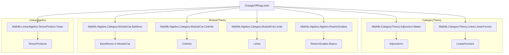
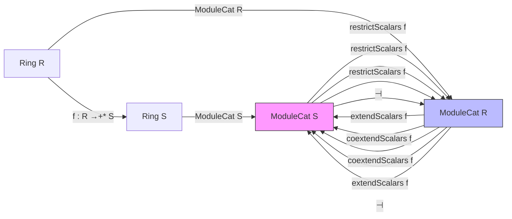

### Technical Brief: `ChangeOfRings.lean`

---

#### **1. Key Definitions & Theorems**

| Name | Type / Signature | Purpose |
|------|------------------|---------|
| `restrictScalars.obj'` | `(f : R →+* S) → ModuleCat.{v} S → ModuleCat R` | Defines the object part of restriction of scalars: an $S$-module $M$ becomes an $R$-module via $r \cdot m := f(r) \cdot m$. |
| `restrictScalars.map'` | `(f : R →+* S) → (M ⟶ N) → (obj' f M ⟶ obj' f N)` | Defines the morphism part: $S$-linear maps are $R$-linear under restriction. |
| `restrictScalars f` | `ModuleCat S ⥤ ModuleCat R` | The full restriction-of-scalars functor. |
| `extendScalars f` | `ModuleCat R ⥤ ModuleCat S` (for `CommRing`) | Extension of scalars: $M \mapsto S \otimes_R M$, with $S$-action $s \cdot (s' \otimes m) = (s s') \otimes m$. |
| `coextendScalars f` | `ModuleCat R ⥤ ModuleCat S` | Coextension of scalars: $M \mapsto \mathrm{Hom}_R(S, M)$, with $S$-action $(s \cdot g)(s') = g(s' s)$. |
| `restrictCoextendScalarsAdj f` | `restrictScalars f ⊣ coextendScalars f` | Adjunction: restriction is left adjoint to coextension. |
| `extendRestrictScalarsAdj f` | `extendScalars f ⊣ restrictScalars f` | Adjunction: extension is left adjoint to restriction (for commutative rings). |
| `homEquiv` | `((extendScalars f).obj X ⟶ Y) ≃ (X ⟶ (restrictScalars f).obj Y)` | Explicit hom-set bijection for extension-restriction adjunction. |
| `HomEquiv.fromRestriction` | `(restrictScalars f).obj Y ⟶ X → Y ⟶ (coextendScalars f).obj X` | Forward direction of restriction-coextension hom equivalence. |
| `HomEquiv.toRestriction` | `Y ⟶ (coextendScalars f).obj X → (restrictScalars f).obj Y ⟶ X` | Inverse direction of restriction-coextension hom equivalence. |
| `restrictScalarsCongr e` | `f = g ⇒ restrictScalars f ≅ restrictScalars g` | Natural isomorphism when ring maps are equal. |
| `restrictScalarsId'` | `restrictScalars (RingHom.id R) ≅ 𝟭 _` | Identity ring map induces identity functor up to iso. |
| `restrictScalarsComp'` | `gf = g ∘ f ⇒ restrictScalars gf ≅ restrictScalars g ⋙ restrictScalars f` | Compatibility with composition of ring maps. |
| `semilinearMapAddEquiv` | `(M →ₛₗ[f] N) ≃+ (M ⟶ restrictScalars f.obj N)` | Identifies semilinear maps with morphisms into restricted scalars. |

---

#### **2. Naming Conventions**

- **Functor names**: `restrictScalars`, `extendScalars`, `coextendScalars` — all take a ring homomorphism `f : R →+* S`.
- **Object/morphism parts**: `obj'`, `map'` — primed variants used internally before wrapping into functors.
- **Hom-equivalence helpers**: `HomEquiv.fromRestriction`, `HomEquiv.toRestriction`, `HomEquiv.toRestrictScalars`, `HomEquiv.fromExtendScalars`.
- **Natural transformations**: `unit'`, `counit'` — used in adjunction constructions.
- **Isomorphisms**: `restrictScalarsCongr`, `restrictScalarsId'App`, `restrictScalarsComp'App`, `restrictScalarsEquivalenceOfRingEquiv`.
- **Notation**: `s ⊗ₜ[R, f] m` for pure tensors in base change (scoped under `ChangeOfRings`).
- **Instances**: `sMulCommClass_mk`, `mulAction`, `distribMulAction`, `isModule` — for module structures on hom spaces.

---

#### **3. Tactic Stack**

Frequently used tactics in proofs:
- `rfl`, `simp`, `ext`, `congr`, `grind`, `induction ... using TensorProduct.induction_on`
- `dsimp`, `erw`, `change`, `rw [← ...]`, `erw [smul_eq_mul, mul_smul]`
- `apply TensorProduct.ext'`, `LinearMap.ext`, `ModuleCat.hom_ext_iff.mp`
- `subst e`, `congr_arg`, `congr`, `ring`, `aesop` (for simple goals)
- `intro`, `intro h`, `intro x`, `intro s`, `intro y`, etc., for variable introduction
- `haveI : ...`, `letI : ...` — for instance resolution

---

#### **4. Proof Logic**

- **Structural pattern**:
  - Define object/morphism parts (`obj'`, `map'`) explicitly.
  - Prove functor laws (`map_id`, `map_comp`) via extensionality (`ext`, `TensorProduct.induction_on`).
  - Construct natural transformations (`unit'`, `counit'`) using explicit formulas.
  - Prove triangle identities or use `Adjunction.mk'` with hom-equivalence.
- **Hom-equivalence proofs**:
  - Define forward/backward maps explicitly.
  - Use `hom_ext` (e.g., `extendScalars.hom_ext`) to reduce to checking on pure tensors.
  - Use `LinearMap.ext` to prove equality of linear maps.
- **Isomorphism constructions**:
  - Use `LinearEquiv.toModuleIso` or `AddEquiv.toLinearEquiv`.
  - Prove naturality via `naturality` lemmas or `simp` + `rfl`.
- **Unbundled vs bundled reasoning**:
  - Many definitions start with unbundled types (`M : Type v`, `[Module R M]`) and later repackage as `ModuleCat`.
  - Use `of _`, `ofHom` to lift unbundled constructions to `ModuleCat`.

---

#### **5. Imports**

Core dependencies defining the scope:

```lean
Mathlib.Algebra.Category.ModuleCat.EpiMono
Mathlib.Algebra.Category.ModuleCat.Colimits
Mathlib.Algebra.Category.ModuleCat.Limits
Mathlib.Algebra.Algebra.RestrictScalars
Mathlib.CategoryTheory.Adjunction.Mates
Mathlib.CategoryTheory.Linear.LinearFunctor
Mathlib.LinearAlgebra.TensorProduct.Tower
```

These indicate:
- Work in the category of modules (`ModuleCat`).
- Use of limits/colimits, epimorphisms/monomorphisms.
- Restriction of scalars as a pre-existing concept (here generalized).
- Adjoint functor machinery (`mates`, `adjunction`).
- Linear functors and tensor products over rings.

---

#### **6. Mermaid Diagrams**

##### **Dependency Graph (Top-Level)**



##### **Overview of Theory Flow**



- **Left adjoints** (top arrows): `extendScalars`, `restrictScalars`
- **Right adjoints** (bottom arrows): `restrictScalars`, `coextendScalars`
- **Adjunctions**:
  - `extendScalars f ⊣ restrictScalars f` (commutative case)
  - `restrictScalars f ⊣ coextendScalars f` (general case)

---

#### **7. Notation Summary**

- `s ⊗ₜ[R, f] m`: Pure tensor in $S \otimes_R M$, where $R \xrightarrow{f} S$.
- `r • m`: Scalar action in restricted scalars: $r \cdot m = f(r) \cdot m$.
- `s • g`: Action on coextension: $(s \cdot g)(s') = g(s' s)$.
- `g y (1 : S)`: Evaluation at 1 in restriction from coextension.

---

#### **8. Open Issues / TODOs (from comments)**

- `obj'`/`map'` design may need refactoring (see PR #19511).
- `restrictScalarsCongr` may cause diamonds if `f : S →+* S`.
- `restrictScalarsId'App` and similar iso lemmas require careful universe handling.
- Some `@[simps]` applications fail due to type inference; manual `@[simps!]` used instead.

--- 

This file formalizes the foundational change-of-rings machinery in category-theoretic terms, with emphasis on adjunctions and explicit constructions of hom-equivalences.
