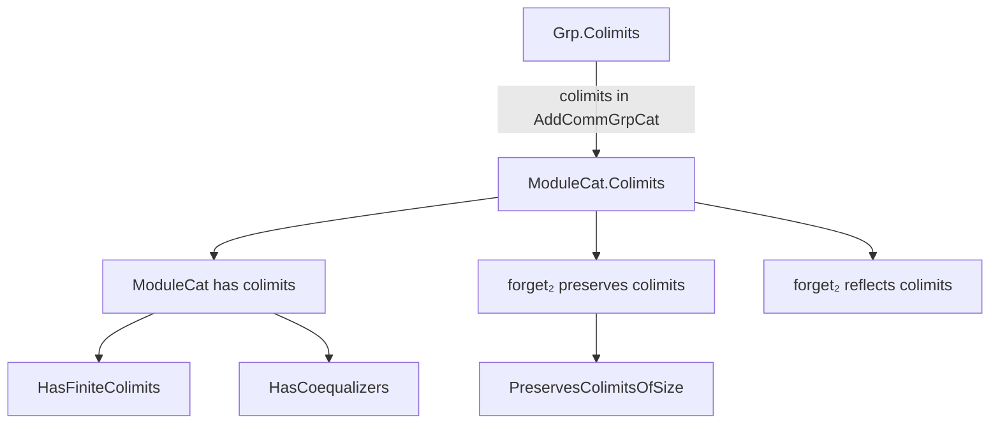
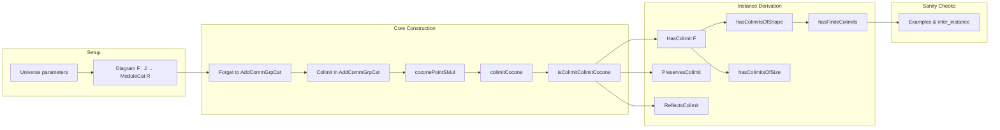

### Technical Brief: `Colimits.lean` — Colimits in `ModuleCat R`

---

#### **1. Key Definitions & Theorems**

| Name | Type / Signature | Purpose |
|------|------------------|---------|
| `coconePointSMul` | `R →+* End (colimit (F ⋙ forget₂ _ AddCommGrpCat))` | Constructs the scalar multiplication map on the colimit object in `AddCommGrpCat`, induced by the $R$-module structure of each $F(j)$. |
| `colimitCocone` | `Cocone F` | Builds a cocone over diagram $F : J → \mathbf{ModuleCat}\, R$ using the colimit in `AddCommGrpCat`, equipping its apex with an $R$-module structure via `coconePointSMul`. |
| `isColimitColimitCocone` | `IsColimit (colimitCocone F)` | Proves that the constructed cocone is universal — i.e., it is a colimit in `ModuleCat R`. |
| `instance HasColimit` | `HasColimit F` | Instantiates existence of colimits for any diagram $F$ in `ModuleCat R`, assuming existence in `AddCommGrpCat`. |
| `instance PreservesColimit` | `PreservesColimit F (forget₂ _ AddCommGrpCat)` | Shows the forgetful functor preserves colimits of shape $F$. |
| `instance ReflectsColimit` | `ReflectsColimit F (forget₂ _ AddCommGrpCat)` | Shows the forgetful functor reflects colimits of shape $F$. |
| `instance hasColimitsOfShape` | `HasColimitsOfShape J (ModuleCat R)` | Extends colimit existence to all diagrams of shape $J$, assuming `AddCommGrpCat` has them. |
| `instance hasColimitsOfSize` | `HasColimitsOfSize.{v, u} (ModuleCat R)` | Extends to colimits indexed by small categories (size control). |
| `instance hasFiniteColimits` | `HasFiniteColimits (ModuleCat R)` | Concludes finite colimits exist in `ModuleCat R`. |
| `instance HasCoequalizers` | `HasCoequalizers (ModuleCat R)` | Explicitly provides coequalizers (used for sanity checks and later use). |

---

#### **2. Naming Conventions**

- **Prefixes**:
  - `coconePointSMul`: `coconePoint_` + `SMul` — indicates construction of scalar multiplication on a cocone point.
  - `colimitCocone`: `colimit_` + `Cocone` — constructs a cocone from a colimit.
  - `isColimitColimitCocone`: `isColimit_` + `ColimitCocone` — proves the constructed cocone is a colimit.
  - `forget₂PreservesColimitsOfShape`: `forget₂_` + `PreservesColimitsOfShape` — forgetful functor preserves colimits of a given shape.

- **Suffixes**:
  - `_SMul`: scalar multiplication related.
  - `_Cocone`: cocone-related constructions.
  - `isColimit_`: universal property proofs.
  - `PreservesColimitsOfShape` / `ReflectsColimitsOfShape`: functorial behavior.

- **General pattern**: `verb_object_qualifier`, e.g., `mkOfSMul`, `homMk`, `colimMap`.

---

#### **3. Tactic Stack**

Frequent tactics used in proofs:

| Tactic | Usage |
|--------|-------|
| `rw` / `erw` | Rewriting using definitional equalities; `erw` used for definitional issues post-#2644. |
| `simp` / `simp only` | Simplifying goals using `@[simps]` lemmas and definitional structure. |
| `dsimp` | Definitional simplification, especially before `rw`. |
| `apply` | Applying lemmas or constructors (e.g., `homMk`, `colimit.hom_ext`). |
| `colimit.hom_ext` | Extensionality for colimit morphisms — key for uniqueness proofs. |
| `funext` (implicit via `hom_ext`) | Proving morphism equality by extensionality. |
| `exact` / `rfl` | Finalizing trivial equalities. |
| `intros` (implicit in `intro`) | Introducing variables/hypotheses. |
| `aesop` (not present here) | Not used — proofs are highly structured and rely on categorical lemmas. |

---

#### **4. Proof Logic**

The logical flow follows a standard *transport-of-structure* pattern:

1. **Assumption**: Assume `AddCommGrpCat` has colimits of shape $J$.
2. **Construct underlying colimit**: Take `colimit (F ⋙ forget₂ _ AddCommGrpCat)` in `AddCommGrpCat`.
3. **Lift scalar multiplication**: Use `coconePointSMul` to define $R$-action on the colimit apex.
4. **Build cocone**: Use `colimitCocone` to lift the colimit cocone in `AddCommGrpCat` to one in `ModuleCat R`.
5. **Verify universality**: Prove `isColimitColimitCocone`:
   - **Existence (`desc`)**: Define the mediating morphism using `colimit.desc`, then lift via `homMk`.
   - **Factorization (`fac`)**: Use injectivity of `forget₂` and `colimit.ι_desc`.
   - **Uniqueness (`uniq`)**: Again use injectivity and `colimit.ι_desc_assoc`.
6. **Derive instances**: From the above, infer `HasColimit`, `PreservesColimit`, `ReflectsColimit`, and generalize to all shapes/sizes.

This is a *categorical reflection* argument: colimits in `ModuleCat R` are inherited from `AddCommGrpCat` because the forgetful functor is monadic (or at least creates limits/colimits).

---

#### **5. Imports**

| Import | Purpose |
|--------|---------|
| `Mathlib.Algebra.Category.ModuleCat.Basic` | Core definitions of `ModuleCat`, `homMk`, `mkOfSMul`, etc. |
| `Mathlib.CategoryTheory.ConcreteCategory.Elementwise` | Tools for working with concrete categories elementwise (e.g., `homMk`, `forget₂`). |
| `Mathlib.Algebra.Category.Grp.Colimits` | Colimits in `AddCommGrpCat`, including `HasColimit`, `colimit.ι_desc`, etc. |

---

#### **6. Mermaid Diagrams**

##### **Dependency Graph (High-Level)**

##### **Overview of File Structure**

---

#### **7. Theory Context**

- **Category-theoretic setting**: `ModuleCat R` is a *reflective subcategory* of `AddCommGrpCat`, and the forgetful functor creates colimits.
- **Model-theoretic gap**: The current proof is *non-constructive* — it uses the colimit in `AddCommGrpCat` and lifts structure. As noted in the TODO, a *concrete* model (e.g., quotient of finitely supported functions) is desirable for computation.
- **Relation to abelianess**: Finite colimits already follow from `Abelian (Module R)`, but this file extends to *all* colimits (including infinite ones), leveraging the structure of `AddCommGrpCat`.

---

#### **8. Summary**

This file demonstrates that **colimits in `ModuleCat R` exist and are preserved/reflecting by the forgetful functor to `AddCommGrpCat`**, by lifting the colimit construction along the forgetful functor and verifying the $R$-module structure is compatible. The proofs are highly structured, relying on categorical lemmas (`colimit.ι_desc`, `hom_ext`) and definitional simplifications (`mkOfSMul_smul`). The approach is general and reusable for other algebraic categories where the forgetful functor creates colimits.
