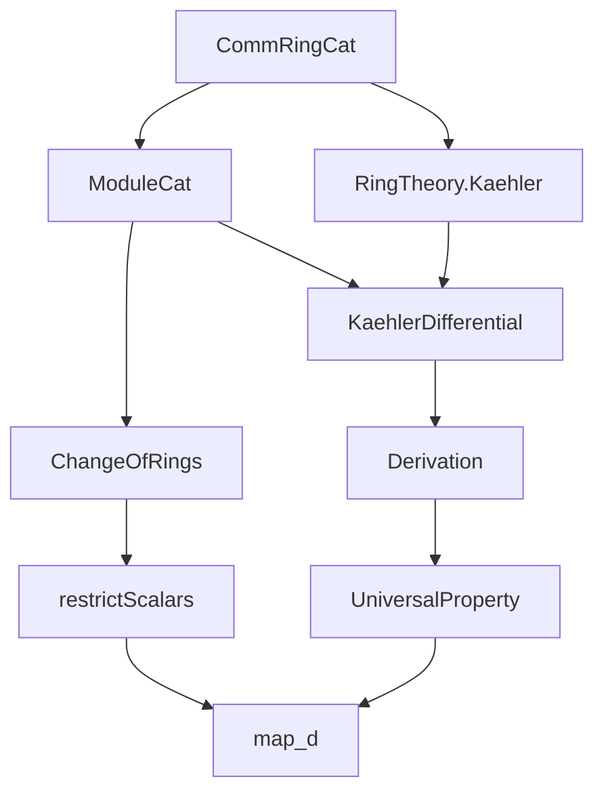
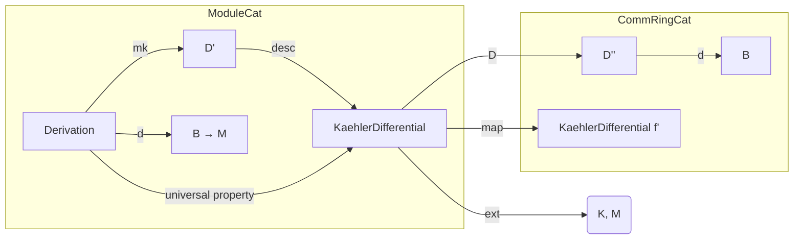
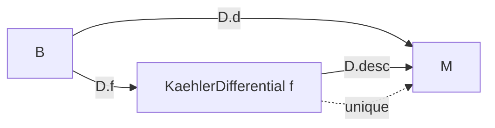

Here is the structured technical brief extracted from `Basic.lean`:

---

### **1. Key Definitions & Theorems**

| Name | Type / Signature | Purpose |
|------|------------------|---------|
| `Derivation` | `M.Derivation f : Type u` | Type of derivations $ B \to M $ relative to $ f: A \to B $, i.e., $ A $-linear Leibniz derivations. |
| `Derivation.mk` | `(d : B → M) → ... → M.Derivation f` | Constructor for derivations, enforcing additivity, Leibniz rule, and vanishing on $ f(A) $. |
| `Derivation.d` | `d : B → M` | Underlying function of a derivation. |
| `Derivation.d_add` | `d(b + b') = d b + d b'` | Additivity of derivation. |
| `Derivation.d_mul` | `d(b * b') = b • d b' + b' • d b` | Leibniz rule. |
| `Derivation.d_map` | `d(f a) = 0` | Derivation vanishes on image of $ f $. |
| `KaehlerDifferential` | `CommRingCat.KaehlerDifferential f : ModuleCat B` | Module of Kähler differentials of $ f $, representing derivations universally. |
| `KaehlerDifferential.D` | `(KaehlerDifferential f).Derivation f` | Universal derivation $ d : B \to \Omega_{B/A} $. |
| `KaehlerDifferential.d` | `d : B → Ω_{B/A}` | Differential map (abbreviation for `D.d`). |
| `KaehlerDifferential.ext` | `(∀ b, α(d b) = β(d b)) → α = β` | Extensionality: morphisms out of $ \Omega_{B/A} $ are determined by their action on differentials. |
| `KaehlerDifferential.map` | `fac : g ≫ f' = f ≫ g' ⇒ Ω_{B/A} → g'^* Ω_{B'/A'}` | Functoriality of Kähler differentials along a commutative square. |
| `KaehlerDifferential.map_d` | `map fac (d b) = d (g' b)` | Compatibility of `map` with universal derivation. |
| `Derivation.desc` | `M.Derivation f ⇒ Ω_{B/A} ⟶ M` | Mediating morphism from Kähler differentials induced by any derivation. |
| `Derivation.desc_d` | `desc(D)(d b) = D.d b` | Universal property: desc commutes with universal derivation. |

---

### **2. Naming Conventions**

- **Prefixes**:
  - `is_`, `of_`, `comp_`, `to_`, `map_`, `lift_`, `desc_`, `span_`, `ker_`, `top_`, `sub_`, `ext_`, `mul_`, `add_`, `map_algebraMap_`, `leibniz_`.
- **Suffixes**:
  - `_d`, `_map`, `_add`, `_mul`, `_ext`, `_desc`, `_d`, `_of`, `_hom`, `_comp`, `_toAlgebra`, `_compHom`.
- **Module/Category-specific**:
  - `ModuleCat.`, `CommRingCat.`, `of`, `ofHom`, `restrictScalars`, `obj`, `hom`.
- **Derivation-specific**:
  - `Derivation.mk`, `Derivation.d`, `D` (for universal derivation), `desc`.

---

### **3. Tactic Stack**

Frequently used tactics:
- `simp` — heavily used for simplifying definitions and goals.
- `rw` — for rewriting using lemmas or definitions.
- `dsimp` — for definitional simplification (e.g., in `mk` proofs).
- `ext` — extensionality for morphisms (especially in `KaehlerDifferential.ext`).
- `algebraize` — custom tactic (likely from Mathlib) to normalize algebra structures.
- `have`, `exact`, `rfl`, `apply`, `intro`, `cases`, `funext`, `sub_eq_zero`, `top_le_iff`, `LinearMap.ker_eq_top`, `SetLike.mem_coe`, `Submodule.span_le`.

---

### **4. Proof Logic**

- **Universal property proofs** follow standard categorical pattern:
  1. Construct candidate morphism using `ofHom` or `of`.
  2. Prove it's a module homomorphism (`map_add'`, `map_smul'`).
  3. Use `ext` to show uniqueness: reduce to checking equality on generators (`d b`).
- **Functoriality**:
  - Use `IsScalarTower` to manage scalar actions in base change.
  - Construct map via `ModuleCat.ofHom` with explicit function.
  - Prove compatibility with `d` using `map_d`.
- **Derivation → morphism**:
  - Use `liftKaehlerDifferential` (from `KaehlerDifferential` theory) to get linear map.
  - Wrap in `ofHom` to get `ModuleCat` morphism.
- **Induction / case analysis** is minimal; most proofs are algebraic simplifications.

---

### **5. Imports**

| Import | Purpose |
|--------|---------|
| `Mathlib.Algebra.Category.ModuleCat.ChangeOfRings` | Base change, restriction of scalars, scalar tower lemmas. |
| `Mathlib.Algebra.Category.Ring.Basic` | Category `CommRingCat`, morphisms, algebra structures. |
| `Mathlib.RingTheory.Kaehler.Basic` | Classical Kähler differentials: `KaehlerDifferential`, `D`, `map`, `liftKaehlerDifferential`. |

---

### **6. Mermaid Diagrams**

#### **Dependency Graph (High-Level)**

#### **Overview of File Structure**

#### **Universal Property Diagram**

---

Let me know if you'd like the Lean code annotated with category-theoretic intuition or formalized universal properties in diagrammatic style.
