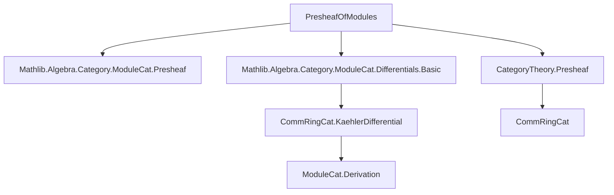
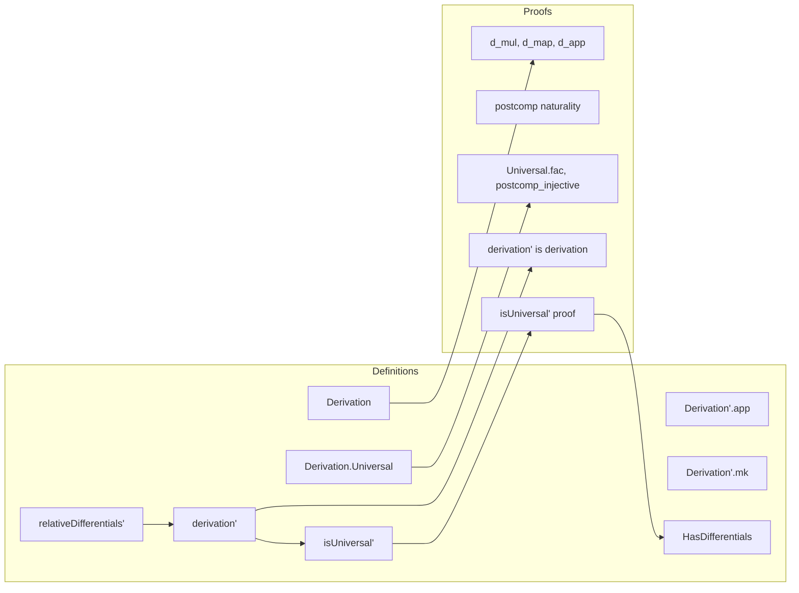

Here is the structured technical brief extracted from `Presheaf.lean`:

---

### **1. KEY DEFINITIONS & THEOREMS**

| Name | Type / Structure | Purpose |
|------|------------------|---------|
| `Derivation` | `structure` | A `φ`-derivation from a presheaf of rings `R` to a presheaf of modules `M`, i.e., a natural additive map `d : R ⇒ M` satisfying Leibniz rule, compatibility with restriction maps, and vanishing on image of `φ`. |
| `Derivation.d` | `{X : Dᵒᵖ} → R.obj X →+ M.obj X` | Underlying additive map of a derivation. |
| `Derivation.d_mul` | `d (a * b) = a • d b + b • d a` | Leibniz rule. |
| `Derivation.d_map` | `d (R.map f x) = M.map f (d x)` | Naturality (compatibility with restriction). |
| `Derivation.d_app` | `d (φ.app X a) = 0` | Vanishing on the structure morphism `φ`. |
| `Derivation.postcomp` | `f : M ⟶ N ⇒ N.Derivation φ` | Post-composition of derivation with module morphism. |
| `Derivation.Universal` | `structure` | Universal property: any derivation `d' : M'.Derivation φ` factors uniquely through `d` via a unique module map `M → M'`. |
| `HasDifferentials` | `class Prop` | Asserts existence of a universal derivation for `φ`. |
| `Derivation'` | `abbrev` | Special case of `Derivation` when `F = 𝟭 D`, i.e., for `φ' : S' ⟶ R`. |
| `Derivation'.app` | `d : M.Derivation' φ' ↦ (X : Dᵒᵖ) ↦ (M.obj X).Derivation (φ'.app X)` | Currying: a global derivation yields a family of derivations at each object. |
| `Derivation'.mk` | `(d : ∀ X, (M.obj X).Derivation (φ'.app X)) → M.Derivation' φ'` | Constructor for global derivations from compatible local ones. |
| `DifferentialsConstruction.relativeDifferentials'` | `PresheafOfModules (R ⋙ forget₂ _ _)` | The *presheaf of relative Kähler differentials*, defined objectwise as `KaehlerDifferential (φ'.app X)`. |
| `DifferentialsConstruction.derivation'` | `(relativeDifferentials' φ').Derivation' φ'` | The *universal derivation*, sending `b ↦ d b` (Kähler differential). |
| `DifferentialsConstruction.isUniversal'` | `(derivation' φ').Universal` | Proof that `derivation'` satisfies the universal property. |
| `HasDifferentials.instance` | `instance : HasDifferentials (F := 𝟭 D) φ'` | Consequence of `isUniversal'`: universal derivation exists for identity functor case. |

---

### **2. NAMING CONVENTIONS**

- **Prefixes**:
  - `d_`: for components of derivations (`d_mul`, `d_map`, `d_app`, `d_one`).
  - `postcomp_`: post-composition with module morphism.
  - `app`: evaluation at an object (currying).
  - `mk`: constructors (e.g., `Derivation'.mk`, `Universal.mk`).
  - `fac`: factorization condition in universal property.
  - `desc`: the unique mediating morphism in universal property.

- **Suffixes**:
  - `'` (prime): indicates restriction to the case `F = 𝟭 D`, i.e., `Derivation'`, `relativeDifferentials'`, `derivation'`, `isUniversal'`.
  - `_obj`, `_map`: for presheaf components (e.g., `relativeDifferentials'_obj`, `relativeDifferentials'_map_d`).

- **Other**:
  - `congr_`: congruence lemmas (e.g., `congr_d`).
  - `ext`: extensionality lemmas (e.g., `KaehlerDifferential.ext` used in proofs).

---

### **3. TACTIC STACK**

- **Core tactics**:
  - `simp`, `dsimp`, `rw`, `erw`, `ext`, `apply`, `cases`, `intro`, `exact`, `refine`, `assumption`.
- **Category-theoretic helpers**:
  - `cat_disch`: discharges category-theoretic goals (custom tactic in Mathlib).
  - `naturality_apply`: used for naturality of module morphisms.
- **Module-specific**:
  - `ModuleCat.Derivation.desc_d`: property of Kähler differentials’ universal derivation.
  - `CommRingCat.KaehlerDifferential.map_d`, `KaehlerDifferential.D`, `KaehlerDifferential.ext`.

---

### **4. PROOF LOGIC**

- **Structure of proofs**:
  1. **Definition**: Define objects/structures (e.g., `Derivation`, `relativeDifferentials'`) using `@[simps]` or `noncomputable def`.
  2. **Verification**: Prove required properties (e.g., `d_mul`, `d_map`, `d_app`) using `by cat_disch` or `simp`.
  3. **Universal property**:
     - Construct mediating morphism `desc` objectwise via Kähler differentials’ universal property.
     - Prove naturality using `ext` + `simp` + `KaehlerDifferential.map_d`.
     - Prove factorization (`fac`) using `desc_d`.
     - Prove uniqueness (`postcomp_injective`) using `ext` + `congr_d`.
  4. **Instantiation**: Use `instance` to conclude `HasDifferentials` for identity case.

- **Inductive/structural reasoning**:
  - Proofs are largely *pointwise* (object-by-object in `Dᵒᵖ`) and rely on the universal property of Kähler differentials in `CommRingCat`.
  - No induction on syntax or natural numbers; reasoning is categorical and algebraic.

---

### **5. IMPORTS & DEPENDENCIES**

- **Core imports**:
  ```lean
  Mathlib.Algebra.Category.ModuleCat.Presheaf
  Mathlib.Algebra.Category.ModuleCat.Differentials.Basic
  ```
- **Key external dependencies**:
  - `CommRingCat.KaehlerDifferential`: Kähler differentials in category of commutative rings.
  - `PresheafOfModules`: category of presheaves of modules over a presheaf of rings.
  - `ModuleCat.Derivation`: derivations in module categories (used via `app`/`desc`).

---

### **6. MERMAID DIAGRAMS**

#### **Dependency Graph (Module-Level)**



#### **Overview of File Structure**



---

### **7. GEOMETRIC INTUITION (from docstring)**

- **Context**: Let $f : X \to S$ be a morphism of ringed spaces.
- **Application**: Take $F = f^{-1}$ (pullback on open subsets), $S = \mathcal{O}_S$, $R = f_* \mathcal{O}_X$, and $\varphi : \mathcal{O}_S \to f_* \mathcal{O}_X$.
- **Goal**: Construct the *relative differentials* $\Omega^1_{X/S}$ as a presheaf on $X$, universal for derivations $\mathcal{O}_X \to \mathcal{F}$ vanishing on pullback of $\mathcal{O}_S$.

---

### **8. TODO (from docstring)**

- General case: reduce to identity-functor case via pullback of presheaves along $F$.
- Show equivalence of vanishing conditions `d_app` for $\varphi : S \to F^\mathrm{op} \mathbin{\circ} R$ and $\varphi' : F^* S \to R$.

--- 

Let me know if you'd like a formalized dependency graph (e.g., for Lean's `leanproject`) or a summary of the Kähler differential lemmas used.
