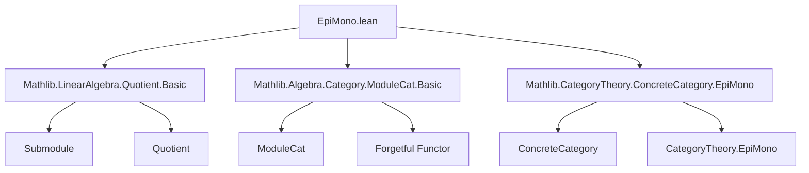
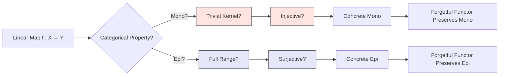

**Technical Brief: `EpiMono.lean` — Monomorphisms and Epimorphisms in `ModuleCat`**

---

### 1. **Key Definitions & Theorems**

| Name | Type | Purpose |
|------|------|---------|
| `ker_eq_bot_of_mono` | `[Mono f] → LinearMap.ker f.hom = ⊥` | Shows that a monomorphism in `ModuleCat` has trivial kernel. |
| `range_eq_top_of_epi` | `[Epi f] → LinearMap.range f.hom = ⊤` | Shows that an epimorphism in `ModuleCat` has full range (i.e., surjective underlying map). |
| `mono_iff_ker_eq_bot` | `Mono f ↔ LinearMap.ker f.hom = ⊥` | Equivalence between categorical monomorphism and trivial kernel. |
| `mono_iff_injective` | `Mono f ↔ Function.Injective f` | Equivalence between categorical monomorphism and injectivity of underlying function. |
| `epi_iff_range_eq_top` | `Epi f ↔ LinearMap.range f.hom = ⊤` | Equivalence between categorical epimorphism and full range. |
| `epi_iff_surjective` | `Epi f ↔ Function.Surjective f` | Equivalence between categorical epimorphism and surjectivity of underlying function. |
| `uniqueOfEpiZero` | `[Epi (0 : X ⟶ of R M)] → Unique M` | If the zero map is an epimorphism, the codomain is trivial (unique element). |
| `mono_as_hom'_subtype` | `Mono (ModuleCat.ofHom U.subtype)` | Submodule inclusion (subtype map) is a monomorphism. |
| `epi_as_hom''_mkQ` | `Epi (ModuleCat.ofHom U.mkQ)` | Quotient projection `mkQ` is an epimorphism. |
| `forget_preservesEpimorphisms` | `(forget …).PreservesEpimorphisms` | The forgetful functor preserves epimorphisms. |
| `forget_preservesMonomorphisms` | `(forget …).PreservesMonomorphisms` | The forgetful functor preserves monomorphisms. |

---

### 2. **Naming Conventions**

- **Prefixes**:
  - `mono_` / `epi_`: Relating to categorical monos/epis.
  - `ker_eq_bot_`, `range_eq_top_`: Describing kernel/range properties.
  - `as_hom'_subtype`, `as_hom''_mkQ`: Constructing categorical mono/epi from module-theoretic constructions.
- **Suffixes**:
  - `_of_mono`, `_of_epi`: From categorical property to algebraic property.
  - `_iff_*`: Biconditional characterizations.
  - `_preserves*`: Functors preserving certain morphism classes.

---

### 3. **Tactic Stack**

Frequently used tactics in proofs:
- `rw` — rewriting using equivalences (e.g., `mono_iff_injective`, `epi_iff_surjective`)
- `convert` — to align goals modulo definitional equality (e.g., `convert LinearMap.ker_eq_bot.1 hf`)
- `exact` / `assumption` — implicit in `mono_of_injective`, `epi_of_surjective`
- `ModuleCat.hom_ext_iff.mp` / `.mpr` — extensionality for module homs
- `ConcreteCategory.*` lemmas — e.g., `mono_of_injective`, `epi_of_surjective`
- `aesop` not used here; proofs are mostly algebraic and rely on `rw`, `convert`, and `simp`-like reasoning.

---

### 4. **Proof Logic**

- **Directional equivalence proofs** (`↔`) are split into two implications:
  - **(→)**: Use categorical property (`[Mono f]` or `[Epi f]`) + cancellation lemmas (`cancel_mono`, `cancel_epi`) to derive algebraic properties (trivial kernel / full range).
  - **(←)**: Use algebraic property + known lemmas (`mono_of_injective`, `epi_of_surjective`) + `ConcreteCategory` facts to lift to categorical property.
- **Subtype / quotient maps**: Proven mono/epi via `mono_iff_ker_eq_bot` / `epi_iff_range_eq_top`, using `Submodule.ker_subtype` and `Submodule.range_mkQ`.
- **Forgetful functor**: Uses `rw` to translate between categorical and concrete injectivity/surjectivity, leveraging `forget_map_eq_coe`.

---

### 5. **Imports**

| Import | Purpose |
|--------|---------|
| `Mathlib.LinearAlgebra.Quotient.Basic` | Submodule operations, quotients, `subtype`, `mkQ`, kernel/range lemmas. |
| `Mathlib.Algebra.Category.ModuleCat.Basic` | Definition of `ModuleCat`, homs, forgetful functor, `ofHom`, `of`. |
| `Mathlib.CategoryTheory.ConcreteCategory.EpiMono` | General lemmas: `mono_of_injective`, `epi_of_surjective`, `forget_preserves*`. |

---

### 6. **Mermaid Diagrams**

#### **Dependency Graph (Module-Level)**

#### **Overview of Theory Flow**

---

### 7. **Summary**

This file establishes the foundational bridge between categorical notions (mono/epi) and classical linear algebra (injectivity/surjectivity) in the category of modules. It leverages:
- The concrete structure of `ModuleCat` (via `forget` and `hom_ext`).
- Standard module-theoretic facts (kernel/range characterizations).
- General categorical principles from `ConcreteCategory`.

It also confirms that the forgetful functor `ModuleCat ⥤ Type` reflects and preserves monos/epis, making `ModuleCat` a *concrete* category where categorical mono/epi coincide with set-theoretic injective/surjective maps.

--- 

Let me know if you'd like a formalized summary in Lean or a proof sketch for a specific theorem.
