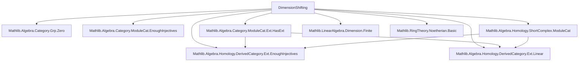

### Technical Brief: `DimensionShifting.lean`

---

#### **1. Key Definitions & Theorems**

| Name | Type / Signature | Purpose |
|------|------------------|---------|
| `ModuleCat.projectiveShortComplex` | `[Small.{v} R] → M : ModuleCat R → ShortComplex (ModuleCat R)` | Constructs a standard short complex $0 \to N \to P \to M \to 0$ with $P$ free (projective), using a basis of $M$ over $R$. |
| `ModuleCat.shortExact_projectiveShortComplex` | `[Small.{v} R] → M : ModuleCat R → M.projectiveShortComplex.ShortExact` | Proves that the constructed short complex is short exact. |
| `precomp_extClass_surjective_of_projective_X₂` | `[Small.{v} R] → M : ModuleCat R → S : ShortComplex R → h : S.ShortExact → n : ℕ → [Projective S.X₂] → Function.Surjective (h.extClass.precomp M (add_comm 1 n))` | Shows surjectivity of the *precomposition* map in the contravariant long exact sequence of $\mathrm{Ext}$ when the middle term $S.X₂$ is projective. |
| `postcomp_extClass_surjective_of_projective_X₂` *(note: name misleading; should be `injective`)* | `[Small.{v} R] → S : ShortComplex R → h : S.ShortExact → M : ModuleCat R → n : ℕ → [Injective S.X₂] → Function.Surjective (h.extClass.postcomp M rfl)` | Shows surjectivity of the *postcomposition* map in the covariant long exact sequence of $\mathrm{Ext}$ when $S.X₂$ is injective. |

> **Note**: The theorem name `postcomp_extClass_surjective_of_projective_X₂` appears to be a typo — it should be `injective`, not `projective`, as the hypothesis `[Injective S.X₂]` is used.

---

#### **2. Naming Conventions**

- **Prefixes**:
  - `projectiveShortComplex`: encodes construction involving projective objects.
  - `precomp_`, `postcomp_`: denote direction of induced maps in Ext sequences.
  - `extClass.`: refers to the connecting class in the long exact sequence of Ext.
- **Suffixes**:
  - `_surjective_of_...`: indicates a surjectivity result conditional on a homological property (projective/injective).
  - `_shortComplex`: used for constructions yielding `ShortComplex`.
- **Other**:
  - `constr`: from `Module.Basis.constr`, used to define linear maps from a basis.
  - `finsupp`: used in basis constructions for free modules.

---

#### **3. Tactic Stack**

- `simp [Module.Basis.constr_apply]`: simplification using basis definition.
- `apply LinearMap.shortExact_shortComplexKer`: structural lemma for short exactness of kernel cokernel sequences.
- `refine fun m ↦ ⟨Finsupp.single m 1, ?_⟩`: constructive proof via dependent pair introduction.
- `Ext.contravariant_sequence_exact₃`, `Ext.covariant_sequence_exact₁`: specialized lemmas for exactness in Ext sequences.
- `Ext.eq_zero_of_projective`, `Ext.eq_zero_of_injective`: lemmas that $\mathrm{Ext}^n(P, -) = 0$ for $n > 0$ if $P$ projective (dually for injective).

No heavy automation (e.g., `aesop`, `ring`, `linarith`) is used — proofs are mostly structural and rely on homological algebra lemmas.

---

#### **4. Proof Logic**

- **Construction Phase**:
  - Use finite free resolution: construct a basis for $M$ over $R$ via `Finsupp` and `Shrink`.
  - Build a short complex using `shortComplexKer`, which yields $0 \to \ker \to R^{(M)} \to M \to 0$.
- **Exactness Proof**:
  - Apply `LinearMap.shortExact_shortComplexKer`, verifying the sequence is exact at each spot.
- **Surjectivity of Ext Maps**:
  - Use long exact sequence of $\mathrm{Ext}$: for a short exact sequence $0 \to A \to B \to C \to 0$, there is a long exact sequence:
    $$
    \cdots \to \mathrm{Ext}^n(M, A) \to \mathrm{Ext}^n(M, B) \to \mathrm{Ext}^n(M, C) \xrightarrow{\delta} \mathrm{Ext}^{n+1}(M, A) \to \cdots
    $$
  - If $B$ is projective (resp. injective), then $\mathrm{Ext}^1(M, B) = 0$, so the connecting map $\delta$ is zero, and the preceding map is surjective.
  - Apply `Ext.contravariant_sequence_exact₃` (resp. `Ext.covariant_sequence_exact₁`) with the vanishing lemma `Ext.eq_zero_of_projective`.

---

#### **5. Imports & Scope**

| Module | Role |
|--------|------|
| `Mathlib.Algebra.Category.Grp.Zero` | Zero objects, zero morphisms in `Ab`/`Grp`. |
| `Mathlib.Algebra.Category.ModuleCat.EnoughInjectives` | Ensures enough injectives in $\mathrm{Mod}_R$. |
| `Mathlib.Algebra.Category.ModuleCat.Ext.HasExt` | Defines $\mathrm{Ext}$ in module category. |
| `Mathlib.Algebra.Homology.DerivedCategory.Ext.EnoughInjectives` | Constructs $\mathrm{Ext}$ via injective resolutions. |
| `Mathlib.Algebra.Homology.DerivedCategory.Ext.Linear` | Linearity properties of $\mathrm{Ext}$. |
| `Mathlib.Algebra.Homology.ShortComplex.ModuleCat` | Short complexes in module category. |
| `Mathlib.LinearAlgebra.Dimension.Finite` | Finite-dimensional vector space facts (used for smallness). |
| `Mathlib.RingTheory.Noetherian.Basic` | Noetherian module theory (likely for smallness assumptions). |

**Assumptions**:
- `Small.{v} R`: ensures module category is locally small and has small coproducts (needed for free module construction).
- `AddCommGroup M`, `Module R M`: standard module structure.

---

#### **6. Mermaid Diagrams**

##### **Dependency Graph (Module-Level)**



##### **Overview of Theory Flow**

```mermaid
flowchart LR
  subgraph Construction
    M[Module M] -->|basis| P[Free Module R^(M)]
    P -->|kernel| K[Ker]
    K --> P --> M --> 0
  end

  subgraph Exactness
    K --> P --> M --> 0[ShortExact]
  end

  subgraph Homological Algebra
    ShortExact -->|long exact Ext seq| ExtSeq
    ExtSeq -->|if X₂ proj/inj| SurjMaps
  end

  M -->|projectiveShortComplex| Construction
  Construction --> Exactness
  Exactness --> Homological Algebra
```

---

#### **7. Summary**

This file formalizes **dimension shifting** in homological algebra for modules over a commutative ring: constructing a short exact sequence with a projective (free) middle term, and proving that the connecting maps in the long exact $\mathrm{Ext}$ sequence are surjective under projectivity/injectivity assumptions. It leverages:
- `Finsupp`-based free module constructions,
- `ShortComplex` machinery,
- `Ext` theory in `ModuleCat`,
- Exactness lemmas for long sequences.

The results are foundational for proving properties like $\mathrm{Ext}^n(M, -) = 0$ for $n > \mathrm{dim}(R)$ in Noetherian settings, or for inductive arguments in dimension theory.

--- 

Let me know if you'd like a formalization of the full dimension shifting isomorphism $\mathrm{Ext}^n(M, N) \cong \mathrm{Ext}^{n-1}(M, K)$ induced by a short exact sequence $0 \to K \to P \to M \to 0$ with $P$ projective.
