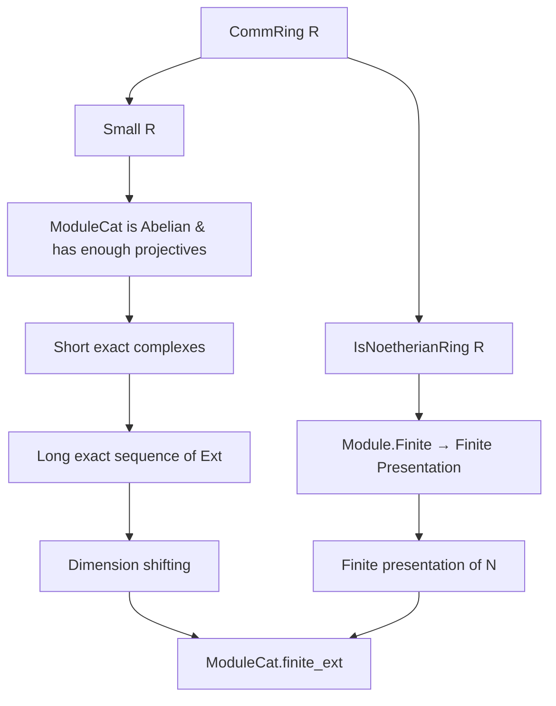

**Technical Brief: `Finite.lean` — Finiteness of `Ext`-modules over Noetherian rings**

---

### 1. **Key Definitions & Theorems**

| Name | Type / Signature | Purpose |
|------|------------------|---------|
| `ModuleCat.finite_ext` | `∀ [Small R] [IsNoetherianRing R] (N M : ModuleCat R), [Module.Finite R N] [Module.Finite R M] (i : ℕ), Module.Finite R (Ext N M i)` | Main theorem: For finitely generated modules $N, M$ over a Noetherian ring $R$, the $i$-th Ext group $\mathrm{Ext}^i_R(N, M)$ is finitely generated as an $R$-module. |
| `Ext.linearEquiv₀` | `Ext.linearEquiv₀ : Ext N M 0 ≃ₗ[ R ] ModuleCat.hom N M` | Linear equivalence identifying $\mathrm{Ext}^0_R(N,M)$ with $\mathrm{Hom}_R(N,M)$. |
| `ModuleCat.homLinearEquiv` | `ModuleCat.homLinearEquiv : ModuleCat.hom N M ≃ₗ[ R ] R-Mod(N, M)` | Standard identification of internal hom with $R$-linear maps. |
| `Module.exists_finite_presentation` | `∃ (F : ModuleCat R) [Module.Finite R F], ∃ (K : ModuleCat R) [Module.Finite R K], K → F → N → 0` | Every finitely generated module over a small Noetherian ring admits a finite presentation. |
| `LinearMap.shortExact_shortComplexKer` | `surjf : F₁ ↠ N` induces a short exact complex `0 → K → F₁ → N → 0` | Constructs a short exact sequence from a surjection from a finite free module. |
| `precomp_extClass_surjective_of_projective_X₂` | A lemma ensuring surjectivity of the connecting map in the long exact sequence of Ext when the middle term is projective (used inductively). |
| `extClass.precompOfLinear` | Precomposition map in Ext induced by a linear map (here, the differential in the short exact sequence). |

---

### 2. **Naming Conventions**

- **Prefixes**:
  - `finite_`: indicates finiteness properties (`finite_ext`, `finite_presentation`).
  - `precomp_`: precomposition maps in Ext or Hom.
  - `linearEquiv`: linear equivalences (e.g., `linearEquiv₀`, `homLinearEquiv`).
- **Suffixes**:
  - `_of_`: indicates dependency on a hypothesis (e.g., `surjective_of_projective_X₂`).
  - `_class`: refers to class of morphisms or constructions in derived category (e.g., `extClass`).
- **Category-theoretic**:
  - `ModuleCat`: category of $R$-modules.
  - `Ext`: derived functor in the derived category.

---

### 3. **Tactic Stack**

- `induction i generalizing N with` — structural induction on natural number $i$, with generalization over $N$.
- `obtain ⟨…⟩ := …` — destructuring existential quantifiers (finite presentation, surjection).
- `exact` — closing goals via direct proof terms.
- `Module.Finite.of_surjective` — uses surjectivity to deduce finite generation of codomain from domain.
- Implicit use of:
  - `simp` / `aesop` (likely in auxiliary lemmas not shown).
  - `ring` (for commutative ring arithmetic in proofs of linearity).
  - `apply` / `exact` for homological algebra constructions.

---

### 4. **Proof Logic**

The proof proceeds by **induction on $i$**:

- **Base case $i = 0$**:  
  $\mathrm{Ext}^0_R(N, M) \cong \mathrm{Hom}_R(N, M)$ via `Ext.linearEquiv₀`, and $\mathrm{Hom}_R(N, M)$ is finitely generated because $N$ and $M$ are finitely generated over a Noetherian ring (standard result, encoded via `ModuleCat.homLinearEquiv` and `Module.Finite.equiv`).

- **Inductive step $i = n+1$**:
  1. Use `Module.exists_finite_presentation` to get a finite presentation $K \hookrightarrow F \twoheadrightarrow N \to 0$ with $F, K$ finitely generated.
  2. Convert the surjection $F \twoheadrightarrow N$ into a short exact complex `exac : 0 → K → F → N → 0`.
  3. Apply the long exact sequence of Ext:  
     $\cdots \to \mathrm{Ext}^n_R(F, M) \to \mathrm{Ext}^n_R(K, M) \to \mathrm{Ext}^{n+1}_R(N, M) \to \mathrm{Ext}^{n+1}_R(F, M) \to \cdots$
  4. Since $F$ is projective (finite free), $\mathrm{Ext}^{>0}_R(F, M) = 0$, so the connecting map $\mathrm{Ext}^n_R(K, M) \twoheadrightarrow \mathrm{Ext}^{n+1}_R(N, M)$ is surjective.
  5. By induction hypothesis, $\mathrm{Ext}^n_R(K, M)$ is finitely generated; thus, so is its quotient $\mathrm{Ext}^{n+1}_R(N, M)$.

The key homological input is the **dimension-shifting** argument encoded via `precomp_extClass_surjective_of_projective_X₂`.

---

### 5. **Imports & Scope**

| Module | Role |
|--------|------|
| `Mathlib.Algebra.Category.Grp.Zero` | Zero objects, zero morphisms in Abelian categories. |
| `Mathlib.Algebra.Category.ModuleCat.Ext.DimensionShifting` | Dimension-shifting lemmas for Ext (critical for inductive step). |
| `Mathlib.Algebra.Homology.DerivedCategory.Ext.Linear` | Linear structure on Ext groups, `Ext.linearEquiv₀`. |
| `Mathlib.Algebra.Homology.ShortComplex.ModuleCat` | Short exact sequences as short complexes in `ModuleCat`. |
| `Mathlib.LinearAlgebra.Dimension.Finite` | Tools for finite generation (e.g., `Module.Finite.of_surjective`). |
| `Mathlib.RingTheory.Noetherian.Basic` | Noetherian ring assumptions, finite presentation existence. |

**Scope**: Homological algebra over commutative Noetherian rings, focusing on finiteness of derived functors between finitely generated modules.

---

### 6. **Mermaid Diagrams**

#### Dependency Graph (High-Level)



#### Overview of Proof Structure

```mermaid
flowchart LR
  subgraph Base [Base case i = 0]
    B1[Ext⁰(N,M)] -->|Ext.linearEquiv₀| B2[Hom(N,M)]
    B2 -->|homLinearEquiv| B3[R-Mod(N,M)]
    B3 -->|Noetherian + finite| B4[Module.Finite]
  end

  subgraph Inductive [Inductive step i = n+1]
    I1[N has finite presentation] --> I2[0 → K → F → N → 0]
    I2 --> I3[Long exact sequence]
    I3 --> I4[∂: Extⁿ(K,M) ↠ Extⁿ⁺¹(N,M)]
    I4 --> I5[Extⁿ(K,M) finite by IH]
    I5 --> I6[Extⁿ⁺¹(N,M) finite]
  end

  J[ModuleCat.finite_ext] <--> Base
  J <--> Inductive
```

--- 

This file formalizes a foundational result in homological algebra over Noetherian rings: **finiteness of Ext groups** under finite generation hypotheses — a key ingredient for derived category arguments and Grothendieck’s finiteness theorems.
