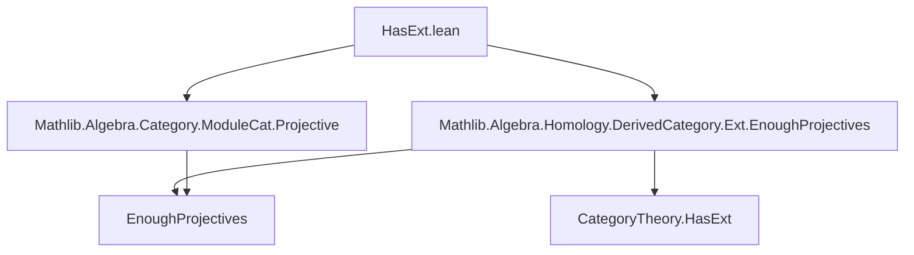

**Technical Brief: `HasExt.lean`**

---

### 1. **Key Definitions & Theorems**

| Name | Type / Signature | Purpose |
|------|------------------|---------|
| `HasExt.{v} (ModuleCat.{v} R)` | `Class` (in `CategoryTheory`) | Indicates that the category `ModuleCat.{v} R` admits a well-defined `Ext` functor in degree ≥ 1, constructed via projective resolutions. |
| `CategoryTheory.hasExt_of_enoughProjectives` | `theorem` / `instance` constructor | Given a preadditive category with enough projectives, constructs a `HasExt` instance. |
| `Small.{v} R` | `Prop` | Asserts that the underlying type of ring `R` is small (i.e., lives in universe `v`), needed to ensure `ModuleCat.{v} R` is locally small and admits projective resolutions of bounded size. |

---

### 2. **Naming Conventions**

- **Prefixes**:
  - `hasExt_`: Indicates constructions/instances tied to the `HasExt` typeclass.
  - `ModuleCat`: Standard naming for module category objects and morphisms.
- **Suffixes**:
  - `.of_enoughProjectives`: Denotes derivation of a property (`HasExt`) from a structural assumption (enough projectives).
- **Universe parameters**: `.{v}` consistently used to track universe levels.

---

### 3. **Tactic Stack**

- **No explicit tactics** appear in the proof term (the instance is defined by direct application of a theorem).
- Implicit reliance on:
  - `apply` (via `:=` application of `hasExt_of_enoughProjectives`)
  - Implicit typeclass resolution for `[Ring R]`, `[Small.{v} R]`
  - Lean’s `instance` resolution for `CategoryTheory.HasExt`

No automation-heavy tactics (`aesop`, `ring`, `simp`) are used in this file.

---

### 4. **Proof Logic**

- **Logical flow**:
  1. Assume `Small.{v} R`, ensuring `ModuleCat.{v} R` is locally small and has a set-indexed family of projective objects covering all modules.
  2. Use the general theorem `CategoryTheory.hasExt_of_enoughProjectives`, which constructs `HasExt` for any preadditive category with enough projectives.
  3. Apply this theorem to `ModuleCat.{v} R`, yielding the instance.

- **No induction or case analysis** is needed — the proof is a direct application of a pre-proved lemma.

---

### 5. **Imports**

| Import | Role |
|--------|------|
| `Mathlib.Algebra.Category.ModuleCat.Projective` | Provides results on projective objects and enough projectives in `ModuleCat`. |
| `Mathlib.Algebra.Homology.DerivedCategory.Ext.EnoughProjectives` | Contains the key theorem `hasExt_of_enoughProjectives`, linking “enough projectives” to `HasExt`. |

These imports define the *domain-specific* theory: homological algebra in module categories.

---

### 8. **Mermaid Diagrams**

#### Dependency Graph (File-Level)



#### Theoretical Overview (Module Category Ext Construction)

```mermaid
flowchart LR
  R[Ring R] --> Small[Small.{v} R]
  Small --> EnoughProj[ModuleCat.{v} R has enough projectives]
  EnoughProj --> HasExtInst[Instance: HasExt.{v} (ModuleCat.{v} R)]
  HasExtInst --> ExtDef[Ext^n_{ModuleCat}(M,N) ∈ Type v]
```

#### Logical Flow (Instance Construction)

```mermaid
flowchart LR
  assumption[Assume Small.{v} R] --> enoughProj[ModuleCat.{v} R has enough projectives]
  enoughProj --> applyThm[Apply hasExt_of_enoughProjectives]
  applyThm --> instance[Define instance HasExt]
```

---

**Summary**: This file establishes the foundational link between set-theoretic smallness of a ring `R` and the existence of `Ext` groups in the category of `R`-modules. It leverages a general categorical principle (`hasExt_of_enoughProjectives`) to instantiate `HasExt` for `ModuleCat`, enabling homological algebra in this setting.
