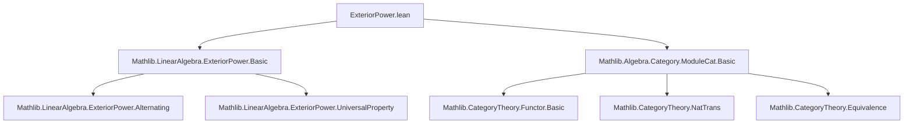
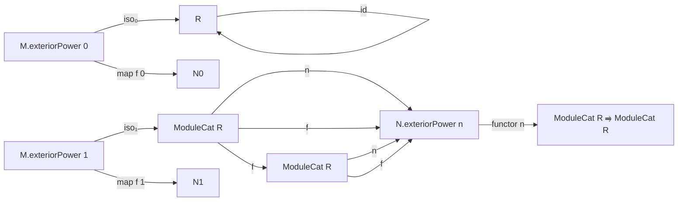

### Technical Brief: Exterior Power Functors in `ModuleCat`

---

#### **1. Key Definitions & Theorems**

| Name | Type / Signature | Purpose |
|------|------------------|---------|
| `exteriorPower` | `M : ModuleCat R → n : ℕ → ModuleCat R` | Defines the $n$th exterior power of a module object in `ModuleCat R`. |
| `AlternatingMap` | `M.AlternatingMap N n` | Type of $n$-linear alternating maps $M^n \to N$ in `ModuleCat R`. |
| `mk` | `M.AlternatingMap (M.exteriorPower n) n` | Universal alternating map into the exterior power (i.e., the canonical $n$-fold wedge). |
| `desc` | `(φ : M.AlternatingMap N n) → M.exteriorPower n ⟶ N` | Universal property: induces a unique linear map from the exterior power. |
| `map` | `(f : M ⟶ N) → n → M.exteriorPower n ⟶ N.exteriorPower n` | Functoriality: induced map on exterior powers. |
| `functor` | `n : ℕ → ModuleCat R ⥤ ModuleCat R` | The $n$th exterior power as a functor. |
| `iso₀` | `M.exteriorPower 0 ≅ ModuleCat.of R R` | Isomorphism between 0th exterior power and base ring. |
| `iso₁` | `M.exteriorPower 1 ≅ M` | Isomorphism between 1st exterior power and original module. |
| `natIso₀` | `functor 0 ≅ const (R)` | Natural isomorphism for $n=0$. |
| `natIso₁` | `functor 1 ≅ 𝟭_` | Natural isomorphism for $n=1$. |

**Key Lemmas**:
- `ext`: Extensionality for alternating maps.
- `hom_ext`: Extensionality for morphisms out of exterior powers.
- `desc_mk`: Compatibility of `desc` with `mk`.
- `map_mk`: Action of `map f n` on wedges.
- `iso₀_hom_apply`, `iso₁_hom_apply`: Explicit descriptions of isomorphisms on generators.
- `iso₀_hom_naturality`, `iso₁_hom_naturality`: Naturality of the isomorphisms.

---

#### **2. Naming Conventions**

- **Prefixes**:
  - `exteriorPower.`: Module-level definitions (e.g., `exteriorPower.mk`, `exteriorPower.map`).
  - `AlternatingMap.`: Definitions and lemmas about alternating maps.
  - `iso₀`, `iso₁`, `natIso₀`, `natIso₁`: Canonical isomorphisms for low degrees.
- **Suffixes**:
  - `_apply`: For lemmas about application of maps on elements (e.g., `desc_mk`, `map_mk`).
  - `_naturality`: For naturality squares (e.g., `iso₁_hom_naturality`).
  - `_hom`: For hom-components of isomorphisms (e.g., `iso₀_hom_apply`).
- **`mk`**: Standard notation for the universal alternating map (wedge of elements).

---

#### **3. Tactic Stack**

- **`ext`**: Used for extensionality (e.g., `ext : 1` in `hom_ext`).
- **`apply`**: For applying lemmas like `exteriorPower.linearMap_ext`, `exteriorPower.alternatingMapLinearEquiv_apply_ιMulti`.
- **`rfl`**: For definitional equalities (e.g., `postcomp_apply`).
- **`simp` / `reassoc` attributes**: Used to tag lemmas for automatic simplification/reassociation in simpsets.
- **`noncomputable def`**: Used where definitions rely on classical choice or noncomputable parts (e.g., `desc`, `map`, `iso₀`, `iso₁`).

---

#### **4. Proof Logic**

- **Universal property proofs**:
  - Use `exteriorPower.linearMap_ext` or `ModuleCat.hom_ext` to reduce to checking equality on `mk x`.
  - Then apply `desc_mk` or `map_mk` to reduce to known behavior on wedges.
- **Naturality proofs**:
  - Reduce to equality of morphisms using `hom_ext`.
  - Then apply `simp` with `map_mk`, `iso₀_hom_apply`, etc., to verify equality on generators.
- **Isomorphism constructions**:
  - Use existing equivalences from `exteriorPower` in `Mathlib.LinearAlgebra.ExteriorPower.Basic` (e.g., `zeroEquiv`, `oneEquiv`).
  - Convert to module isomorphisms via `.toModuleIso`.

---

#### **5. Imports**

| Import | Purpose |
|--------|---------|
| `Mathlib.LinearAlgebra.ExteriorPower.Basic` | Core theory of exterior powers over modules (algebraic, not categorical). |
| `Mathlib.Algebra.Category.ModuleCat.Basic` | Basic category theory of modules over a commutative ring. |

---

#### **8. Mermaid Diagrams**

##### **Dependency Graph (File-level)**

##### **Overview of Module Structure**

```mermaid
graph LR
  subgraph "ExteriorPower.lean"
    A[ModuleCat] --> B[exteriorPower n]
    A --> C[AlternatingMap]
    B --> D[map f n]
    B --> E[desc φ]
    B --> F[functor n]
    B --> G[iso₀, iso₁]
    G --> H[natIso₀, natIso₁]
  end

  subgraph "Underlying Theory"
    I[Mathlib.LinearAlgebra.ExteriorPower.Basic] --> B
    J[Mathlib.CategoryTheory] --> F
  end
```

##### **Categorical Structure**

---

This file formalizes the **categorical lifting** of the exterior power construction from modules to the category of modules, establishing it as a **functor** and verifying its behavior on morphisms, universal properties, and low-degree cases. It leverages existing algebraic results from `Mathlib.LinearAlgebra.ExteriorPower.Basic` and adapts them to the categorical setting via `ModuleCat`.
