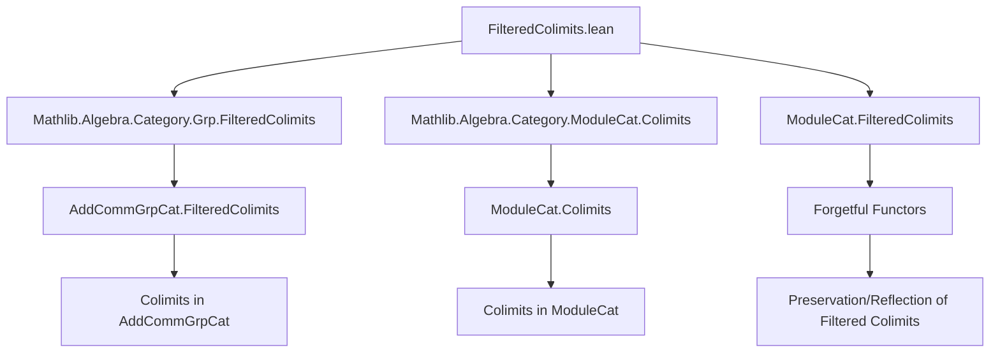

### Technical Brief: `FilteredColimits.lean`

---

#### **1. Key Definitions & Theorems**

| Name | Type / Signature | Purpose |
|------|------------------|---------|
| `M : AddCommGrpCat` | `def M : AddCommGrpCat` | The colimit in `AddCommGrpCat` of the diagram `F ⋙ forget₂`, underlying the eventual `R`-module colimit. |
| `M.mk : (Σ j, F.obj j) → M F` | `def M.mk` | Canonical projection from the disjoint union to the colimit (as a quotient). |
| `colimitSMulAux : R → (Σ j, F.obj j) → M F` | `def colimitSMulAux` | Pre-smultiplication on representatives; used to define scalar multiplication on the colimit. |
| `colimitHasSMul : SMul R (M F)` | `instance colimitHasSMul` | Defines scalar multiplication on the colimit via quotient lifting. |
| `colimitMulAction : MulAction R (M F)` | `instance colimitMulAction` | Verifies monoid action axioms (`1 • x = x`, `(r * s) • x = r • (s • x)`). |
| `colimitSMulWithZero : SMulWithZero R (M F)` | `instance colimitSMulWithZero` | Extends to `SMulWithZero`, ensuring `0 • x = 0`, `r • 0 = 0`. |
| `colimitModule : Module R (M F)` | `instance colimitModule` | Final `R`-module structure on the colimit; verifies distributivity and compatibility. |
| `colimit : ModuleCat R` | `def colimit` | The colimit object in `ModuleCat R`, bundled as an `R`-module. |
| `coconeMorphism : F.obj j ⟶ colimit F` | `def coconeMorphism` | Canonical maps from diagram objects to the colimit, linear. |
| `colimitCocone : Cocone F` | `def colimitCocone` | Cocone over `F` with vertex `colimit F`. |
| `colimitDesc : colimit F ⟶ t.pt` | `def colimitDesc` | Mediating morphism from the colimit to any other cocone point; linear. |
| `colimitCoconeIsColimit : IsColimit (colimitCocone F)` | `def colimitCoconeIsColimit` | Proves the cocone is a colimit in `ModuleCat R`. |
| `forget₂AddCommGroup_preservesFilteredColimits` | `instance` | `forget₂ (ModuleCat R) AddCommGrpCat` preserves filtered colimits. |
| `forget_preservesFilteredColimits` | `instance` | `forget (ModuleCat R)` preserves filtered colimits. |
| `forget_reflectsFilteredColimits` | `instance` | `forget (ModuleCat R)` reflects filtered colimits. |

---

#### **2. Naming Conventions**

- **Prefixes**:
  - `colimit_`: for constructions related to the colimit object or its structure.
  - `M.`: for constructions on the underlying additive group of the colimit.
  - `cocone_`: for cocone-related maps and properties.
- **Suffixes**:
  - `_mk`: for canonical projections from representatives.
  - `_aux`: for auxiliary definitions before quotienting (e.g., `colimitSMulAux`).
  - `_isColimit`: for proofs that a cocone is a colimit.
- **Other**:
  - `ι_colimitDesc`: `reassoc` lemma for composition of colimit cocone legs with mediating map.

---

#### **3. Tactic Stack**

- **Core tactics**:
  - `obtain ⟨j, x, rfl⟩ := M.mk_surjective F x` — elimination of quotient elements.
  - `simp`, `simp only [...]`, `rw [...]`, `apply ...`, `refine ...`, `ext ...`, `hom_ext`, `LinearMap.coe_injective`.
- **Category-theoretic automation**:
  - `solve_by_elim` — for simple typeclass resolution.
  - `congr_fun`, `congr_map`, `forget ... .congr_map` — for reasoning about forgetful functors.
  - `preservesColimit_of_preserves_colimit_cocone`, `reflectsColimit_of_reflectsIsomorphisms` — high-level colimit preservation lemmas.
- **Ring/module reasoning**:
  - `smul_zero`, `map_smul`, `add_smul`, `_root_.add_smul`, `mul_smul`.

---

#### **4. Proof Logic**

The proof proceeds in stages:

1. **Construct underlying additive group**:
   - Define `M` as the colimit in `AddCommGrpCat`.
   - Use `M.mk` to represent elements as equivalence classes of pairs `(j, x)`.

2. **Lift scalar multiplication**:
   - Define `colimitSMulAux` on representatives.
   - Show it respects the colimit equivalence relation (`colimitSMulAux_eq_of_rel`).
   - Lift to `colimitHasSMul` via `Quot.lift`.
   - Verify module axioms stepwise:
     - `MulAction` → `SMulWithZero` → `Module`.

3. **Bundle as `ModuleCat R` object**:
   - `colimit := ModuleCat.of R (M F)`.

4. **Verify universal property**:
   - Define cocone legs `coconeMorphism`.
   - Show naturality and cocone property.
   - Define mediating map `colimitDesc` using the additive colimit’s universal property.
   - Prove linearity of `colimitDesc`.
   - Show uniqueness via `forget (ModuleCat R)`-reflection of equality.

5. **Preservation/Reflection**:
   - Use `colimitCoconeIsColimit` to show the constructed colimit is indeed a colimit in `ModuleCat R`.
   - Deduce preservation and reflection for `forget₂` and `forget`.

---

#### **5. Imports**

- `Mathlib.Algebra.Category.Grp.FilteredColimits` — colimits in `AddCommGrpCat`.
- `Mathlib.Algebra.Category.ModuleCat.Colimits` — general colimit machinery in `ModuleCat`.

---

#### **8. Mermaid Diagrams**

##### **Dependency Graph (Module-Level)**

##### **Overview of Theory Flow**

```mermaid
flowchart LR
  Start[Given: Ring R, Small Filtered J, F : J → ModuleCat R] --> Step1[Take colimit in AddCommGrpCat: M]
  Step1 --> Step2[Define scalar mult on M via representatives]
  Step2 --> Step3[Verify module axioms]
  Step3 --> Step4[Bundle as colimit : ModuleCat R]
  Step4 --> Step5[Construct cocone & mediating maps]
  Step5 --> Step6[Prove universal property]
  Step6 --> Step7[Conclude: forget₂ & forget preserve filtered colimits]
  Step7 --> End[Applications: e.g., exactness of forgetful functor, transfer of limits]
```

---

This file formalizes a foundational result in categorical algebra: **filtered colimits in `R`-Mod can be computed underlyingly in Ab**, and the forgetful functor reflects and preserves them. It exemplifies how algebraic structure can be lifted along colimits when the indexing category is filtered.
