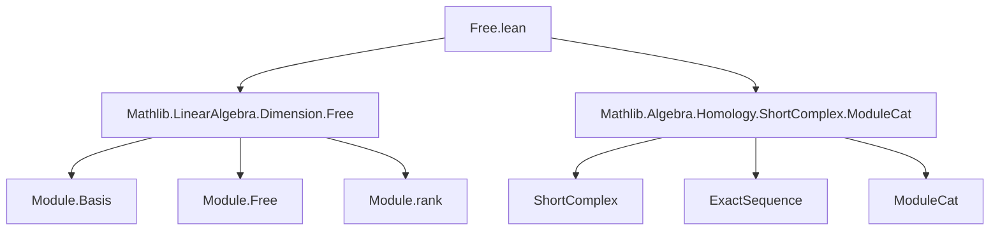
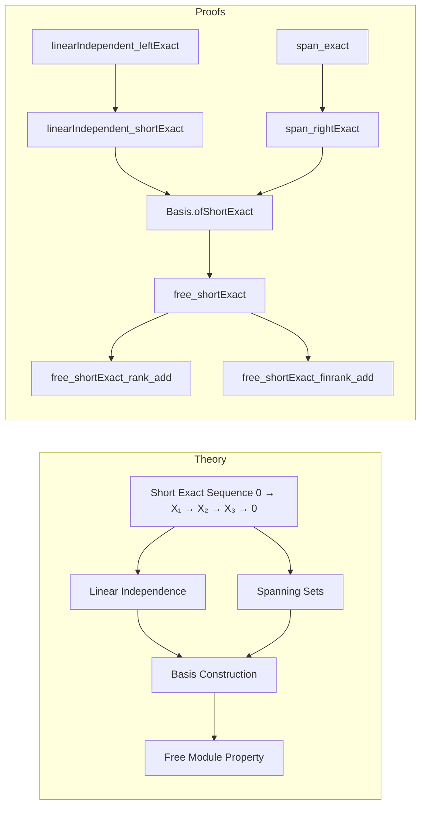

### Technical Brief: `Free.lean` — Exact Sequences with Free Modules in Lean 4

---

#### **1. Key Definitions & Theorems**

| Name | Type / Signature | Purpose |
|------|------------------|---------|
| `disjoint_span_sum` | `Disjoint (span R (range (u ∘ Sum.inl))) (span R (range (u ∘ Sum.inr)))` | Shows that the spans of the images of `Sum.inl` and `Sum.inr` under `u` are disjoint in an exact setting. |
| `linearIndependent_leftExact` | `LinearIndependent R u` | Under injectivity of `u`, and linear independence of `v` and `w`, deduces linear independence of `u`. |
| `linearIndependent_shortExact` | `LinearIndependent R (Sum.elim (S.f ∘ v) (S.g.hom.toFun.invFun ∘ w))` | In a *short* exact sequence, combines linearly independent families from `X₁` and `X₃` into one in `X₂`. |
| `span_exact` | `⊤ ≤ span R (range u)` | If `v` spans `X₁` and `w` spans `X₃`, then `u` spans `X₂` in an exact sequence. |
| `span_rightExact` | `⊤ ≤ span R (range (Sum.elim (S.f ∘ v) (S.g.hom.toFun.invFun ∘ w)))` | In a *right* exact sequence (`X₁ → X₂ → X₃ → 0`), combines spanning families to get a spanning family in `X₂`. |
| `Basis.ofShortExact` | `Basis (ι ⊕ ι') R S.X₂` | Constructs a basis for `X₂` from bases of `X₁` and `X₃` in a short exact sequence. |
| `free_shortExact` | `Module.Free R S.X₂` | Proves that if `X₁` and `X₃` are free in a short exact sequence, then so is `X₂`. |
| `free_shortExact_rank_add` | `Module.rank R S.X₂ = Module.rank R S.X₁ + Module.rank R S.X₃` | Rank additivity in short exact sequences (requires `StrongRankCondition`). |
| `free_shortExact_finrank_add` | `finrank R S.X₂ = n + p` | Finite-dimensional version of rank additivity. |

---

#### **2. Naming Conventions**

- **Prefixes**:
  - `linearIndependent_`: Theorems about linear independence.
  - `span_`: Theorems about spanning sets.
  - `free_`: Theorems about freeness of modules.
- **Suffixes**:
  - `_leftExact`, `_rightExact`, `_shortExact`: Indicate which part of the exact sequence is used (left, right, or full short exact).
- **Helper names**:
  - `disjoint_span_sum`, `span_exact`: Descriptive compound names for intermediate lemmas.
- **Constructors**:
  - `Basis.ofShortExact`: Named after the construction method.

---

#### **3. Tactic Stack**

| Tactic | Usage Frequency | Purpose |
|--------|------------------|---------|
| `rw` | Very High | Rewriting definitions (e.g., `huv`, `hS.moduleCat_range_eq_ker`, `span_eq`). |
| `simp` / `simp only` | High | Simplifying goals using algebraic properties (e.g., `map_sub`, `map_smul`, `comp_apply`). |
| `exact` / `infer_instance` | Medium | Completing goals or inferring class instances (e.g., `Mono`, `Epi`). |
| `convert` | Medium | Aligning goals with known facts (e.g., `convert hw` after simplifying). |
| `obtain` / `rcases` | Medium | Extracting witnesses from existential statements (e.g., `⟨cm, hm⟩`, `⟨n, hnm⟩`). |
| `congr` | Low | Congruence reasoning (e.g., `congr; ext a b`). |
| `ext` | Medium | Extensionality for functions/morphisms. |
| `apply` | Medium | Applying lemmas to goals. |
| `have` / `set` | Medium | Introducing intermediate facts or definitions. |
| `aesop` | Not present | Not used in this file. |
| `ring` | Not present | Not used. |

---

#### **4. Proof Logic**

- **Structure**: Proofs follow a *constructive algebraic* style:
  1. **Decomposition**: Use exactness to decompose elements (e.g., write `m ∈ X₂` as sum of image of `X₁` and lift of `X₃`).
  2. **Witness extraction**: Use `Finsupp.mem_span_range_iff_exists_finsupp` to extract finite linear combinations.
  3. **Algebraic manipulation**: Use properties of linear maps (`map_smul`, `map_finsuppSum`, `map_sub`) to verify membership.
  4. **Disjointness & independence**: Use `disjoint_span_sum` and `linearIndependent_sum` to verify linear independence via sum decomposition.
- **Induction**: Not used directly; instead, proofs rely on *element-wise* reasoning in modules.
- **Categorical reasoning**: Leverages `ShortComplex`, `Exact`, `Mono`, `Epi`, and `ModuleCat` infrastructure.

---

#### **5. Imports**

| Import | Role |
|--------|------|
| `Mathlib.LinearAlgebra.Dimension.Free` | Provides `Basis`, `Module.Free`, `Module.rank`, `Module.finrank`. |
| `Mathlib.Algebra.Homology.ShortComplex.ModuleCat` | Provides `ShortComplex`, `Exact`, `ShortExact`, morphism infrastructure (`f`, `g`, `S.X₁`, etc.). |

---

#### **8. Mermaid Diagrams**

##### **Dependency Graph (Module-Level)**

##### **Overview of File Structure**

---

#### **Summary**

This file formalizes foundational homological algebra over modules: how linear independence and spanning behave in exact sequences, culminating in the proof that freeness is preserved in short exact sequences. It leverages categorical language (`ShortComplex`, `Exact`) and classical module-theoretic reasoning (via `Finsupp`, `span`, `LinearIndependent`). The structure is modular, with lemmas building toward the main theorem `free_shortExact`, and supporting rank-additivity results under additional assumptions (`StrongRankCondition`).
