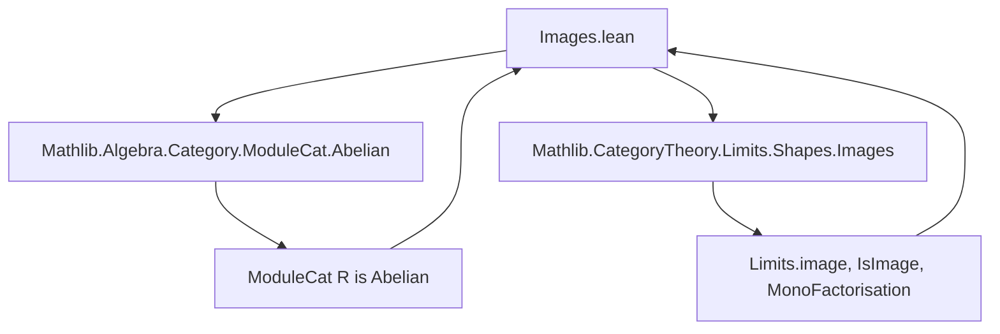
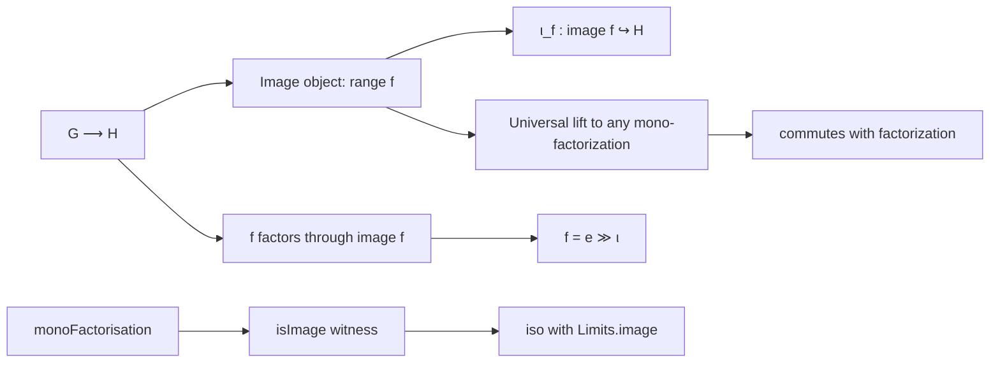

**Technical Brief: `Images.lean` — Categorical Images in `ModuleCat R`**

---

### 1. **Key Definitions & Theorems**

| Name | Type / Signature | Purpose |
|------|------------------|---------|
| `image` | `G ⟶ H → ModuleCat R` | Constructs the image object as `ModuleCat.of R (LinearMap.range f.hom)` |
| `image.ι f` | `image f ⟶ H` | The monomorphism embedding the image into the codomain |
| `factorThruImage f` | `G ⟶ image f` | Corestriction of `f` to its image via `rangeRestrict` |
| `image.fac` | `factorThruImage f ≫ image.ι f = f` | Factorization identity (simplification lemma) |
| `image.lift` | `MonoFactorisation f → image f ⟶ F'.I` | Universal map from the image to any other mono-factorization |
| `image.lift_fac` | `image.lift F' ≫ F'.m = image.ι f` | Compatibility of `image.lift` with the mono-factorization |
| `monoFactorisation f` | `MonoFactorisation f` | Canonical mono-factorization via image |
| `isImage f` | `IsImage (monoFactorisation f)` | Proves `monoFactorisation f` satisfies the universal property of a categorical image |
| `imageIsoRange f` | `Limits.image f ≅ ModuleCat.of R (LinearMap.range f.hom)` | Shows categorical image agrees with linear-algebraic range |
| `imageIsoRange_inv_image_ι` | `simp` lemma | Commutativity of iso inverse with image inclusion |
| `imageIsoRange_hom_subtype` | `simp` lemma | Commutativity of iso forward with inclusion |

---

### 2. **Naming Conventions**

- **Prefixes**:
  - `image.`: for definitions/lemmas about the image object and its structure.
  - `factorThruImage`: corestriction to image.
  - `lift`: universal property map.
- **Suffixes**:
  - `_fac`: factorization identities.
  - `_isoRange`: identification with linear algebraic range.
- **Structure fields**:
  - `ι`, `e`, `m`: standard for factorizations (`e` = epimorphism part, `m` = monomorphism part).
- **Lemmas**:
  - `image.lift_fac`, `image.fac`: use `_fac` suffix for factorization equations.
  - `imageIsoRange_*`: use `_iso*` for isomorphism-related lemmas.

---

### 3. **Tactic Stack**

Frequently used tactics in proofs:

- `ext`: extensionality for morphisms (via `Subtype.ext`).
- `rw`, `simp_rw`: rewriting using definitions and simplification lemmas.
- `change`: to align goal with known terms.
- `simp`: especially with `[local simp] image.fac`.
- `apply (mono_iff_injective _)`: to prove monomorphism via injectivity.
- `Classical.indefiniteDescription`: used to pick witnesses in constructive settings (e.g., in `image.lift`).
- `rfl`: for definitional equalities (e.g., `image.fac`).
- `infer_instance`: to resolve typeclass constraints (e.g., `Mono` instance).

---

### 4. **Proof Logic**

- **Structure**: The file proceeds in layers:
  1. **Concrete construction** of image object and inclusion (`image`, `image.ι`).
  2. **Verification of properties**:
     - `image.ι` is mono (via injectivity).
     - Factorization `factorThruImage` exists and satisfies `image.fac`.
  3. **Universal property**:
     - Define `image.lift` using classical choice to pick preimages.
     - Prove `image.lift_fac` to ensure compatibility.
  4. **Categorical identification**:
     - Show `monoFactorisation f` is an image (`isImage`).
     - Prove equivalence with the limit-theoretic image (`imageIsoRange`).
- **Key logical pattern**:
  - Use `Classical.indefiniteDescription` to construct maps from quotient-like data.
  - Prove algebraic properties (additivity, scalar multiplication) by reducing to the ambient map via mono-injectivity.

---

### 5. **Imports**

- `Mathlib.Algebra.Category.ModuleCat.Abelian`: establishes `ModuleCat R` is abelian (hence has all images).
- `Mathlib.CategoryTheory.Limits.Shapes.Images`: provides general categorical image definitions (`Limits.image`, `IsImage`, `MonoFactorisation`).

> **Note**: The file does *not* register instances — it leverages the abelian structure of `ModuleCat R` to avoid redundant constructions.

---

### 6. **Mermaid Diagrams**

#### **Dependency Graph (Module-Level)**



#### **Overview of Image Construction Flow**



#### **Categorical vs Linear-Algebraic Image**

```mermaid
flowchart LR
  Limits.image[f in C] -->|iso| ModuleCat.of R (LinearMap.range f.hom)
  Limits.image.ι -->|iso| (LinearMap.range f.hom).subtype
```

---

### 7. **Summary**

This file constructs and verifies the categorical image in `ModuleCat R` concretely using linear algebraic data (`LinearMap.range`). It shows that the abstract categorical image coincides with the familiar range of a module homomorphism, and that the standard factorization `G ↠ im f ↪ H` satisfies the universal property of images in an abelian category. The proofs rely on concrete set-theoretic reasoning (via `Subtype`, `rangeRestrict`, `Classical.indefiniteDescription`) and are justified by the abelian structure of `ModuleCat R`.
