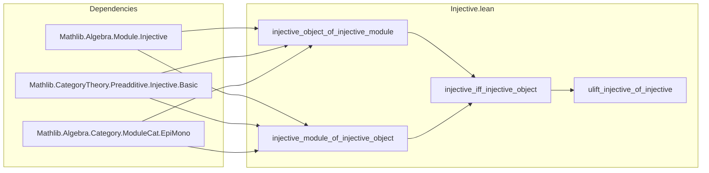

**Technical Brief: `Injective.lean` — Injective Objects in `ModuleCat`**

---

### 1. **Key Definitions & Theorems**

| Name | Type | Purpose |
|------|------|---------|
| `injective_object_of_injective_module` | `Module.Injective R M → CategoryTheory.Injective (ModuleCat.of R M)` | Shows that an injective $R$-module induces an injective object in the category of $R$-modules (`ModuleCat`). |
| `injective_module_of_injective_object` | `CategoryTheory.Injective (ModuleCat.of R M) → Module.Injective R M` | Converse: an injective object in `ModuleCat` corresponds to an injective $R$-module. |
| `injective_iff_injective_object` | `Module.Injective R M ↔ CategoryTheory.Injective (ModuleCat.of R M)` | Equivalence (bijection) between module-theoretic and categorical injectivity. |
| `ModuleCat.ulift_injective_of_injective` | Instance | Lifts injectivity along `ULift`: if $M$ is injective, so is its universe lift `ULift M`. |

---

### 2. **Naming Conventions**

- **Prefixes**:
  - `injective_`: Indicates properties related to injectivity (module or categorical).
  - `of`: Used in `ModuleCat.of` (embedding of modules into category) and `ModuleCat.ofHom` (embedding of module homomorphisms).
- **Suffixes**:
  - `_object`: Denotes categorical injectivity (object-level).
  - `_module`: Denotes module-theoretic injectivity (element-wise lifting property).
- **Pattern**: `X_of_Y` where `X` is the target notion, `Y` the source.

---

### 3. **Tactic Stack**

| Tactic | Usage |
|--------|-------|
| `have ⟨l, h⟩ := ...` | Extracting existence + proof from `Injective.out` / `factors`. |
| `ext x` | Extensionality for module homs (functional extensionality). |
| `simpa using h x` | Simplify goal using hypothesis `h` applied to `x`. |
| `rfl` | Proving equality of homs via `ModuleCat.hom_ext_iff`. |
| `exact ⟨l.hom, ...⟩` | Constructing morphisms in `ModuleCat`. |
| `by` (tactic block) | Used for concise proof of `out` in `injective_module_of_injective_object`. |

No heavy automation (`aesop`, `ring`, `simp`) beyond basic simplification and extensionality.

---

### 4. **Proof Logic**

- **Forward direction** (`injective_object_of_injective_module`):
  - Given module-theoretic injectivity `inj`, and a diagram $X \xrightarrow{f} Y$ (mono) and $M \xrightarrow{g} Y$, use `inj.out` to lift $g$ along $f$ (as sets/maps).
  - Verify lift is $R$-linear (via `ModuleCat.ofHom`) and commutes (via `ext` + `simpa`).

- **Reverse direction** (`injective_module_of_injective_object`):
  - Given categorical injectivity, take module monomorphism $f: X \to Y$ and map $g: M \to Y$.
  - Promote $f, g$ to `ModuleCat` morphisms, apply `inj.factors`, then use `ModuleCat.hom_ext_iff` to extract lift at module level.

- **Equivalence** (`injective_iff_injective_object`):
  - Direct application of the two theorems.

- **ULift instance**:
  - Uses `injective_object_of_injective_module` + `injective_module_of_injective_object` to translate between module-level `ULift` injectivity and categorical injectivity.

---

### 5. **Imports**

| Import | Role |
|--------|------|
| `Mathlib.Algebra.Module.Injective` | Defines `Module.Injective R M` (module-theoretic injectivity). |
| `Mathlib.CategoryTheory.Preadditive.Injective.Basic` | Defines `CategoryTheory.Injective` (categorical injective object). |
| `Mathlib.Algebra.Category.ModuleCat.EpiMono` | Provides `ModuleCat.mono_iff_injective`, linking mono in `ModuleCat` to injective maps. |

---

### 6. **Mermaid Diagrams**

#### **Dependency Graph (Theoretical)**

```mermaid
graph TD
  A[Module.Injective R M] -->|injective_object_of_injective_module| B[CategoryTheory.Injective (ModuleCat.of R M)]
  B -->|injective_module_of_injective_object| A
  A <-->|injective_iff_injective_object| B

  C[ModuleCat.mono_iff_injective] -->|used in both directions| A & B
  D[ModuleCat.of / ofHom] -->|embedding| A & B
```

#### **File Overview**



---

### 7. **Domain-Specific AI Agent Notes**

- **Core theory**: This file bridges *homological algebra* (injective modules) and *category theory* (injective objects), specifically in the context of module categories.
- **Key insight**: In `ModuleCat`, categorical injectivity coincides with classical injectivity (Baer’s criterion).
- **Automation potential**: The proofs are highly structured and repetitive — suitable for tactic automation (e.g., `aesop` + `ext` + `simpa`).
- **Extension points**: Could be extended to derived functors (`Ext^1`), resolutions, or sheaf-theoretic injectives.

--- 

Let me know if you'd like a formalized summary in Lean or a proof sketch in natural deduction style.
