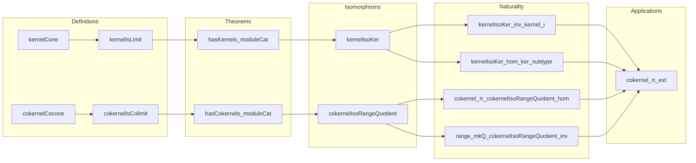

### Technical Brief: Kernels.lean — Categorical (Co)kernels in `ModuleCat`

---

#### **1. Key Definitions & Theorems**

| Name | Type | Purpose |
|------|------|---------|
| `kernelCone f` | `KernelFork f` | Constructs the kernel cone from the concrete (module-theoretic) kernel submodule. |
| `kernelIsLimit f` | `IsLimit (kernelCone f)` | Proves the kernel cone is terminal — i.e., categorical kernel exists and matches the module-theoretic one. |
| `cokernelCocone f` | `CokernelCofork f` | Constructs the cokernel cocone via the quotient map `range f → N / range f`. |
| `cokernelIsColimit f` | `IsColimit (cokernelCocone f)` | Proves the cokernel cocone is initial — i.e., categorical cokernel exists and matches the module-theoretic quotient. |
| `hasKernels_moduleCat` | `HasKernels (ModuleCat R)` | Concludes `ModuleCat R` has all kernels (by existence of kernel for each morphism). |
| `hasCokernels_moduleCat` | `HasCokernels (ModuleCat R)` | Concludes `ModuleCat R` has all cokernels. |
| `kernelIsoKer f` | `kernel f ≅ ModuleCat.of R (LinearMap.ker f.hom)` | Shows the categorical kernel object is isomorphic to the concrete kernel module. |
| `kernelIsoKer_inv_kernel_ι` | `simp` lemma | Commutativity of the iso with the kernel inclusion. |
| `kernelIsoKer_hom_ker_subtype` | `simp` lemma | Commutativity of the iso inverse with the kernel inclusion. |
| `cokernelIsoRangeQuotient f` | `cokernel f ≅ ModuleCat.of R (H ⧸ LinearMap.range f.hom)` | Shows categorical cokernel ≅ quotient by range. |
| `cokernel_π_cokernelIsoRangeQuotient_hom` | `simp` lemma | Commutativity of the iso with the cokernel projection. |
| `range_mkQ_cokernelIsoRangeQuotient_inv` | `simp` lemma | Commutativity of the iso inverse with the quotient projection. |
| `cokernel_π_ext` | `theorem` | Characterizes equality in cokernel: if $x = y + f(m)$, then their images in the cokernel coincide. |

---

#### **2. Naming Conventions**

- **Prefixes**:
  - `kernel*`, `cokernel*`: for constructions related to kernels/cokernels.
  - `ofHom`: lifts linear maps to `ModuleCat` morphisms.
  - `mk`, `mkQ`, `subtype`: standard module-theoretic constructors (`Submodule.mk`, `Submodule.mkQ`, `Subtype.subtype`).
- **Suffixes**:
  - `Cone`, `Cocone`: for pre-limit/pre-colimit diagrams.
  - `IsLimit`, `IsColimit`: for universal properties.
  - `Iso*`: for isomorphisms between categorical and concrete constructions.
- **`elementwise` attribute**: used on `simp` lemmas to enable element-wise reasoning (via `ConcreteCategory.comp_apply`).

---

#### **3. Tactic Stack**

| Tactic | Usage |
|--------|-------|
| `aesop` | Quick automation for simple goals (e.g., verifying cone conditions). |
| `simp` + `rw` | Simplification using module-theoretic definitions (`LinearMap.mem_ker`, `range_mkQ_comp`, etc.). |
| `hom_ext` | Proves equality of module morphisms by extensionality (pointwise equality). |
| `LinearMap.ext` | Extensionality for linear maps. |
| `Subtype.ext_iff.2` | Proves equality in subtype (e.g., kernel elements) by equality of underlying values. |
| `cancel_epi` | Used in cokernel proof to cancel epimorphisms (via `epi_iff_range_eq_top`). |
| `haveI : Epi ...` | Introduces an epimorphism instance for later use. |
| `subst` | Eliminates equality hypotheses (e.g., in `cokernel_π_ext`). |
| `simpa` | Simplify with target goal (e.g., `simpa using ...`). |

---

#### **4. Proof Logic**

- **Kernel proof structure**:
  1. Define `kernelCone` using `KernelFork.ofι` with the inclusion `ker(f) ↪ M`.
  2. Show it’s a limit via `Fork.IsLimit.mk`:
     - Construct mediating morphism using `LinearMap.codRestrict` and `LinearMap.ker.subtype`.
     - Verify commutativity and uniqueness using `hom_ext` and `LinearMap.ext`.
- **Cokernel proof structure**:
  1. Define `cokernelCocone` using the quotient map `N ↠ N / range(f)`.
  2. Show it’s a colimit via `Cofork.IsColimit.mk`:
     - Mediating morphism uses `liftQ` (universal property of quotient).
     - Uses `range_le_ker_iff` to verify compatibility.
     - Uniqueness via epimorphism cancellation (`cancel_epi`).
- **Isomorphism proofs**:
  - Use `limit.isoLimitCone` / `colimit.isoColimitCocone` to get canonical isos.
  - Prove naturality (commuting with structure maps) via `simp` lemmas.

---

#### **5. Imports & Dependencies**

| Import | Role |
|--------|------|
| `Mathlib.Algebra.Category.ModuleCat.EpiMono` | Provides `epi_iff_range_eq_top`, used to prove epimorphism in cokernel proof. |
| `Mathlib.CategoryTheory.ConcreteCategory.Elementwise` | Enables `elementwise` attribute and `comp_apply` simplifications for concrete categories. |

**Core dependencies**:
- `CategoryTheory.Limits` (for `kernel`, `cokernel`, `HasKernels`, `HasCokernels`, `limit`, `colimit`)
- `ModuleCat` infrastructure (objects = modules, morphisms = linear maps)
- `LinearMap`, `Submodule`, `Quotient` (from algebra library)

---

#### **6. Mermaid Diagrams**

##### **Dependency Graph (High-Level)**

```mermaid
graph TD
  A[ModuleCat] --> B[CategoryTheory.Limits]
  A --> C[ModuleCat.EpiMono]
  A --> D[ConcreteCategory.Elementwise]
  B --> E[HasKernels / HasCokernels]
  B --> F[Limit / Colimit]
  C --> G[epi_iff_range_eq_top]
  D --> H[hom_ext, comp_apply]
  A --> I[Kernels.lean (this file)]
  I --> J[KernelFork / CokernelCofork]
  I --> K[IsLimit / IsColimit]
  I --> L[Iso between categorical & concrete]
```

##### **Overview of File Structure**



---

#### **7. Summary**

This file establishes that the category of $R$-modules (`ModuleCat R`) has all kernels and cokernels, and that these categorical constructions coincide with the standard module-theoretic ones (kernel submodule and quotient by range). It uses:
- Universal properties (`IsLimit`, `IsColimit`) to prove correctness,
- Concrete module constructions (`LinearMap.ker`, `range`, `mkQ`, `subtype`) to define candidates,
- `simp`-friendly isomorphisms (`kernelIsoKer`, `cokernelIsoRangeQuotient`) to bridge abstract and concrete perspectives.

The proofs are highly structured, leveraging:
- Extensionality principles (`hom_ext`, `LinearMap.ext`),
- Epimorphism/cokernel cancellation,
- Quotient universal properties (`liftQ`, `range_mkQ_comp`).

This is foundational for homological algebra in `ModuleCat`, enabling constructions like images, coimages, and exactness.
