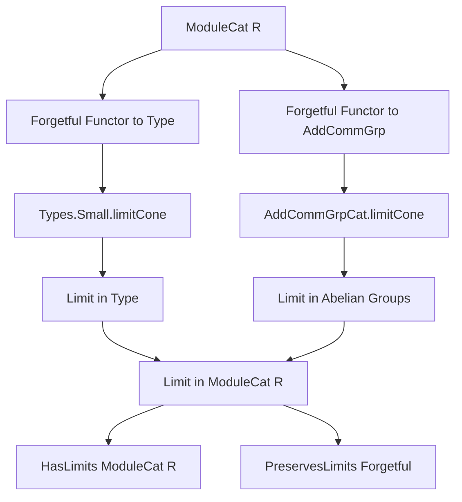
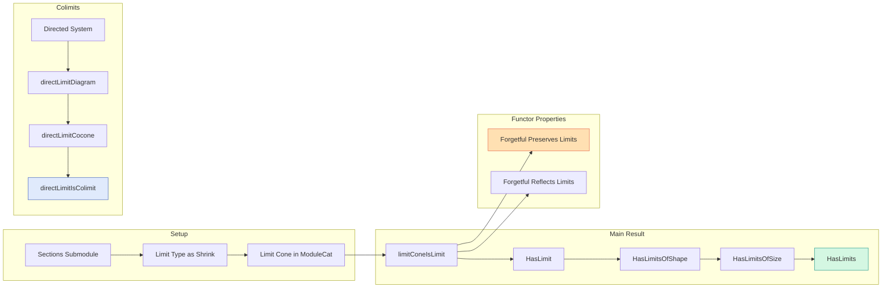

### Technical Brief: `Limits.lean` — Limits in the Category of R-Modules

---

#### **1. Key Definitions & Theorems**

| Name | Type / Signature | Purpose |
|------|------------------|---------|
| `sectionsSubmodule F` | `Submodule R (∀ j, F.obj j)` | Constructs the submodule of natural transformations (sections) from the constant diagram to `F`, i.e., the limit in `Type` lifted to modules. |
| `limitπLinearMap F j` | `(limitCone F).pt →ₗ[R] (F ⋙ forget).obj j` | The projection maps of the limit cone, shown to be $R$-linear. |
| `limitCone F` | `Cone F` | The candidate limit cone in `ModuleCat R`, built from the limit in `Type` (via `Types.Small.limitCone`) and equipped with $R$-module structure. |
| `limitConeIsLimit F` | `IsLimit (limitCone F)` | Proves that `limitCone F` satisfies the universal property of a limit in `ModuleCat R`. |
| `hasLimit F` | `HasLimit F` | Instance showing every diagram `F : J ⥤ ModuleCat R` has a limit (under smallness assumptions). |
| `hasLimitsOfShape [Small J]` | `HasLimitsOfShape J (ModuleCat R)` | Limits of shape `J` exist when `J` is small. |
| `hasLimitsOfSize [UnivLE v w]` | `HasLimitsOfSize (ModuleCat R)` | All limits (of any size bounded by universe levels) exist. |
| `hasLimits` | `HasLimits (ModuleCat R)` | Full statement: `ModuleCat R` has all limits. |
| `forget_preservesLimits` | `PreservesLimits (forget (ModuleCat R))` | The forgetful functor to `Type` preserves all limits. |
| `forget₂AddCommGroup_preservesLimits` | `PreservesLimits (forget₂ (ModuleCat R) AddCommGrpCat)` | Forgetful functor to abelian groups preserves all limits. |
| `forget₂AddCommGroup_reflectsLimit` | `ReflectsLimit F (forget₂ (ModuleCat R) AddCommGrpCat)` | The forgetful functor reflects limits (i.e., if the image has a limit, so does `F`, and it’s preserved). |
| `directLimitDiagram G f` | `ι ⥤ ModuleCat R` | Diagram associated to a directed system of modules. |
| `directLimitCocone G f` | `Cocone (directLimitDiagram G f)` | Cocone induced by the unbundled direct limit. |
| `directLimitIsColimit G f` | `IsColimit (directLimitCocone G f)` | Shows the unbundled direct limit is a categorical colimit. |

---

#### **2. Naming Conventions**

- **Prefixes**:
  - `limit*`: limit-related constructions (`limitCone`, `limitπLinearMap`, `limitAddCommGroup`, etc.)
  - `has*`: existence instances (`hasLimit`, `hasLimitsOfShape`, `hasLimitsOfSize`, `hasLimits`)
  - `forget*`: forgetful functors (`forget`, `forget₂AddCommGroup`)
  - `directLimit*`: colimit constructions for directed systems
- **Suffixes**:
  - `IsLimit` / `IsColimit`: universal properties (witnesses)
  - `Preserves*` / `Reflects*`: functorial behavior
  - `Aux`: auxiliary lemmas for performance (e.g., `forget₂AddCommGroup_preservesLimitsAux`)
- **Structure**:
  - `ofHom`: embeds linear maps into `ModuleCat` morphisms
  - `of`: embeds types/modules into `ModuleCat`

---

#### **3. Tactic Stack**

Frequent tactics used in proofs:
- `simp only [...]`: heavily used for rewriting with specific lemmas (e.g., `limitCone_π_app`, `equivShrink_*`, `map_smul`)
- `rw [...]`: rewriting using definitional equalities or lemmas
- `ext`: extensionality for functions/morphisms (especially after `linearMap_ext`)
- `rfl`: reflexivity for definitional equalities
- `symm`: reversing equalities
- `congr_arg`: congruence for function application
- `have : ... := ...`: intermediate claims, often for smallness or instance inference
- `intro x y`: standard intro for universal properties
- `exact ...`: final step in many proofs

No heavy automation (`aesop`, `linarith`, `tauto`) — proofs are mostly structural and rely on explicit manipulation of limits/colimits in `Type` and lifting structure.

---

#### **4. Proof Logic**

**General pattern for limits**:
1. **Construct candidate limit cone** in `ModuleCat R`:
   - Use `Types.Small.limitCone` (limit in `Type`) on the underlying diagram.
   - Show the limit type carries an $R$-module structure via `sectionsSubmodule`.
   - Define projections as linear maps (`limitπLinearMap`).
2. **Verify universal property**:
   - Use `IsLimit.ofFaithful` with `forget (ModuleCat R)` (faithful functor to `Type`).
   - Reduce to `Types.Small.limitConeIsLimit`, then lift the universal cone via `ofHom`.
   - Check $R$-linearity of the lift using `equivShrink_smul`, `equivShrink_add`.
3. **Preservation/Reflection**:
   - For preservation: show image of `limitCone` under forgetful functor is a limit (via `Types.Small.limitConeIsLimit` or `AddCommGrpCat.limitConeIsLimit`).
   - For reflection: use `reflectsLimit_of_reflectsIsomorphisms` + smallness of sections.

**Direct limits**:
- Construct cocone from unbundled `DirectLimit.of`.
- Use `Module.DirectLimit.lift` for universal property.
- Prove uniqueness via `funext` and simplification.

---

#### **5. Imports & Dependencies**

| Import | Role |
|--------|------|
| `Mathlib.Algebra.Category.ModuleCat.Basic` | Core definitions of `ModuleCat`, `of`, `ofHom`, etc. |
| `Mathlib.Algebra.Category.Grp.Limits` | Limits in `AddCommGrpCat`, used for intermediate steps. |
| `Mathlib.Algebra.Colimit.Module` | Direct limits of modules (used in `directLimit*` section). |
| `Mathlib.Algebra.Module.Shrink` | `Shrink` and `linearEquiv` for universe management and equivalence with `Shrink`. |
| `CategoryTheory.Limits` | Generic limits API: `Cone`, `IsLimit`, `HasLimit`, `limit`, etc. |

---

#### **6. Mermaid Diagrams**

##### **Dependency Graph (High-Level)**

##### **Overview of `Limits.lean`**

---

#### **7. Summary**

This file establishes that:
- The category of $R$-modules has all limits (of any size).
- These limits are constructed explicitly as submodules of product sections.
- The forgetful functors to `Type` and `AddCommGrp` preserve and reflect limits.
- Direct limits (colimits over directed posets) exist and coincide with the usual unbundled construction.

The formalization follows a standard “limit-by-embedding-in-Type” strategy, leveraging Lean’s universe management (`Shrink`, `Small`) and careful lifting of algebraic structure. Proofs are mostly constructive and rely on explicit universal properties.
