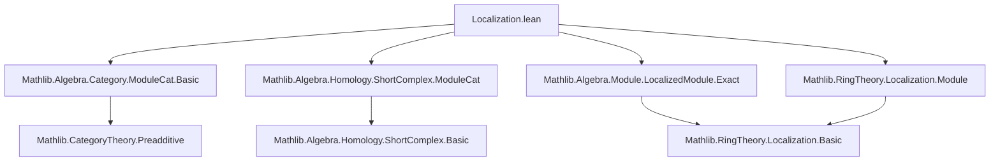
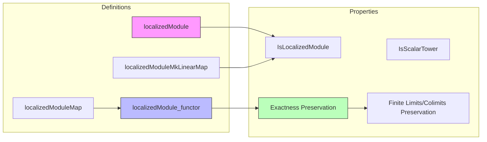

**Technical Brief: Localization in `ModuleCat` (Lean 4)**  
*Source: `Localization.lean`*

---

### 1. **Key Definitions & Theorems**

| Name | Type / Signature | Purpose |
|------|------------------|---------|
| `localizedModule` | `[Small.{v} R] → M : ModuleCat.{v} R → S : Submonoid R → ModuleCat.{v} (Localization S)` | Constructs the localized module object in the target category. |
| `localizedModuleMkLinearMap` | `M →ₗ[R] M.localizedModule S` | The canonical $R$-linear map exhibiting localization. |
| `localizedModuleMap` | `f : M ⟶ N ↦ (M.localizedModule S) ⟶ (N.localizedModule S)` | Action of the localization functor on morphisms. |
| `localizedModule_functor` | `S : Submonoid R → ModuleCat.{v} R ⥤ ModuleCat.{v} (Localization S)` | The localization functor (exact, preserves finite limits & colimits). |
| `localizedModule_functor_map_exact` | `T : ShortComplex (ModuleCat.{v} R), h : T.Exact ⇒ (T.map localizedModule_functor).Exact` | Proves the functor preserves exactness of short complexes. |
| `localizedModule_isLocalizedModule` | `IsLocalizedModule S (localizedModuleMkLinearMap S)` | Verifies the universal property of localization holds. |
| `IsScalarTower R (Localization S) (M.localizedModule S)` | `IsScalarTower` instance | Ensures compatibility of scalar actions: $R \to \Localization S \to \End(M_S)$. |

---

### 2. **Naming Conventions**

- **Prefixes**:
  - `localizedModule*`: Core constructions related to localized modules.
  - `isScalarTower`, `IsLocalizedModule`: Properties tied to module-theoretic universal properties.
- **Suffixes**:
  - `MkLinearMap`: Canonical linear map into localized module.
  - `Functor`: Denotes categorical functors.
  - `Map`: Morphism-level action of a functor.
- **Pattern**: `X.localizedModule S` for objects, `X.localizedModuleMkLinearMap S` for structure maps.

---

### 3. **Tactic Stack**

| Tactic | Usage Frequency | Role |
|--------|-----------------|------|
| `simp` / `simp_rw` | High | Simplifying definitions (e.g., `localizedModule`, `localizedModuleMkLinearMap`). |
| `ext` | Medium | Extensionality for morphisms in `ModuleCat`. |
| `dsimp` | Medium | Definitional simplification before type class inference. |
| `infer_instance` | High | Solving type class goals (e.g., `IsLocalizedModule`, `Small`, `IsScalarTower`). |
| `exact` | Medium | Direct proof of exactness using known lemmas. |
| `rw` | Medium | Rewriting using equivalences or lemmas like `moduleCat_exact_iff_function_exact`. |
| `have` / `exact` | Medium | Intermediate lemma application (e.g., `Functor.exact_tfae`). |

---

### 4. **Proof Logic**

- **Structure**:
  1. **Definitional Setup**: Define `localizedModule`, `localizedModuleMkLinearMap`, and verify `IsLocalizedModule` via `infer_instance`.
  2. **Functor Construction**: Define object and morphism parts; prove functoriality (`map_comp`) via `simp` and `IsLocalizedModule.map_comp'`.
  3. **Exactness Preservation**:
     - Translate `ShortComplex.Exact` in `ModuleCat` to function-level exactness (`moduleCat_exact_iff_function_exact`).
     - Apply `IsLocalizedModule.map_exact` to lift exactness through localization.
  4. **Limit/Colimit Preservation**:
     - Use `Functor.exact_tfae` equivalence: exactness of the functor ⇔ preservation of finite limits & colimits.
     - Derive both from `localizedModule_functor_map_exact`.

- **Key Logical Flow**:
  > *Define → Verify universal property → Build functor → Prove exactness → Deduce limit/colimit preservation.*

---

### 5. **Imports**

| Module | Role |
|--------|------|
| `Mathlib.Algebra.Category.ModuleCat.Basic` | Base category theory of modules. |
| `Mathlib.Algebra.Homology.ShortComplex.ModuleCat` | Short complexes and exactness in `ModuleCat`. |
| `Mathlib.Algebra.Module.LocalizedModule.Exact` | Exactness properties of localized modules. |
| `Mathlib.RingTheory.Localization.Module` | Foundational theory of localized modules and `IsLocalizedModule`. |

---

### 6. **Mermaid Diagrams**

#### **Dependency Graph (Module-Level)**

#### **Overview of File Structure**

---

### 7. **Summary**

This file formalizes the **localization functor** on module categories:  
$$
(-)_S : \mathbf{Mod}_R \to \mathbf{Mod}_{S^{-1}R}
$$  
and proves it is **exact** and **preserves finite limits and colimits**, leveraging the categorical characterization of localization via `IsLocalizedModule`. The development is fully constructive (modulo `Shrink` and `Small` assumptions), and integrates cleanly with homological algebra in `ModuleCat`.
