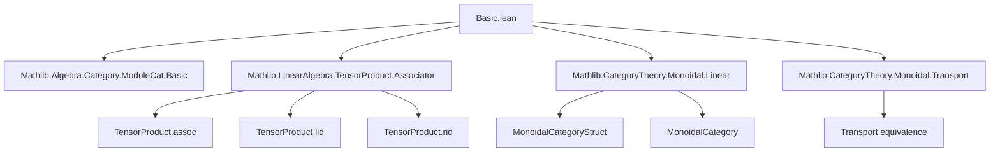
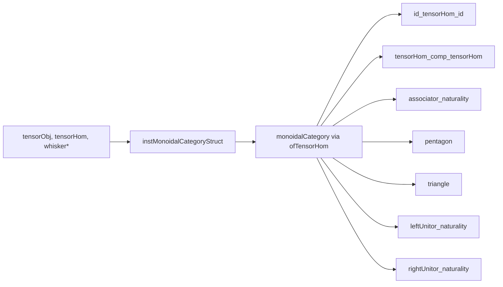

### Technical Brief: Monoidal Structure on `ModuleCat R`

---

#### **1. Key Definitions & Theorems**

| Name | Type / Signature | Purpose |
|------|------------------|---------|
| `tensorObj` | `SemimoduleCat R → SemimoduleCat R → SemimoduleCat R` | Defines tensor product of objects via `M ⊗[R] N` |
| `tensorHom` | `(f : M ⟶ N) → (g : M' ⟶ N') → tensorObj M M' ⟶ tensorObj N N'` | Defines tensor product of morphisms via `TensorProduct.map` |
| `whiskerLeft`, `whiskerRight` | `(M : _) → (f : N₁ ⟶ N₂) → tensorObj M N₁ ⟶ tensorObj M N₂`<br>`(f : M₁ ⟶ M₂) → (N : _) → tensorObj M₁ N ⟶ tensorObj M₂ N` | Left/right action of tensoring with a fixed module on morphisms |
| `associator` | `α_{M,N,K} : (M ⊗ N) ⊗ K ≅ M ⊗ (N ⊗ K)` | Associativity constraint from `TensorProduct.assoc` |
| `leftUnitor`, `rightUnitor` | `λ_M : R ⊗ M ≅ M`, `ρ_M : M ⊗ R ≅ M` | Unit constraints from `TensorProduct.lid`, `TensorProduct.rid` |
| `instMonoidalCategoryStruct` | `MonoidalCategoryStruct (SemimoduleCat R)` | Pre-structure for monoidal category |
| `monoidalCategory` | `MonoidalCategory (SemimoduleCat R)` | Full monoidal category instance (via `ofTensorHom`) |
| `tensorLift` | `(f : M₁ → M₂ → M₃)` bilinear → `M₁ ⊗ M₂ ⟶ M₃` | Universal property of tensor product |
| `tensor_ext`, `tensor_ext₃`, `tensor_ext₃'` | Extensionality lemmas for morphisms out of tensor products | Enables proof by evaluation on simple tensors |

**Theorems verifying monoidal axioms** (used in `ofTensorHom`):
- `id_tensorHom_id`, `tensorHom_comp_tensorHom`
- `associator_naturality`, `pentagon`, `triangle`
- `leftUnitor_naturality`, `rightUnitor_naturality`

**Simp lemmas** (for computation):
- `tensorHom_tmul`, `whiskerLeft_apply`, `whiskerRight_apply`
- `leftUnitor_hom_apply`, `rightUnitor_hom_apply`, `associator_hom_apply`
- Analogous lemmas for inverses

---

#### **2. Naming Conventions**

- **Prefixes**:
  - `tensor*`: operations involving tensor product (`tensorObj`, `tensorHom`, `tensorLift`)
  - `whisker*`: left/right tensoring with a fixed module (`whiskerLeft`, `whiskerRight`)
  - `*Unitor`: unitors (`leftUnitor`, `rightUnitor`)
  - `hom_*`: projections from bundled morphisms to underlying linear maps (`hom_tensorHom`, `hom_whiskerLeft`, etc.)

- **Suffixes**:
  - `_apply`: evaluation on simple tensors (`leftUnitor_hom_apply`, `associator_hom_apply`)
  - `_ext`, `_ext₃`, `_ext₃'`: extensionality lemmas for morphisms out of tensor products

- **Notation**:
  - `⊗ₘ` for `tensorHom` (i.e., `f ⊗ₘ g`)
  - `◁`, `▷` for `whiskerLeft`, `whiskerRight`
  - `λ_`, `ρ_`, `α_` for unitors and associator (category-theoretic notation)

---

#### **3. Tactic Stack**

- **`ext` / `TensorProduct.ext` / `TensorProduct.ext_threefold` / `TensorProduct.ext_fourfold`**:  
  Used to prove equality of linear maps by checking on simple / triple / quadruple tensors.

- **`rfl`**: Most simp lemmas are definitional equalities.

- **`simp` / `simp only [...]`**: To normalize expressions involving `hom`, `tensorHom`, `whisker*`, etc.

- **`erw`**: Used in `MonoidalPreadditive` instance to rewrite under binders where `rw` fails due to definitional issues.

- **`apply TensorProduct.lift` / `TensorProduct.map`**: For constructing morphisms from tensor products.

- **`hom_ext`**: To conclude equality of morphisms in `ModuleCat`/`SemimoduleCat` from equality of underlying linear maps.

---

#### **4. Proof Logic**

- **Structure**:  
  The monoidal structure is built in two layers:
  1. **`SemimoduleCat R`** (for `CommSemiring R`):  
     - Define all structure components (`tensorObj`, `tensorHom`, `whisker*`, `associator`, etc.) using `TensorProduct` API.
     - Prove naturality and coherence laws (pentagon, triangle) by evaluating on simple tensors.
     - Use `ofTensorHom` to lift to `MonoidalCategory`.

  2. **`ModuleCat R`** (for `CommRing R`):  
     - Either reuse `SemimoduleCat` via `equivalenceSemimoduleCat.functor`, or define directly.
     - Prove monoidal preadditive and monoidal linear structure using `ext` + `simp` + `erw`.

- **Common proof pattern**:
  ```lean
  ext : 1
  apply TensorProduct.ext_threefold
  intro m n k
  rfl
  ```
  This is repeated for associator naturality, pentagon, triangle, etc.

- **Extensionality**:  
  Morphisms from tensor products are equal if they agree on simple tensors (`tensor_ext`, `tensor_ext₃`, `tensor_ext₃'`).

---

#### **5. Imports**

| Import | Role |
|--------|------|
| `Mathlib.Algebra.Category.ModuleCat.Basic` | Core module category definitions |
| `Mathlib.LinearAlgebra.TensorProduct.Associator` | `TensorProduct.assoc`, `lid`, `rid`, etc. |
| `Mathlib.CategoryTheory.Monoidal.Linear` | Definitions for monoidal linear categories |
| `Mathlib.CategoryTheory.Monoidal.Transport` | For transporting structures along equivalences |

---

#### **8. Mermaid Diagrams**

##### **Dependency Graph (Top-Level)**



##### **Overview of File Structure**

```mermaid
flowchart LR
  subgraph "SemimoduleCat R"
    S1[instMonoidalCategoryStruct] --> S2[monoidalCategory]
    S2 --> S3[MonoidalCategory (SemimoduleCat R)]
  end

  subgraph "ModuleCat R"
    M1[MonoidalCategoryStruct] --> M2[monoidalCategory]
    M2 --> M3[MonoidalCategory (ModuleCat R)]
    M3 --> M4[MonoidalPreadditive]
    M3 --> M5[MonoidalLinear R]
  end

  S3 -->|via equivalence| M3
```

##### **Monoidal Axiom Verification Flow**



---

This file constructs the foundational monoidal structure on module categories using the tensor product, with heavy reliance on the `TensorProduct` API and extensionality principles. The naming and proof patterns are highly systematic, enabling reuse and formal verification of higher-level structures (e.g., closed structure, symmetry).
