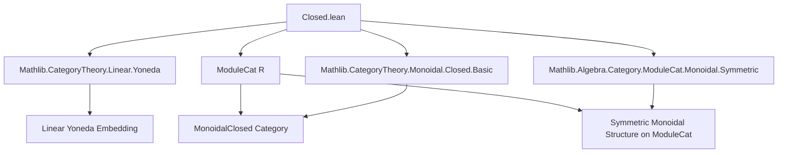

**Technical Brief: `Closed.lean` — Monoidal Closed Structure on `Module R`**

---

### 1. **Key Definitions & Theorems**

| Name | Type / Signature | Purpose |
|------|------------------|---------|
| `monoidalClosedHomEquiv` | `(M N P : ModuleCat R) → ((M ⊗ N) ⟶ P) ≃ (N ⟶ (Hom(M, -)) P)` | Auxiliary equivalence establishing the adjunction $M \otimes - \dashv \mathrm{Hom}(M, -)$; used to define the `MonoidalClosed` instance. |
| `instance MonoidalClosed` | `MonoidalClosed (ModuleCat R)` | Constructs the monoidal closed structure on `ModuleCat R`, using `monoidalClosedHomEquiv` and naturality proof. |
| `ihom` | `M : ModuleCat R → ModuleCat R ⟶ ModuleCat R` | Internal hom functor: $N \mapsto \mathrm{Hom}(M, N)$, defined via the closed structure. |
| `ihom_map_apply` | `(f : N ⟶ P) (g : M ⟶ N) → (ihom M).map f g = g ≫ f` | Describes action of internal hom on morphisms: precomposition. |
| `monoidalClosed_curry` | `(f : M ⊗ N ⟶ P) (x : M) (y : N) → (curry f y).x = f (x ⊗ₜ y)` | Currying in terms of elements: evaluation of curried map at $(x, y)$ equals $f(x \otimes y)$. |
| `monoidalClosed_uncurry` | `(f : N ⟶ M ⟶ P) (x : M) (y : N) → uncurry f (x ⊗ₜ y) = (f y).x` | Uncurrying in terms of elements: evaluation of uncurried map on simple tensor. |
| `ihom_ev_app` | `(M N : ModuleCat R) → (ev M).app N = ...` | Describes the counit of the adjunction $M \otimes - \dashv \mathrm{Hom}(M, -)$: evaluation map $M \otimes \mathrm{Hom}(M, N) \to N$. |
| `ihom_coev_app` | `(M N : ModuleCat R) → (coev M).app N = ...` | Describes the unit of the adjunction: $N \to \mathrm{Hom}(M, M \otimes N)$, $n \mapsto (m \mapsto m \otimes n)$. |
| `monoidalClosed_pre_app` | `(f : N ⟶ M) (P) → (pre f).app P = ...` | Describes precomposition action of $f : N \to M$ on internal hom: $\mathrm{Hom}(M, P) \to \mathrm{Hom}(N, P)$. |

---

### 2. **Naming Conventions**

- **Prefixes**:
  - `ihom_`: internal hom–related definitions (`ihom`, `ihom_ev`, `ihom_coev`).
  - `monoidalClosed_`: properties of the closed structure (`curry`, `uncurry`, `pre`).
- **Suffixes**:
  - `_app`: component of a natural transformation at an object (e.g., `ev M . app N`).
  - `_hom`: underlying linear map or morphism (e.g., `f.hom`, `f.hom₂`).
- **Other patterns**:
  - `ofHom`, `ofHom₂`: constructing morphisms in `ModuleCat` from linear maps.
  - `TensorProduct.mk`, `TensorProduct.lift`, `TensorProduct.uncurry`: standard tensor constructions.
  - `homLinearEquiv`: equivalence between `M ⊸ N` and `M ⊗ N`-linear maps.

---

### 3. **Tactic Stack**

- **Core tactics**:
  - `ext : 1`: extensionality on the underlying type (module underlying).
  - `apply TensorProduct.ext'`: prove equality of tensors by testing on generators.
  - `intro m n`: introduce elements for tensor product extensionality.
  - `rfl`: definitional equality (used heavily for `ihom_map_apply`, `ihom_coev_app`, etc.).
  - `solve_by_elim`: used in `left_inv` of `monoidalClosedHomEquiv`.
  - `rw [← MonoidalClosed.uncurry_id_eq_ev]`: rewriting using known lemmas.
  - `apply monoidalClosed_uncurry`: to reduce to elementwise computation.

---

### 4. **Proof Logic**

- **Structure of proofs**:
  - **Elementwise reasoning**: Most proofs reduce to checking equality on simple tensors $x \otimes y$, using `TensorProduct.ext'`.
  - **Definitional simplification**: Many theorems (`ihom_map_apply`, `ihom_coev_app`, `monoidalClosed_curry`, etc.) are *definitionally* true (`rfl`), reflecting careful design of `ihom` and adjunction components.
  - **Naturality**: Proved by `ext : 1` + `TensorProduct.ext'`, followed by element-wise verification (`intro m n`, `rfl`).
  - **Adjointness**: The `MonoidalClosed` instance is built via `Adjunction.mkOfHomEquiv`, requiring only a hom-equivalence and naturality in both arguments (only `naturality_left_symm` is nontrivial, but still solved elementwise).

---

### 5. **Imports**

| Import | Purpose |
|--------|---------|
| `Mathlib.CategoryTheory.Monoidal.Closed.Basic` | General theory of monoidal closed categories (adjunctions, internal hom, curry/uncurry). |
| `Mathlib.CategoryTheory.Linear.Yoneda` | Linear Yoneda embedding (`linearCoyoneda`), used to define internal hom as a right adjoint. |
| `Mathlib.Algebra.Category.ModuleCat.Monoidal.Symmetric` | Symmetric monoidal structure on `ModuleCat R`, including tensor product and braiding `β_`. |

---

### 8. **Mermaid Diagrams**

#### **Dependency Graph (Top-Level)**



#### **Overview of Theory Flow**

```mermaid
flowchart LR
  subgraph Setup
    G[CommRing R] --> H[ModuleCat R]
    H --> I[Monoidal Structure ⊗]
    H --> J[Braiding β]
  end

  subgraph Construction
    K[linearCoyoneda R] --> L[Right Adjoint: Hom(M, -)]
    M[monoidalClosedHomEquiv] --> N[Adjunction M ⊗ - ⊣ Hom(M, -)]
    N --> O[MonoidalClosed Instance]
  end

  subgraph Consequences
    O --> P[ihom Functor]
    O --> Q[ev, coev Natural Transformations]
    P --> R[Curry/Uncurry Isomorphisms]
  end

  Setup --> Construction --> Consequences
```

---

**Summary**: This file constructs the canonical monoidal closed structure on the category of modules over a commutative ring $R$, leveraging the linear Yoneda embedding to define internal homs and verifying all adjunction data elementwise via tensor product extensionality. The proofs are highly uniform: reduce to simple tensors, then use definitional equalities or bilinearity.
