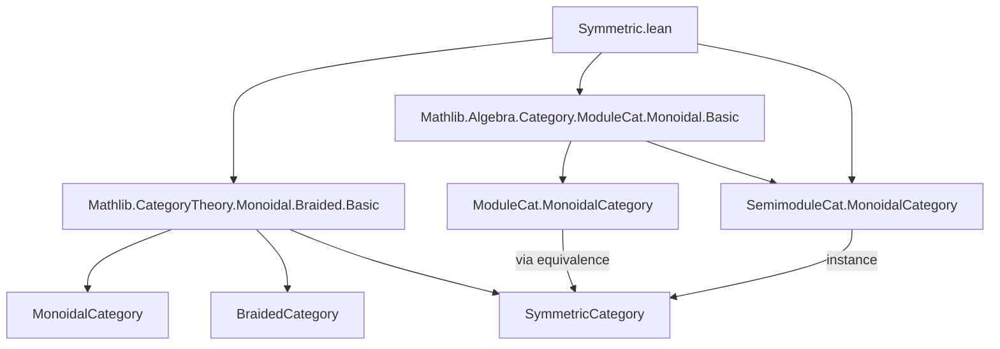
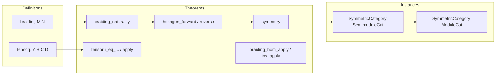

**Technical Brief: Symmetric Monoidal Structure on Modules**

---

### 1. **Key Definitions & Theorems**

| Name | Type / Purpose |
|------|----------------|
| `braiding` | `M ⊗ N ≅ N ⊗ M` — the canonical symmetry isomorphism for tensor product of semimodules, defined via `TensorProduct.comm`. |
| `symmetricCategory` (for `SemimoduleCat`) | Instance of `SymmetricCategory (SemimoduleCat R)` — constructs the symmetric monoidal structure using `braiding` and verifies axioms (naturality, hexagon, symmetry). |
| `symmetricCategory` (for `ModuleCat`) | Instance of `SymmetricCategory (ModuleCat R)` — transferred from `SemimoduleCat` via the faithful functor `equivalenceSemimoduleCat.functor`. |
| `braiding_naturality` | Naturality of braiding in both arguments: $(f \otimes g) \circ \beta_{X_1,Y_1} = \beta_{X_2,Y_2} \circ (g \otimes f)$. |
| `braiding_naturality_left` / `right` | Special cases of naturality when one morphism is identity (using left/right tensor actions). |
| `hexagon_forward` / `hexagon_reverse` | Hexagon identities required for braided monoidal categories; verified elementwise using `TensorProduct.ext_threefold`. |
| `symmetry` | Proof that $\beta_{M,N} = \beta_{N,M}^{-1}$ — uses `TensorProduct.ext'`. |
| `tensorμ_eq_tensorTensorTensorComm` | Identification of the associator component `tensorμ` with the commutativity isomorphism on 4-fold tensors. |
| `tensorμ_apply` | Explicit action of `tensorμ`: $(x \otimes y) \otimes (z \otimes w) \mapsto (x \otimes z) \otimes (y \otimes w)$. |
| `braiding_hom_apply` / `inv_apply` | Action of braiding isomorphisms on simple tensors: $m \otimes n \mapsto n \otimes m$ (and vice versa). |

---

### 2. **Naming Conventions**

- **Prefixes**:
  - `braiding_`: properties of the symmetry isomorphism (`braiding_naturality`, `hexagon_*`, `symmetry`).
  - `tensorμ_`: properties of the tensor multiplication isomorphism (`tensorμ_eq_...`, `tensorμ_apply`).
  - `*_apply`: elementwise action of morphisms (e.g., `braiding_hom_apply`).
- **Suffixes**:
  - `_hom` / `_inv`: hom/inverse components of isomorphisms.
  - `_left` / `_right`: directional naturality variants.
  - `_forward` / `_reverse`: forward/backward hexagon identities.

---

### 3. **Tactic Stack**

- **`ext` / `ext : 1`**: Element-wise extensionality for module/homomorphism equality.
- **`apply TensorProduct.ext'` / `TensorProduct.ext_threefold`**: Prove equality of linear maps by checking simple / triple tensors.
- **`rfl`**: Trivial equalities (e.g., definition of braiding on simple tensors).
- **`simp_rw [← id_tensorHom]`**: Rewriting using tensor-hom adjunction identities.
- **`cancel_epi`**: Cancellation of epimorphisms (used in `hexagon_reverse`).
- **`aesop`**: Automated reasoning (used in `symmetry` proof after porting note).
- **`LinearMap.ext₂` / `SemimoduleCat.hom_ext` / `ModuleCat.hom_ext`**: Extensionality for module homs.

---

### 4. **Proof Logic**

- **Structure**:
  1. Define `braiding` via `TensorProduct.comm`.
  2. Prove naturality (full and left/right variants) by reducing to tensor product extensionality.
  3. Verify hexagon identities by checking on triple tensors.
  4. Prove symmetry ($\beta_{M,N} = \beta_{N,M}^{-1}$) using extensionality.
  5. Assemble into `SymmetricCategory` instance.
  6. Transfer to `ModuleCat` via `ofFaithful` using the equivalence with `SemimoduleCat` (for `CommRing R`).

- **Common pattern**:
  - Use `ext : 1` to reduce to simple tensors.
  - Apply `TensorProduct.ext'` or `TensorProduct.ext_threefold`.
  - Conclude with `rfl` or `LinearMap.ext₂`.

---

### 5. **Imports & Dependencies**

| Module | Role |
|--------|------|
| `Mathlib.CategoryTheory.Monoidal.Braided.Basic` | Provides `SymmetricCategory`, `BraidedCategory`, hexagon/naturality axioms. |
| `Mathlib.Algebra.Category.ModuleCat.Monoidal.Basic` | Defines monoidal structure on `ModuleCat` (tensor product, associator, unitors). |
| `TensorProduct` (implicit) | Core algebraic object; used for `comm`, `ext`, `ext_threefold`, etc. |
| `SemimoduleCat` / `ModuleCat` | Base categories; `SemimoduleCat` for `CommSemiring`, `ModuleCat` for `CommRing`. |
| `equivalenceSemimoduleCat` | Equivalence between `SemimoduleCat R` and `ModuleCat R` when $R$ is a ring. |

---

### 6. **Mermaid Diagrams**

#### Dependency Graph (Top-Level)

#### Overview of File Structure

---

### 7. **Domain-Specific AI Agent Notes**

- **Focus**: Formal verification of monoidal category theory in algebraic settings.
- **Key lemmas to surface**: `braiding_hom_apply`, `hexagon_forward`, `symmetry`, `tensorμ_apply`.
- **Common proof patterns**: `ext` + `TensorProduct.ext` + `rfl`.
- **Critical dependencies**: `TensorProduct`, `SemimoduleCat`, `BraidedCategory`.
- **Edge cases**: Distinguish `CommSemiring` (semimodules) vs `CommRing` (modules); use `equivalenceSemimoduleCat` for transfer.

--- 

Let me know if you'd like a formalized summary in Lean 4 or a visualization of the `SymmetricCategory` instance construction.
