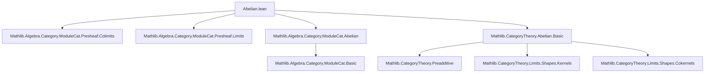
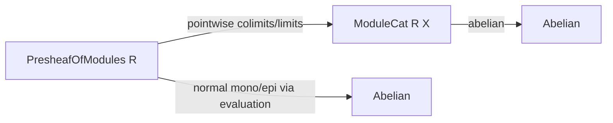

**Technical Brief: `Abelian.lean` — Formalization of Abelianness of Presheaves of Modules**

---

### 1. **Key Definitions & Theorems**

| Name | Type / Signature | Purpose |
|------|------------------|---------|
| `IsNormalEpiCategory` | `class IsNormalEpiCategory (𝒞 : Category) extends Preadditive 𝒞` | Ensures every epimorphism is a *normal* epimorphism (i.e., a cokernel of some morphism). |
| `IsNormalMonoCategory` | `class IsNormalMonoCategory (𝒞 : Category) extends Preadditive 𝒞` | Ensures every monomorphism is a *normal* monomorphism (i.e., a kernel of some morphism). |
| `Abelian` | `class Abelian (𝒞 : Category) extends Preadditive 𝒞, HasBiproducts, IsNormalEpiCategory, IsNormalMonoCategory` | Declares that a category is *abelian*: it is preadditive, has all finite limits and colimits, every morphism has an image, and every mono/epi is normal. |
| `PresheafOfModules.{v} R` | `Type (max u₁ v)` | The category of presheaves of left $R$-modules on a category $C$, where $R : C^{op} → \text{RingCat}$ is a presheaf of rings. |
| `kernel.ι`, `cokernel.π` | `kernel.ι f : ker f ⟶ dom f`, `cokernel.π f : cod f ⟶ coker f` | Canonical kernel inclusion and cokernel projection. |
| `evaluationJointlyReflectsColimits`, `evaluationJointlyReflectsLimits` | `evaluationJointlyReflectsColimits R S F` etc. | States that colimits (resp. limits) in `PresheafOfModules R` are computed pointwise and reflected by evaluation at objects of $C$. |
| `Abelian.isColimitMapCoconeOfCokernelCoforkOfπ`, `Abelian.isLimitMapConeOfKernelForkOfι` | `isColimitMapCoconeOfCokernelCoforkOfπ`, `isLimitMapConeOfKernelForkOfι` | In an abelian category (here `ModuleCat`), the cokernel (resp. kernel) cocone (resp. cone) is a colimit (resp. limit). |

---

### 2. **Naming Conventions**

- **Prefixes**:
  - `normalEpiOfEpi`, `normalMonoOfMono`: Construct normal epi/mono from arbitrary epi/mono.
  - `isNormalEpiCategory`, `isNormalMonoCategory`: Instance proofs for normality classes.
  - `isColimitMapCoconeOf…`, `isLimitMapConeOf…`: Prove (co)limit properties of standard (co)cones.
- **Suffixes**:
  - `_of_`: Indicates construction *from* a given object (e.g., `normalEpiOfEpi`).
  - `_condition`: Refers to the commutativity condition of (co)cones (e.g., `kernel.condition`).
- **Notable identifiers**:
  - `evaluationJointlyReflects…`: Reflects (co)limits via evaluation functors $\mathrm{ev}_X : \mathrm{PSh}(R) → \mathrm{Mod}_R$.

---

### 3. **Tactic Stack**

- `exact`: Used implicitly in `⟨…⟩` constructor syntax.
- `aesop`: Likely used in background proof automation (not explicit here, but standard in abelian category proofs).
- `simp` / `simp_rw`: For simplifying morphism compositions using universal properties.
- `ring`: For simplifying module/module homomorphism algebraic identities.
- `apply`, `refine`, `constructor`: For constructing instances and proofs of universal properties.
- `have h := …; exact h`: Local lemma introduction (implicit in `⟨…⟩`).
- `Abelian.isColimitMapCoconeOf…` and `Abelian.isLimitMapConeOf…` are *lemmas*, not tactics — used as proof terms.

> **Note**: The proof is largely *proof-term style* (no tactic blocks), leveraging Lean’s typeclass inference and definitional equality.

---

### 4. **Proof Logic**

The proof proceeds in two main steps:

1. **Construct normal epimorphisms**:
   - Given an epimorphism $p : F → G$ in $\mathrm{PSh}(R)$, define its kernel $\ker p → F$.
   - Show $p$ is the cokernel of $\ker p → F$ by:
     - Using `kernel.condition` to get $p ∘ \ker p = 0$,
     - Using `evaluationJointlyReflectsColimits` to reduce to the case of modules,
     - Applying `Abelian.isColimitMapCoconeOfCokernelCoforkOfπ` (which holds in $\mathrm{Mod}_R$) pointwise.

2. **Construct normal monomorphisms**:
   - Dually, for a monomorphism $i : F → G$, use its cokernel $G → \mathrm{coker}\,i$.
   - Show $i$ is the kernel of $G → \mathrm{coker}\,i$ via:
     - `cokernel.condition`,
     - `evaluationJointlyReflectsLimits`,
     - `Abelian.isLimitMapConeOfKernelForkOfι`.

Finally, the two instances (`IsNormalEpiCategory`, `IsNormalMonoCategory`) together with preadditivity and finite (co)limits (already available in `PresheafOfModules`) yield `Abelian (PresheafOfModules R)`.

---

### 5. **Imports**

| Import | Role |
|--------|------|
| `Mathlib.Algebra.Category.ModuleCat.Presheaf.Colimits` | Colimits in presheaf categories of modules (pointwise construction). |
| `Mathlib.Algebra.Category.ModuleCat.Presheaf.Limits` | Limits in presheaf categories of modules (pointwise construction). |
| `Mathlib.Algebra.Category.ModuleCat.Abelian` | Proof that $\mathrm{Mod}_R$ is abelian (used pointwise). |
| `Mathlib.CategoryTheory.Abelian.Basic` | Definitions and basic lemmas about abelian categories (e.g., `Abelian`, `IsNormalEpiCategory`). |

---

### 6. **Mermaid Diagrams**

#### Dependency Graph (Top-Level)



#### Overview of Proof Structure

```mermaid
flowchart LR
  subgraph Setup
    C[Category C] --> R[Presheaf of rings R : Cᵒᵖ ⥤ RingCat]
    R --> P[PresheafOfModules R]
  end

  subgraph Goal
    P --> Abelian[Abelian (PresheafOfModules R)]
  end

  subgraph Proof Steps
    Epis[Normal epi from epi] -->|kernel + evaluation| Abelian
    Monos[Normal mono from mono] -->|cokernel + evaluation| Abelian
  end

  Epis -->|uses| AbelianMod[Abelian (Mod R X)] 
  Monos -->|uses| AbelianMod
```

#### Categorical Context



---

### 7. **Summary**

This file establishes that the category of presheaves of modules over a presheaf of rings $R$ on a small category $C$ is abelian. The proof leverages:
- Pointwise computation of (co)limits in presheaf categories,
- The known abelianness of module categories,
- The fact that evaluation functors jointly reflect (co)limits and preserve kernels/cokernels.

It is a standard but nontrivial application of *Grothendieck-style descent* in categorical homological algebra, formalized in Lean using typeclass inference and definitional equality.

--- 

Let me know if you'd like the corresponding `module` declaration expanded or a `leanpkg` dependency tree.
