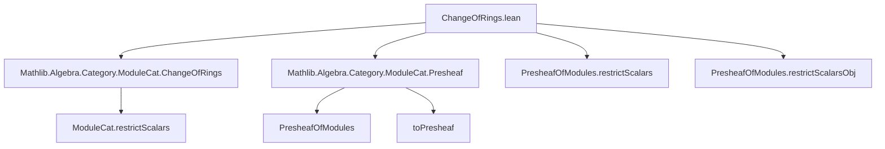
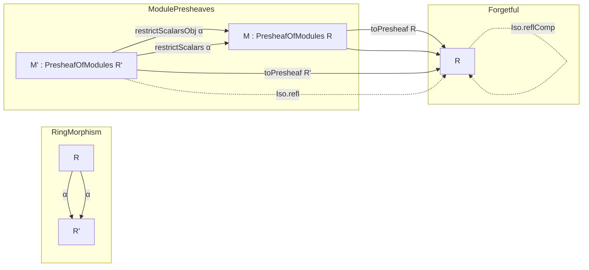

**Technical Brief: `ChangeOfRings.lean` (Mathlib4)**  
*Domain: Category Theory, Sheaf Theory, Module Categories*  
*Author: Joël Riou (2024)*  
*License: Apache 2.0*

---

### 1. KEY DEFINITIONS & THEOREMS

| Name | Type | Purpose |
|------|------|---------|
| `restrictScalarsObj` | `(M' : PresheafOfModules R') → (α : R ⟶ R') → PresheafOfModules R` | Defines the object-level action of restriction of scalars: for each object `X`, takes the underlying abelian group/module of `M' X` and views it as an `R X`-module via `α.app X`. |
| `restrictScalars` | `(α : R ⟶ R') → PresheafOfModules R' ⥤ PresheafOfModules R` | The functorial restriction of scalars: sends a presheaf of `R'`-modules to a presheaf of `R`-modules, and a morphism of such presheaves to the same underlying natural transformation (now of `R`-modules). |
| `restrictScalarsCompToPresheaf` | `restrictScalars α ⋙ toPresheaf R ≅ toPresheaf R'` | States that composing restriction of scalars with the forgetful functor `toPresheaf R` recovers `toPresheaf R'` *up to equality* (here implemented as `Iso.refl _`, i.e., definitional equality). |

> **Note**: The `toPresheaf` functors are the forgetful functors `PresheafOfModules R ⥤ PresheafOfAbelianGroups` (or equivalently `Cᵒᵖ ⥤ Ab`), used to compare modules over different base rings.

---

### 2. NAMING CONVENTIONS

- **Prefixes**:
  - `restrictScalars*`: for constructions related to restriction of scalars.
  - `toPresheaf`: for the forgetful functor from presheaves of modules to presheaves of abelian groups.
- **Suffixes**:
  - `Obj`: for object-level definitions (e.g., `restrictScalarsObj`).
  - No explicit suffix for functors (`restrictScalars` is the full functor).
- **Module-theoretic terms**:
  - `ModuleCat.restrictScalars`: imported from `Mathlib.Algebra.Category.ModuleCat.ChangeOfRings`, used internally.
  - `map_smul'`, `map_add'`: standard module homomorphism properties.

---

### 3. TACTIC STACK

| Tactic | Usage |
|--------|-------|
| `ext` | To prove equality of natural transformations or morphisms of presheaves (by extensionality). |
| `rw`, `rfl`, `trans` | Rewriting using naturality, module axioms, and definitional equalities. |
| `dsimp` | Simplifying dependent types (e.g., after applying `congrArg`). |
| `congrArg`, `RingHom.congr_fun` | To extract pointwise equalities from ring homomorphism naturality. |
| `exact`, `intro`, `apply` | Basic proof scripting. |
| `inferInstanceAs` | For instance resolution (e.g., `Full`, `Faithful`). |

No heavy automation (`aesop`, `ring`, `simp`) is used — proofs are mostly manual and rely on careful unfolding of definitions.

---

### 4. PROOF LOGIC

- **Structure of `restrictScalarsObj.map`**:
  - Define the underlying function as `M'.map f`.
  - Prove additivity (`map_add'`) by inheriting from `M'`.
  - Prove `R$-linearity (`map_smul'`) using:
    - naturality of `α` (i.e., `α.app Y ∘ R.map f = R'.map f ∘ α.app X`),
    - module compatibility in `M'` (`M'.map_smul`), and
    - `RingHom.congr_fun` to evaluate at `r : R X`.

- **Functoriality of `restrictScalars`**:
  - `obj` uses `restrictScalarsObj`.
  - `map` reuses the underlying natural transformation, checking naturality via `naturality_apply`.

- **Instances**:
  - `Additive`: follows from `ModuleCat.restrictScalars` being additive.
  - `Faithful`: proven via injectivity of `toPresheaf` on morphisms.
  - `Full`: only for identity morphism (via `inferInstanceAs (𝟭 _).Full`).

- **Isomorphism `restrictScalarsCompToPresheaf`**:
  - Implemented as `Iso.refl _`, indicating that the composite is *definitionally* equal to `toPresheaf R'`. This suggests the underlying type-level equality holds by definition (no homotopy or coherence needed).

---

### 5. IMPORTS & DEPENDENCIES

| Import | Role |
|--------|------|
| `Mathlib.Algebra.Category.ModuleCat.ChangeOfRings` | Provides `ModuleCat.restrictScalars`, the 1-categorical restriction of scalars for modules over rings. |
| `Mathlib.Algebra.Category.ModuleCat.Presheaf` | Defines `PresheafOfModules`, `toPresheaf`, and basic categorical structure. |

> **Core dependencies**: `CategoryTheory`, `RingCat`, `ModuleCat`, presheaf machinery.

---

### 6. MERMAID DIAGRAMS

#### Dependency Graph (Module-Level)

#### Overview of Theory Flow

> **Interpretation**: For any ring morphism `α : R → R'` (natural transformation of presheaves of rings), restriction of scalars pulls back `R'`-modules to `R`-modules *presheaf-wise*. The forgetful functors commute *on the nose* with this construction.

---

### 7. REMARKS & TODOs

- **Commented TODO** (line 37–39):  
  > `-- TODO: after https://github.com/leanprover-community/mathlib4/pull/19511 we need to hint (X := ...) and (Y := ...)`.  
  > `-- This suggests restrictScalars needs to be redesigned.`  
  → Indicates future refactoring to improve typeclass inference or dependent type handling.

- **Definitional equality**: The isomorphism `restrictScalarsCompToPresheaf` is `Iso.refl`, meaning the composite `restrictScalars α ⋙ toPresheaf R` is *definitionally equal* to `toPresheaf R'`. This is a design choice to avoid coherence issues.

- **No left/right adjoints discussed**: This file only defines restriction of scalars; extension of scalars (left adjoint) would require additional assumptions (e.g., colimits, flatness).

--- 

Let me know if you'd like a formalization of the *left adjoint* (extension of scalars) or a comparison with the global sections functor.
