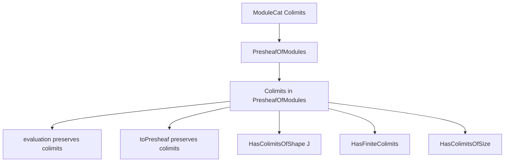
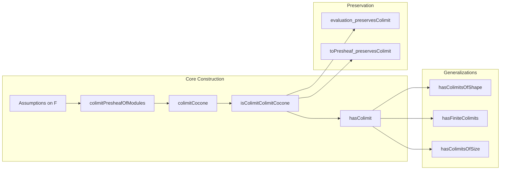

### Technical Brief: Colimits in `PresheafOfModules`

---

#### **1. Key Definitions & Theorems**

| Name | Type / Signature | Purpose |
|------|------------------|---------|
| `evaluationJointlyReflectsColimits` | `∀ c : Cocone F, (∀ X, IsColimit ((evaluation R X).mapCocone c)) → IsColimit c` | Shows that a cocone in `PresheafOfModules R` is colimiting iff all its evaluations at objects `X : Cᵒᵖ` are colimiting in `ModuleCat`. |
| `colimitPresheafOfModules` | `PresheafOfModules R` | Constructs the colimit presheaf by taking colimits objectwise in module categories. |
| `colimitCocone` | `Cocone F` | The canonical cocone over `F` whose apex is `colimitPresheafOfModules F`. |
| `isColimitColimitCocone` | `IsColimit (colimitCocone F)` | Proves that `colimitCocone F` is indeed a colimit cocone. |
| `hasColimit` | `HasColimit F` | Instance asserting existence of colimits in `PresheafOfModules R`. |
| `evaluation_preservesColimit` | `PreservesColimit F (evaluation R X)` | Shows that evaluation at any `X` preserves colimits of `F`. |
| `toPresheaf_preservesColimit` | `PreservesColimit F (toPresheaf R)` | Shows that the forgetful functor to presheaves of abelian groups preserves colimits. |
| `hasColimitsOfShape` | `HasColimitsOfShape J (PresheafOfModules R)` | Generalizes colimit existence to diagrams of shape `J`. |
| `hasFiniteColimits` | `HasFiniteColimits (PresheafOfModules R)` | Special case for finite diagrams. |
| `hasColimitsOfSize` | `HasColimitsOfSize.{v₂, u₂} (PresheafOfModules R)` | Colimit existence relative to universe sizes. |

---

#### **2. Naming Conventions**

- **Prefixes**:
  - `evaluation_`: Relates to evaluation functors `evaluation R X : PresheafOfModules R ⥤ ModuleCat (R.obj X)`
  - `colimit_`: Refers to constructions involving colimits (e.g., `colimitPresheafOfModules`, `colimitCocone`)
  - `preserves_`: Indicates preservation of colimits (e.g., `preservesColimit`, `preservesFiniteColimits`)
  - `has_`: Instance names asserting existence (e.g., `hasColimit`, `hasFiniteColimits`)
- **Suffixes**:
  - `_Cocone`: Denotes cocones (e.g., `colimitCocone`)
  - `_PresheafOfModules`: Specifies constructions in the category of presheaves of modules
  - `_App`, `_inv`, `_assoc`: Used in manipulation of natural transformations and morphism components

---

#### **3. Tactic Stack**

Frequent tactics used in proofs:
- `ext1 X`: Extensionality for natural transformations / morphisms of presheaves.
- `rw [...]`: Rewriting using lemmas like `ι_colimMap_assoc`, `ι_preservesColimitIso_inv`, etc.
- `dsimp`, `simp only [...]`: Simplification with definitional equalities and known lemmas.
- `erw [...]`: Eager rewriting for equations involving type-theoretic issues (e.g., `Functor.assoc`).
- `rfl`: Reflexivity for definitional equalities.
- `simpa using ...`: To discharge goals using a given hypothesis.
- `apply ...`: For applying lemmas like `isColimitOfPreserves`, `preservesColimit_of_preserves_colimit_cocone`.

---

#### **4. Proof Logic**

The logical flow follows a standard pattern for constructing colimits in functor categories:

1. **Objectwise Colimits**: Assume colimits exist in each `ModuleCat (R.obj X)` and that restriction scalars preserve them.
2. **Construct Candidate Colimit**:
   - Define `colimitPresheafOfModules F` objectwise as `colimit (F ⋙ evaluation R X)`.
   - Define action on morphisms using `colimMap` and `preservesColimitIso`.
3. **Verify Functoriality**:
   - Prove `map_id` and `map_comp` using properties of colimit morphisms and naturality.
4. **Define Cocone**:
   - Use colimit injections `ι` to define the cocone structure.
5. **Prove Colimit Property**:
   - Show that the cocone is colimiting by showing all evaluations are colimiting (via `evaluationJointlyReflectsColimits`).
6. **Preservation Properties**:
   - Derive that evaluation and `toPresheaf` preserve colimits using the universal property.
7. **Generalize**:
   - Extend to colimits of shape `J`, finite colimits, and colimits of a given size.

---

#### **5. Imports**

- `Mathlib.Algebra.Category.ModuleCat.Presheaf`: Defines `PresheafOfModules R`.
- `Mathlib.Algebra.Category.ModuleCat.Colimits`: Provides foundational results about colimits in module categories.

---

#### **6. Mermaid Diagrams**

##### **Dependency Graph (High-Level)**

##### **Overview of File Structure**

---

#### **7. Summary**

This file establishes that the category of presheaves of modules over a ring-valued presheaf of rings `R : Cᵒᵖ ⥤ RingCat` has all colimits (under mild assumptions), and that these colimits can be computed objectwise. It leverages the fact that colimits in functor categories can be constructed pointwise, and that the evaluation functors jointly reflect colimits. The results are then generalized to colimits of arbitrary shapes, finite colimits, and colimits of a given size. The formalization is typical of modern Lean category theory: heavy use of `simps`, `rw`, and `erw` to manage coherence and naturality.
