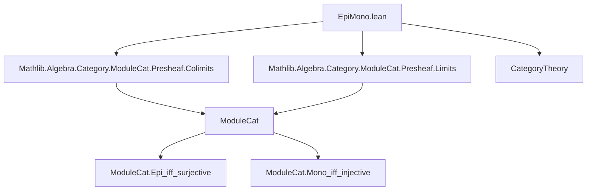
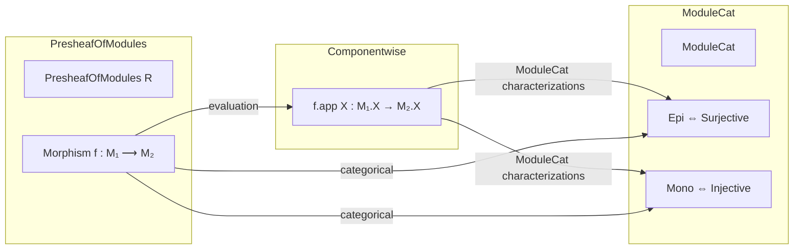

**Technical Brief: `EpiMono.lean` — Epimorphisms and Monomorphisms in `PresheafOfModules`**

---

### 1. **Key Definitions & Theorems**

| Name | Type / Signature | Purpose |
|------|------------------|---------|
| `epi_of_surjective` | `(hf : ∀ ⦃X⦄, Function.Surjective (f.app X)) → Epi f` | Shows that a natural transformation between presheaves of modules is an epimorphism if all its components are surjective module homomorphisms. |
| `mono_of_injective` | `(hf : ∀ ⦃X⦄, Function.Injective (f.app X)) → Mono f` | Shows that a natural transformation is a monomorphism if all its components are injective. |
| `instance [Epi f] (X)` | `Epi (f.app X)` | Lifts the categorical epimorphism property of `f` to each component `f.app X`. |
| `instance [Mono f] (X)` | `Mono (f.app X)` | Lifts the categorical monomorphism property of `f` to each component. |
| `surjective_of_epi` | `[Epi f] → ∀ ⦃X⦄, Function.Surjective (f.app X)` | Converse direction: if `f` is categorical epi, then each component is surjective. |
| `injective_of_mono` | `[Mono f] → ∀ ⦃X⦄, Function.Injective (f.app X)` | Converse direction: if `f` is categorical mono, then each component is injective. |
| `epi_iff_surjective` | `Epi f ↔ ∀ ⦃X⦄, Function.Surjective (f.app X)` | Full equivalence: categorical epi ⇔ pointwise surjective. |
| `mono_iff_surjective` *(typo in name)* | `Mono f ↔ ∀ ⦃X⦄, Function.Injective (f.app X)` | Full equivalence: categorical mono ⇔ pointwise injective. *(Note: name should be `mono_iff_injective`)* |

---

### 2. **Naming Conventions**

- **Prefixes**:
  - `epi_`, `mono_`: indicate categorical epimorphism/monomorphism properties.
  - `surjective_of_`, `injective_of_`: derive pointwise algebraic properties from categorical ones.
  - `of_`: derive categorical property from pointwise algebraic condition (e.g., `epi_of_surjective`).
- **Suffixes**:
  - `_iff_`: equivalence statements.
  - `_app X`: refers to component at object `X`.
- **Consistency**: All lemmas use `f.app X` for evaluation at `X : Cᵒᵖ`.

---

### 3. **Tactic Stack**

- `ext`: extensionality (for natural transformations / functions).
- `obtain ⟨m₁, rfl⟩ := hf m₂`: destruct surjectivity hypothesis.
- `congr_fun`: apply congruence to function application.
- `rw [← ModuleCat.epi_iff_surjective]`: rewrite using known equivalence in `ModuleCat`.
- `infer_instance`: use typeclass inference to fill `Epi`/`Mono` instances.
- `exact`: finish proof with direct evidence.

No heavy automation (`aesop`, `ring`, `simp_rw`) is used—proofs are mostly structural and rely on module-categorical characterizations.

---

### 4. **Proof Logic**

- **Structure**: Two-directional equivalences are proven by:
  1. Showing *pointwise* algebraic condition ⇒ categorical property (`epi_of_surjective`, `mono_of_injective`).
  2. Showing categorical property ⇒ *pointwise* algebraic condition (`surjective_of_epi`, `injective_of_mono`), using known characterizations in `ModuleCat`.
- **Core reasoning**:
  - For `epi_of_surjective`: Use surjectivity to lift a target section `m₂` to `m₁`, then apply naturality + evaluation functor to reduce to equality in `ModuleCat`.
  - For `mono_of_injective`: Use injectivity to cancel inputs after applying naturality.
  - Instances use `inferInstanceAs` to lift categorical properties via evaluation functors.
- **No induction or case analysis**—proofs are pointwise and rely on universal properties of the forgetful functor `PresheafOfModules R ⥤ (Cᵒᵖ ⥤ ModuleCat)`.

---

### 5. **Imports**

| Import | Role |
|--------|------|
| `Mathlib.Algebra.Category.ModuleCat.Presheaf.Colimits` | Provides colimits in presheaf category of modules (used implicitly via `ModuleCat` structure). |
| `Mathlib.Algebra.Category.ModuleCat.Presheaf.Limits` | Provides limits (again, background for categorical structure). |
| `CategoryTheory` | Core category theory (natural transformations, evaluation, functors, `Epi`, `Mono`). |
| `ModuleCat` | Used via `ModuleCat.epi_iff_surjective`, `ModuleCat.mono_iff_injective`. |

> **Note**: The file assumes `PresheafOfModules R` is a concrete category over `Cᵒᵖ ⥤ ModuleCat`, with the forgetful functor `evaluation R X ⋙ forget _` extracting the module at `X`.

---

### 6. **Mermaid Diagrams**

#### Dependency Graph (Module-Level)



#### Overview of Theory Flow



#### Proof Strategy Flow (for `epi_iff_surjective`)

```mermaid
graph TD
  start[Epi f] --> surj[∀X, Surj(f.app X)]
  surj --> epi_of_surj[Epi f]
  surj --> surj_of_epi[Epi f ⇒ Surj(f.app X)]
  epi_of_surj & surj_of_epi --> iff[↔]
```

---

### 7. **Corrections & Notes**

- **Typo**: `mono_iff_surjective` should be `mono_iff_injective`.
- **Assumption**: The universe parameters `v v₁ u₁ u` are declared but not all used explicitly—likely for generality across large/small categories.
- **Key Insight**: The forgetful functor `PresheafOfModules R ⥤ Cᵒᵖ ⥤ ModuleCat` creates limits/colimits and reflects monos/epis, enabling pointwise characterizations.

--- 

Let me know if you'd like a formalization checklist or a plan for extending this to sheaves of modules.
