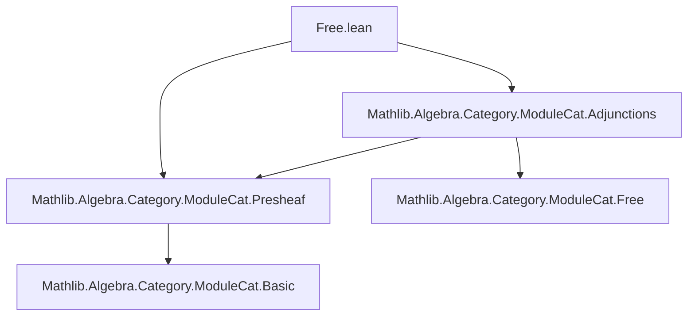

### Technical Brief: `Free.lean` — Free Presheaf of Modules

---

#### **1. Key Definitions & Theorems**

| Name | Type / Signature | Purpose |
|------|------------------|---------|
| `freeObj` | `F : Cᵒᵖ ⥤ Type u` ↦ `PresheafOfModules.{u} R` | Constructs the presheaf of free modules over `R`, assigning to each object `X` the free `R(X)`-module on `F(X)`. |
| `free` | `(Cᵒᵖ ⥤ Type u) ⥤ PresheafOfModules.{u} R` | The functorial extension of `freeObj`, sending morphisms of presheaves of types to morphisms of presheaves of modules via module extension of scalars. |
| `freeObjDesc` | `φ : F ⟶ G.presheaf ⋙ forget _` ↦ `freeObj F ⟶ G` | Universal property: the unique morphism of presheaves of modules induced by a morphism of underlying presheaves of types. |
| `freeAdjunctionUnit` | `F ⟶ (freeObj F).presheaf ⋙ forget _` | Unit of the adjunction: sends each section `x` to the formal generator `freeMk x`. |
| `freeHomEquiv` | `(freeObj F ⟶ G) ≃ (F ⟶ G.presheaf ⋙ forget _)` | Hom-set bijection expressing the adjunction; explicitly constructs forward and inverse maps. |
| `free_hom_ext` | Extensionality lemma for morphisms out of `freeObj F`. | If two maps agree after precomposing with the unit, they are equal. |
| `freeAdjunction` | `free.{u} R ⊣ toPresheaf R ⋙ forget` | Main theorem: `free` is left adjoint to the forgetful functor from `R`-module presheaves to presheaves of sets. |
| `freeAdjunction_homEquiv`, `freeAdjunction_unit_app` | `[simp]` lemmas | Simplification lemmas for the adjunction data. |

---

#### **2. Naming Conventions**

- **Prefixes**:
  - `freeObj`, `free`: core constructions.
  - `freeObjDesc`, `freeAdjunctionUnit`, `freeHomEquiv`: universal property / adjunction components.
- **Suffixes**:
  - `Obj`: object-level construction (presheaf of modules).
  - `Desc`: descent / universal property (module hom from free module).
  - `Adjunction`: adjunction-related data (unit, equivalence).
- **`_app` suffix**: used for components of natural transformations at objects (e.g., `unit.app`, `app X`).
- **`_naturality`**: proofs of naturality conditions.

---

#### **3. Tactic Stack**

| Tactic | Usage Frequency | Role |
|--------|-----------------|------|
| `aesop` | Low | Used in `map_id` proof for `freeObj`. |
| `simp` / `simp only` | High | Simplifying hom-components, naturality squares, and unit definitions. |
| `ext` | High | Extensionality for functions, natural transformations, module homs. |
| `dsimp` | Medium | Simplifying definitions before `ext`. |
| `simpa` | Medium | Simplifying using assumptions (e.g., naturality of `φ`). |
| `rfl` | Low | Reflexivity proofs (e.g., `freeAdjunction_unit_app`). |
| `funext` (implicit via `ext`) | Medium | Proving equality of functions/natural transformations. |

---

#### **4. Proof Logic**

- **Structure**: All proofs follow a *concrete, component-wise* style:
  1. **Define object and morphism parts explicitly** (e.g., `obj X`, `app X`).
  2. **Prove functoriality / naturality** by:
     - Introducing variables (`ext x`, `ext f`).
     - Unfolding definitions (`dsimp`).
     - Applying known naturality or module properties (`simp [presheaf]`, `simp [FunctorToTypes.naturality]`).
  3. **Adjointness** is established via:
     - Constructing a natural bijection (`freeHomEquiv`).
     - Verifying naturality of the bijection using `free_hom_ext`.
     - Invoking `Adjunction.mkOfHomEquiv`.

- **Induction**: Not used — all constructions are *pointwise* and rely on the universal property of free modules.

- **Key logical flow**:
  > Define `freeObj` on objects → extend to morphisms via `freeDesc` → verify functor laws → define unit → construct hom-equivalence → prove adjunction.

---

#### **5. Imports**

| Module | Purpose |
|--------|---------|
| `Mathlib.Algebra.Category.ModuleCat.Presheaf` | Defines `PresheafOfModules`, `toPresheaf`, `forget`, and basic structure. |
| `Mathlib.Algebra.Category.ModuleCat.Adjunctions` | Provides `ModuleCat.free`, `ModuleCat.freeDesc`, and related adjunctions (used internally). |

> **Note**: The file builds on `ModuleCat.free` (free module functor) and its universal property.

---

#### **6. Mermaid Diagrams**

##### **Dependency Graph (File-Level)**



##### **Theoretical Overview (Module-Level)**

```mermaid
graph LR
  A[Cᵒᵖ ⥤ Type u] -->|freeObj| B[PresheafOfModules R]
  A -->|free| B
  B -->|toPresheaf ⋙ forget| A
  B -- unit -->|η : id ⇒ forget ⋙ free| A
  B -- counit? -->|not constructed| A
  A <-->|freeHomEquiv| B
  free --⊣--> forget
```

##### **Universal Property Diagram (at Object Level)**

```mermaid
graph LR
  F[X] -- φ_X --> G[X]
   |               ^
   | freeMk        | freeDesc(φ_X)
   v               |
  Free(R[X], F[X]) --→ G[X]
```

> Where `Free(R[X], F[X])` is the free `R(X)`-module on `F(X)`.

---

#### **7. Summary**

This file formalizes the *free presheaf of modules* construction in the context of a presheaf of rings `R` on a category `C`. It establishes that the assignment `F ↦ freeObj F` extends to a functor `free : (Cᵒᵖ ⥤ Type u) → PresheafOfModules R`, and that this functor is left adjoint to the forgetful functor `PresheafOfModules R → Cᵒᵖ ⥤ Type u`. The construction is fully explicit, leveraging the universal property of free modules (`ModuleCat.freeDesc`) and naturality of presheaf morphisms. All proofs are elementary and rely on pointwise reasoning, consistent with the “sheaf-theoretic” style of `Mathlib`.
