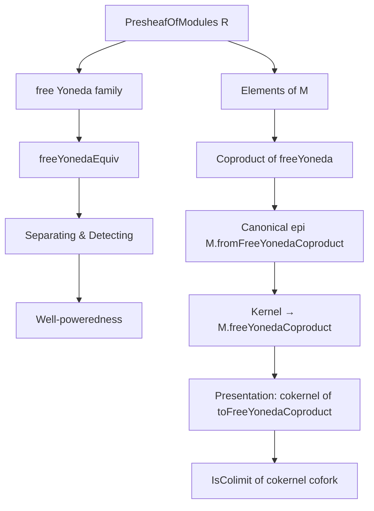
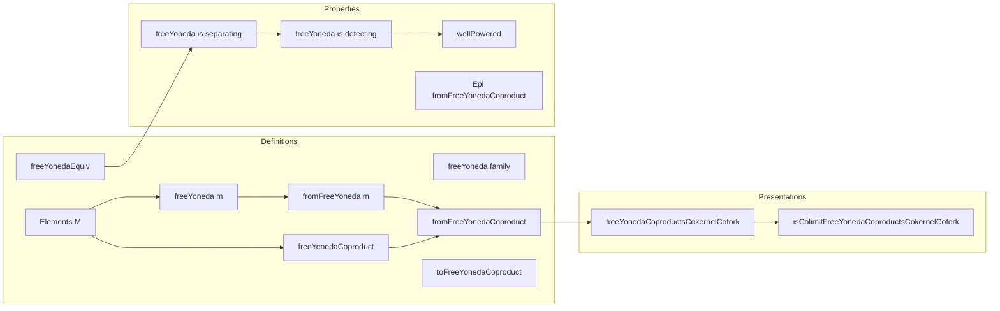

Here is the structured technical metadata extracted from `Generator.lean`:

---

### **1. Key Definitions & Theorems**

| Name | Type / Signature | Purpose |
|------|------------------|---------|
| `freeYonedaEquiv` | `((free R).obj (yoneda.obj X) ⟶ M) ≃ M.obj (Opposite.op X)` | Bijection between module homs from a free Yoneda object and elements of $M$ at $X^\mathrm{op}$. |
| `freeYonedaEquiv_symm_app` | Lemma | Describes the action of the inverse equivalence on an element $x \in M(X^\mathrm{op})$. |
| `freeYonedaEquiv_comp` | Lemma | Compatibility of `freeYonedaEquiv` with composition. |
| `freeYoneda` | `ObjectProperty (PresheafOfModules R)` | The class of objects of the form $(\mathrm{free}\ R)\ (\mathrm{yoneda}\ X)$. |
| `freeYoneda.isSeparating` | `ObjectProperty.IsSeparating (freeYoneda R)` | The family `freeYoneda R` is separating: monomorphisms are detected by maps from these objects. |
| `freeYoneda.isDetecting` | `ObjectProperty.IsDetecting (freeYoneda R)` | The family `freeYoneda R` is detecting: zero morphisms are detected by maps from these objects. |
| `wellPowered` | Instance | Proves `PresheafOfModules R` is well-powered using detecting property. |
| `Elements` | Abbreviation | Type of elements of a presheaf of modules: $\sum_{X : C^\mathrm{op}} M(X)$. |
| `elementsMk` | Abbreviation | Constructor for elements: $\langle X, x \rangle$. |
| `freeYoneda (m : M.Elements)` | `PresheafOfModules R` | Free presheaf of modules on Yoneda at underlying object of $m$. |
| `fromFreeYoneda (m : M.Elements)` | `m.freeYoneda ⟶ M` | Canonical map from free Yoneda object to $M$, adjoint to $m.2$. |
| `fromFreeYoneda_app_apply` | Lemma | Evaluates `fromFreeYoneda` at the generator. |
| `freeYonedaCoproduct` | `PresheafOfModules R` | Coproduct over all `m : M.Elements` of `m.freeYoneda`. |
| `ιFreeYonedaCoproduct` | `m.freeYoneda ⟶ M.freeYonedaCoproduct` | Coproduct injection. |
| `fromFreeYonedaCoproduct` | `M.freeYonedaCoproduct ⟶ M` | Canonical epimorphism induced by universal property of coproduct. |
| `freeYonedaCoproductMk` | `M.freeYonedaCoproduct.obj m.1` | Element in the coproduct corresponding to $m$. |
| `ι_fromFreeYonedaCoproduct` | Lemma | Compatibility of injections with the canonical map. |
| `fromFreeYonedaCoproduct_app_mk` | Lemma | Evaluates the canonical map on `freeYonedaCoproductMk`. |
| `Epi fromFreeYonedaCoproduct` | Instance | The canonical map is an epimorphism (surjective on sections). |
| `toFreeYonedaCoproduct` | `(kernel M.fromFreeYonedaCoproduct).freeYonedaCoproduct ⟶ M.freeYonedaCoproduct` | Presentation morphism: map between coproducts of free Yoneda objects. |
| `toFreeYonedaCoproduct_fromFreeYonedaCoproduct` | Lemma | The composite is zero. |
| `freeYonedaCoproductsCokernelCofork` | `CokernelCofork M.toFreeYonedaCoproduct` | Cokernel cofork giving a presentation. |
| `isColimitFreeYonedaCoproductsCokernelCofork` | `IsColimit ...` | Shows the cokernel cofork is a colimit: $M$ is a cokernel of a map between coproducts of free Yoneda objects. |

---

### **2. Naming Conventions**

- **Prefixes**:
  - `freeYoneda*`: All definitions/lemmas related to the family of free presheaves generated by Yoneda.
  - `fromFreeYoneda*`: Maps *from* free Yoneda objects or coproducts thereof.
  - `ιFreeYonedaCoproduct*`: Inclusion maps into the coproduct.
  - `freeYonedaCoproduct*`: Coproduct constructions and related morphisms.

- **Suffixes**:
  - `Equiv`: Bijection (e.g., `freeYonedaEquiv`).
  - `app_apply`: Evaluates an application of a natural transformation at a generator.
  - `Mk`: Constructor for elements or morphisms (e.g., `freeYonedaCoproductMk`, `elementsMk`).
  - `from_`: Canonical map *from* a construction (e.g., `fromFreeYoneda`, `fromFreeYonedaCoproduct`).

- **Category-theoretic terms**:
  - `ι*`: Coproduct injections.
  - `desc*`: Universal property of coproducts.
  - `kernel.*`, `cokernel.*`: Standard kernel/cokernel constructions.

---

### **3. Tactic Stack**

- `rw`, `erw`: Rewriting using lemmas and equivalences.
- `dsimp`, `simp`: Simplification, especially with `reassoc` and `@[simp]`.
- `exact`, ` rfl`: Trivial proofs and definitional equalities.
- `intro`, `obtain`, `congr_arg`: Proof structuring and element-chasing.
- `infer_instance`: Automatic instance resolution.
- `simp [toFreeYonedaCoproduct]`: Simplification using definitions.
- `exact ... .gIsCokernel`: Use of homological algebra lemmas (e.g., `ShortComplex.exact_iff_of_epi_of_isIso_of_mono`).

---

### **4. Proof Logic**

- **Structure**:
  1. **Adjunction-based equivalence**: `freeYonedaEquiv` is built from `freeHomEquiv` and `yonedaEquiv`.
  2. **Separating ⇒ Detecting**: Uses general categorical fact: a separating family in a pre-abelian category is detecting.
  3. **Well-poweredness**: Follows from detecting family + smallness.
  4. **Element-wise constructions**: Elements of $M$ index free Yoneda objects; coproduct over elements gives a surjection onto $M$.
  5. **Presentation via coproducts**:
     - Construct epimorphism $P_0 = M.\mathrm{freeYonedaCoproduct} \to M$.
     - Take kernel $K \to P_0$, then build $P_1 = K.\mathrm{freeYonedaCoproduct} \to P_0$.
     - Show $M \cong \mathrm{coker}(P_1 \to P_0)$ using short complex exactness and properties of kernels/cokernels.

- **Key technique**: Element-chasing via `freeYonedaEquiv` and its inverse, combined with universal properties of coproducts and kernels.

---

### **5. Imports**

| Module | Purpose |
|--------|---------|
| `Mathlib.Algebra.Category.ModuleCat.Presheaf.Abelian` | Abelian structure on presheaves of modules. |
| `Mathlib.Algebra.Category.ModuleCat.Presheaf.EpiMono` | Epimorphisms/monomorphisms in presheaf categories. |
| `Mathlib.Algebra.Category.ModuleCat.Presheaf.Free` | Free presheaves of modules, including `free` functor. |
| `Mathlib.Algebra.Homology.ShortComplex.Exact` | Exactness in short complexes, used for cokernel presentations. |
| `Mathlib.CategoryTheory.Elements` | Elements of presheaves (as coproducts over representables). |
| `Mathlib.CategoryTheory.Generator.Basic` | General theory of separating/detecting families and well-poweredness. |

---

### **6. Mermaid Diagrams**

#### **Dependency Graph (High-Level)**

#### **Overview of File Structure**

---

Let me know if you'd like a formalized summary in Lean syntax or a diagram of the short exact sequence used in `isColimitFreeYonedaCoproductsCokernelCofork`.
