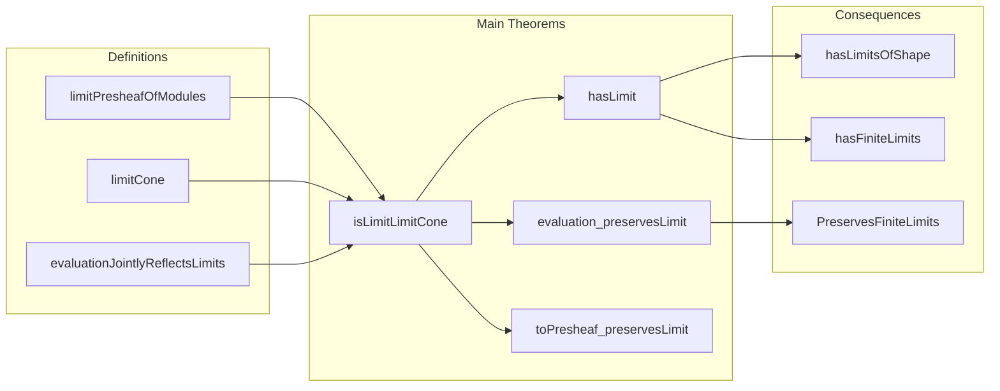

Here is the structured technical brief extracted from `Limits.lean`:

---

### **1. Key Definitions & Theorems**

| Name | Type / Signature | Purpose |
|------|------------------|---------|
| `evaluationJointlyReflectsLimits` | `∀ c : Cone F, (∀ X, IsLimit (evaluation R X).mapCone c) → IsLimit c` | Shows that a cone in `PresheafOfModules R` is limit iff all its evaluations at objects `X : Cᵒᵖ` are limit cones. |
| `limitPresheafOfModules` | `F : J ⥤ PresheafOfModules R ⇒ limitPresheafOfModules F : PresheafOfModules R` | Constructs the limiting presheaf of modules pointwise: $(\varprojlim F)(X) = \varprojlim (F ⋙ \mathrm{eval}_X)$. |
| `limitCone` | `F : J ⥤ PresheafOfModules R ⇒ limitCone F : Cone F` | The canonical limiting cone built from the pointwise limits. |
| `isLimitLimitCone` | `IsLimit (limitCone F)` | Proves that `limitCone F` is indeed a limit cone. |
| `hasLimit` | `HasLimit F` | Instance asserting existence of all limits of shape `J` in `PresheafOfModules R`, under the smallness assumption. |
| `evaluation_preservesLimit` | `PreservesLimit F (evaluation R X)` | Shows that evaluation at any `X` preserves limits of shape `J`. |
| `toPresheaf_preservesLimit` | `PreservesLimit F (toPresheaf R)` | Shows that the global sections functor `toPresheaf R` preserves limits. |
| `hasLimitsOfShape`, `hasLimitsOfSize` | `HasLimitsOfShape J`, `HasLimitsOfSize.{v, v}` | Instances asserting existence of all limits of a given shape/size. |
| `hasFiniteLimits` | `HasFiniteLimits` | Instance for existence of all finite limits. |
| `evaluation_preservesFiniteLimits`, `toPresheaf_preservesFiniteLimits` | `PreservesFiniteLimits` | Instances showing finite limit preservation. |

---

### **2. Naming Conventions**

- **Prefixes**:
  - `evaluation_`: Relates to evaluation functors $\mathrm{eval}_X : \mathrm{PresheafOfModules}\, R \to R(X)\text{-}\mathbf{Mod}$.
  - `limit_`: Relates to constructions of limits (e.g., `limitPresheafOfModules`, `limitCone`).
  - `preservesLimit_`, `preservesFiniteLimits`: For preservation properties.
  - `hasLimit_`, `hasFiniteLimits_`, `hasLimitsOfShape_`: For existence instances.

- **Suffixes**:
  - `_jointlyReflectsLimits`: Reflects limits jointly via a family of functors.
  - `_preservesLimit`: Preservation of limits by a functor.
  - `_App`, `_inv`, `_hom`: For components of natural transformations / isomorphisms (e.g., `preservesLimitIso_hom_π`).

- **Other patterns**:
  - `assoc`, `reassoc_of%`, `comp_id`, `Iso.inv_hom_id`: Standard category-theoretic rewrites.
  - `whiskerLeft`, `restriction`, `restrictScalars`: Functors induced by morphisms in the base category.

---

### **3. Tactic Stack**

Frequent tactics used in proofs:

- `ext1 X`: Extensionality over a presheaf component.
- `simp only [...]`: Simplification with precise lemmas (e.g., `limMap_π`, `preservesLimitIso_inv_π`, `evaluation_obj`).
- `rw [...]`: Rewriting using naturality, functoriality, or isomorphism properties.
- `dsimp`: Simplify definitional equalities.
- `apply ...hom_ext`: Use module homomorphism extensionality.
- `erw [...]`: Rewrite using definitional equality (for “motive is type-incorrect” cases).
- `apply ...inv_naturality`, `apply ...naturality`: Use naturality of natural transformations.
- `apply limit.hom_ext`: Use limit cone universal property.
- `rw [← cancel_mono ...]`: Cancel monos to reduce proofs.

---

### **4. Proof Logic**

The logical flow is:

1. **Pointwise construction**: Define the limiting presheaf object-wise as a limit in module categories.
2. **Verify presheaf structure**: Prove `map_id` and `map_comp` using properties of limit maps and restriction functors.
3. **Define limiting cone**: Use universal property of limits to define cone morphisms.
4. **Prove universality**:
   - Use `evaluationJointlyReflectsLimits`, which reduces the problem to checking that each evaluation of the cone is limit.
   - Since evaluations preserve limits (via `preservesLimit_of_preserves_limit_cone`), and the pointwise cones are limits, this holds.
5. **Consequences**:
   - Derive existence of limits (`hasLimit`, `hasLimitsOfShape`, etc.).
   - Derive preservation properties for evaluation and global sections.

Induction is not used; the proofs rely on:
- Universal properties of limits,
- Functoriality and naturality,
- Properties of restriction of scalars and module categories.

---

### **5. Imports**

| Import | Role |
|--------|------|
| `Mathlib.Algebra.Category.ModuleCat.Presheaf` | Defines `PresheafOfModules R`. |
| `Mathlib.Algebra.Category.ModuleCat.ChangeOfRings` | Provides `restrictScalars`, `restriction`, etc. |
| `Mathlib.CategoryTheory.Limits.Preserves.Limits` | Tools for proving limit preservation. |
| `Mathlib.CategoryTheory.Limits.FunctorCategory.Basic` | Basic facts about functor categories and limits. |

---

### **6. Mermaid Diagrams**

#### **Dependency Graph (High-Level)**

```mermaid
graph TD
  A[PresheafOfModules R] --> B[ModuleCat (R X)]
  B --> C[AddCommGrpCat]
  A --> D[FunctorCategory J ⥤ PresheafOfModules R]
  D --> E[Limits in PresheafOfModules R]
  E --> F[evaluation R X]
  E --> G[toPresheaf R]
  F --> H[Preserves limits]
  G --> H
  H --> I[HasLimitsOfShape J]
```

#### **Overview of File Structure**



---

Let me know if you'd like a formalized summary in Lean syntax or a more detailed tactic-level trace.
