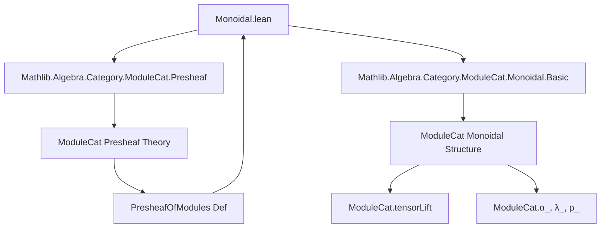
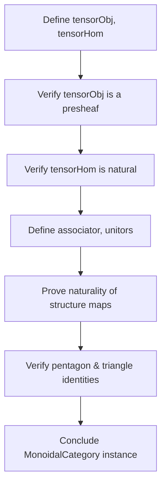

### Technical Brief: Monoidal Structure on Presheaves of Modules

---

#### **1. Key Definitions & Theorems**

| Name | Type / Signature | Purpose |
|------|------------------|---------|
| `tensorObjMap` | `{X Y : Cᵒᵖ} → (f : X ⟶ Y) → M₁.obj X ⊗ M₂.obj X ⟶ (ModuleCat.restrictScalars (R.map f).hom).obj (M₁.obj Y ⊗ M₂.obj Y)` | Defines the action on morphisms for the tensor product presheaf of modules. Ensures compatibility with restriction of scalars. |
| `tensorObj` | `PresheafOfModules (R ⋙ forget₂ _ _)` | Tensor product of two presheaves of modules: `(M₁ ⊗ M₂)(X) = M₁(X) ⊗ M₂(X)`. Constructed as a presheaf via `tensorObjMap`. |
| `tensorHom` | `(f : M₁ ⟶ M₂) → (g : M₃ ⟶ M₄) → tensorObj M₁ M₃ ⟶ tensorObj M₂ M₄` | Tensor product of morphisms of presheaves of modules: `(f ⊗ g)(X) = f(X) ⊗ g(X)`. Verified natural. |
| `monoidalCategoryStruct` | `MonoidalCategoryStruct (PresheafOfModules (R ⋙ forget₂ _ _))` | Constructs the *pre*-monoidal structure: tensor object, tensor hom, unit, associator, unitors. |
| `monoidalCategory` | `MonoidalCategory (PresheafOfModules (R ⋙ forget₂ _ _))` | Proves the monoidal axioms (naturality of associator/unitors, pentagon, triangle, etc.) hold. |

**Key lemmas used in proofs**:
- `tensorObj_map_tmul`: Describes how `tensorObj.map f` acts on simple tensors.
- `ModuleCat.MonoidalCategory.tensor_ext`, `tensor_ext₃'`: Extensionality principles for module homs defined on simple tensors.
- `naturality_apply`: Used to relate `f.app X` and `f.app Y` via `M.map φ`.

---

#### **2. Naming Conventions**

- **Prefixes**:
  - `tensorObj`, `tensorHom`: Denote tensor product constructions.
  - `tensorObjMap`: Auxiliary map for tensor object’s morphism part.
- **Suffixes**:
  - `_map_tmul`: Lemmas describing behavior on simple tensors (`⊗ₜ`).
  - `_def`, `_naturality`, `_comp`: Standard Lean category theory suffixes for definitions and properties.
- **`α_`, `λ_`, `ρ_`**: Standard monoidal category structure morphisms (associator, left/right unitor) from `ModuleCat`.

---

#### **3. Tactic Stack**

| Tactic | Usage |
|--------|-------|
| `ext` / `ext1` | Proving equality of natural transformations / morphisms by extensionality. |
| `simp`, `dsimp` | Simplifying definitions (especially `tensorObj`, `tensorHom`, `tensorObjMap`). |
| `rw`, `erw` | Rewriting using lemmas; `erw` used when typeclass inference or definitional equality needs flexibility (e.g., `leftUnitor_inv_apply`). |
| `rfl` | Proving definitional equalities (e.g., on simple tensors). |
| `ModuleCat.MonoidalCategory.tensor_ext`, `tensor_ext₃'` | Proving equality of module homs by checking on simple tensors. |
| `intro`, `intros` | Introducing variables for extensionality proofs. |
| `rfl` + `simp` | For verifying naturality squares on simple tensors. |

---

#### **4. Proof Logic**

The proof follows a **constructive, pointwise** strategy:

1. **Define tensor object**:
   - On objects: `(M₁ ⊗ M₂)(X) := M₁(X) ⊗ M₂(X)` (module tensor product over `R(X)`).
   - On morphisms: Use `tensorLift` to define `M₁(X) ⊗ M₂(X) → M₁(Y) ⊗ M₂(Y)` via `M₁.map f ⊗ M₂.map f`, ensuring bilinearity and `R(X)`-linearity via `R.map f`.

2. **Verify presheaf axioms**:
   - `map_id`: Uses `tensor_ext` + `simp` + `rfl`.
   - `map_comp`: Same, leveraging functoriality of `M₁`, `M₂`.

3. **Define tensor hom**:
   - `(f ⊗ g)(X) = f(X) ⊗ₘ g(X)`.
   - Naturality: Prove via `tensor_ext`, unfolding definitions and applying naturality of `f`, `g`.

4. **Construct monoidal structure**:
   - **Associator**: Componentwise `α_` from `ModuleCat`, verified natural via `tensor_ext₃'`.
   - **Unitors**: Componentwise `λ_`, `ρ_`, with inverses used to get isomorphisms in `PresheafOfModules`.
   - **Unit object**: `unit _`, the constant presheaf with value `unit _` (the terminal module).

5. **Verify monoidal axioms**:
   - All reduce to corresponding axioms in `ModuleCat`, applied pointwise.
   - Proofs use `ext1` + `apply [axiom]` pattern, leveraging that all structure is defined pointwise.

---

#### **5. Imports & Dependencies**

| Import | Role |
|--------|------|
| `Mathlib.Algebra.Category.ModuleCat.Presheaf` | Defines `PresheafOfModules`, restriction of scalars, and basic presheaf constructions. |
| `Mathlib.Algebra.Category.ModuleCat.Monoidal.Basic` | Provides monoidal structure on `ModuleCat`, including `tensorLift`, `α_`, `λ_`, `ρ_`, and their properties. |

**Key ambient assumptions**:
- `C : Type* [Category* C]`: A category (not necessarily small, but `u`-small in practice).
- `R : Cᵒᵖ ⥤ CommRingCat`: A presheaf of commutative rings.
- `PresheafOfModules (R ⋙ forget₂ _ _)`: Presheaves of modules over `R`, i.e., contravariant functors to `ModuleCat` over the ring-valued presheaf.

---

#### **6. Mermaid Diagrams**

##### **Dependency Graph (Module-Level)**



##### **Overview of File Structure**

```mermaid
flowchart LR
  subgraph "PresheafOfModules"
    M1[M₁ : PresheafOfModules]
    M2[M₂ : PresheafOfModules]
    M3[M₃ : PresheafOfModules]
    M4[M₄ : PresheafOfModules]
  end

  subgraph "Tensor Construction"
    tensorObj["tensorObj M₁ M₂"]
    tensorHom["tensorHom f g"]
    tensorObjMap["tensorObjMap f"]
  end

  subgraph "Monoidal Structure"
    monoidalCategoryStruct["MonoidalCategoryStruct"]
    monoidalCategory["MonoidalCategory"]
  end

  M1 & M2 --> tensorObj
  M1 & M2 & M₃ & M₄ --> tensorHom
  tensorObj & tensorHom --> monoidalCategoryStruct
  monoidalCategoryStruct --> monoidalCategory
```

##### **Proof Strategy Flow (for `monoidalCategory` instance)**



---

#### **7. Summary**

This file constructs the **canonical monoidal structure** on the category of presheaves of modules over a presheaf of commutative rings. The tensor product is defined **pointwise**, and all structure maps are verified to be natural by reducing to the known monoidal structure on module categories. The formalization is clean, modular, and leverages Lean’s typeclass inference and extensionality principles heavily.

The result is foundational for further work in derived algebraic geometry and sheaf theory in Lean, especially in contexts like the *stacks project* formalization or moduli problems.
