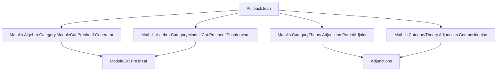

### Technical Brief: Pullback of Presheaves of Modules (Lean 4 Formalization)

---

#### **1. Key Definitions & Theorems**

| Name | Type / Signature | Purpose |
|------|------------------|---------|
| `pullback` | `pullback : PresheafOfModules.{v} S ⥤ PresheafOfModules.{v} R` | Left adjoint to `pushforward φ`, defined when `pushforward φ` is a right adjoint. |
| `pullbackPushforwardAdjunction` | `pullback φ ⊣ pushforward φ` | The adjunction witnessing `pullback φ` as left adjoint to `pushforward φ`. |
| `pullbackObjIsDefined` | `ObjectProperty (PresheafOfModules S)` | Predicate stating whether the (partial) left adjoint of `pushforward φ` is defined at a given object. |
| `pushforwardCompCoyonedaFreeYonedaCorepresentableBy` | `X : C → ... CorepresentableBy ...` | Shows that `pushforward φ` satisfies the solution set condition on free yoneda objects, enabling construction of left adjoint. |
| `pullbackObjIsDefined_free_yoneda` | `pullbackObjIsDefined φ ((free S).obj (yoneda.obj X))` | Corepresentability of the relevant functor for free yoneda objects. |
| `pullbackObjIsDefined_eq_top` | `pullbackObjIsDefined φ = ⊤` | Proves that the left adjoint is *everywhere* defined, hence `pushforward φ` is a right adjoint *unconditionally* (under universe assumptions). |
| `pullbackId` | `pullback (𝟙 S) ≅ 𝟭 _` | Pullback along identity morphism is naturally isomorphic to identity functor. |
| `pullbackComp` | `pullback φ ⋙ pullback ψ ≅ pullback (φ ≫ whiskerLeft F.op ψ)` | Compatibility of pullback with composition of base morphisms. |
| `pullback_assoc` | Equality of two ways of composing three pullbacks (up to associator) | Ensures coherence of pullback composition (pseudofunctoriality). |
| `pullback_id_comp`, `pullback_comp_id` | Unit laws for pullback composition | Ensure unitality of the pseudofunctorial structure. |

---

#### **2. Naming Conventions**

- **Prefixes**:
  - `pullback*`: for constructions related to the left adjoint.
  - `pushforward*`: for constructions related to the right adjoint.
  - `freeYoneda*`: for equivalences involving free modules and yoneda embedding.
  - `isRightAdjoint*`, `leftAdjointObjIsDefined*`: for properties of adjointness.

- **Suffixes**:
  - `Adjunction`: for adjunction data (`pullbackPushforwardAdjunction`).
  - `Iso`: for natural isomorphisms (`pullbackId`, `pullbackComp`).
  - `CorepresentableBy`: for corepresentability statements.
  - `comp`, `id`: for composition/unit laws (`pullbackComp`, `pullbackId`, `pullback_id_comp`, etc.).

- **Whiskering**:
  - `whiskerLeft`, `whiskerRight`: used in composition of natural transformations and functors.
  - `isoWhiskerLeft`, `isoWhiskerRight`: for whiskering isomorphisms.

---

#### **3. Tactic Stack**

- `simp only [...]`: heavily used for simplification with specific lemmas.
- `erw [...]`: rewriting with definitional equality (e.g., `freeYonedaEquiv_comp`).
- `conv_rhs => ...`: for targeted rewriting on the right-hand side.
- `dsimp`: for definitional simplification.
- `apply ...`: for applying lemmas or constructors.
- `all_goals [...]`: for applying tactics uniformly across all goals.
- `ext`: extensionality for functors/natural transformations.
- `rw`, `apply`, `exact`, `refl`: standard proof scripting.
- `leftAdjointObjIsDefined_of_isColimit`, `isRightAdjoint_of_iso`, `isRightAdjoint_of_leftAdjointObjIsDefined_eq_top`: specialized lemmas for adjoint existence.

---

#### **4. Proof Logic**

- **Existence of pullback**:
  - Show that `pushforward φ` satisfies the solution set condition on a dense generating class (free yoneda objects).
  - Prove that the left adjoint is defined on all objects via colimit preservation (`M.isColimitFreeYonedaCoproductsCokernelCofork`).
  - Conclude `pushforward φ` is a right adjoint, hence `pullback φ` exists.

- **Pseudofunctoriality**:
  - Use general adjunction calculus: if `F ⊣ G` and `F' ⊣ G'`, then `F ⋙ F' ⊣ G' ⋙ G`.
  - Apply `Adjunction.leftAdjointCompIso` to deduce `pullback φ ⋙ pullback ψ ≅ pullback (φ ≫ ...)` from `pushforwardComp φ ψ`.
  - Coherence (associativity, unit laws) follows from corresponding properties of `pushforward` and uniqueness of left adjoints.

- **Key lemmas**:
  - `pullbackObjIsDefined_free_yoneda`: uses `freeYonedaEquiv` and injectivity.
  - `pullbackObjIsDefined_eq_top`: uses colimit preservation and density of free yoneda objects.
  - `pullbackComp`, `pullback_assoc`, `pullback_id_comp`, `pullback_comp_id`: all derived from general adjunction lemmas (`leftAdjointCompIso_*`, `leftAdjointIdIso`).

---

#### **5. Imports & Dependencies**

| Module | Role |
|--------|------|
| `Mathlib.Algebra.Category.ModuleCat.Presheaf.Generator` | Provides free modules and yoneda-based density results. |
| `Mathlib.Algebra.Category.ModuleCat.Presheaf.Pushforward` | Defines `pushforward` and its properties (e.g., `pushforwardComp`, `pushforwardId`). |
| `Mathlib.CategoryTheory.Adjunction.PartialAdjoint` | Tools for partial adjoints, solution set condition, corepresentability. |
| `Mathlib.CategoryTheory.Adjunction.CompositionIso` | General lemmas about composition of adjoints and induced isomorphisms. |

---

#### **6. Mermaid Diagrams**

##### **Dependency Graph (Module-Level)**



##### **Conceptual Overview (Theory Flow)**

```mermaid
graph LR
  subgraph Setup
    C[Category C] -->|F| D[Category D]
    D -->|R: Dᵒᵖ → RingCat| Ring
    C -->|S: Cᵒᵖ → RingCat| Ring
    S -->|φ| F.op ⋙ R
  end

  subgraph Adjunction
    φ -->|pushforward φ| PresheafOfModules S ⥮ PresheafOfModules R
    φ -->|pullback φ| PresheafOfModules S ⥯ PresheafOfModules R
    pullback φ ⊣ pushforward φ
  end

  subgraph Pseudofunctoriality
    pullback φ ⋙ pullback ψ ≅ pullback (φ ≫ whiskerLeft F.op ψ)
    pullback (𝟙 S) ≅ 𝟭
  end

  pushforwardComp --> pullbackComp
  pushforwardId --> pullbackId
  pushforward_assoc --> pullback_assoc
```

---

#### **7. Summary**

This file formalizes the *pullback functor* between categories of presheaves of modules, defined as the left adjoint to *pushforward*. It establishes:

- **Existence** of pullback under universe assumptions, via solution set condition and density of free yoneda objects.
- **Pseudofunctoriality**: pullback respects identities and composition up to coherent isomorphism.
- **Explicit constructions** of the adjunction and coherence isomorphisms using general adjunction theory.

The formalization leverages:
- The *yoneda embedding* and *free module* constructions for density arguments.
- *Partial adjoint* theory to handle existence without assuming all colimits.
- *Adjunction composition lemmas* to derive pseudofunctorial properties.

This is foundational for descent theory, base change, and Grothendieck constructions in derived algebraic geometry and homological algebra.
