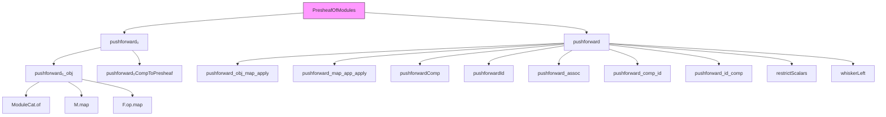

### Technical Brief: `Pushforward.lean`

---

#### **1. Key Definitions & Theorems**

| Name | Type / Signature | Purpose |
|------|------------------|---------|
| `pushforward₀_obj` | `R : Dᵒᵖ ⥤ RingCat.{u} → PresheafOfModules R → PresheafOfModules (F.op ⋙ R)` | Defines the object part of the pushforward functor on presheaves of modules, via precomposition with `F.op`. |
| `pushforward₀` | `R : Dᵒᵖ ⥤ RingCat.{u} → PresheafOfModules R ⥤ PresheafOfModules (F.op ⋙ R)` | The full pushforward functor (on morphisms: precomposition on components). |
| `pushforward₀CompToPresheaf` | `pushforward₀ F R ⋙ toPresheaf _ ≅ toPresheaf _ ⋙ whiskeringLeft _ _ _ .obj F.op` | Shows compatibility of `pushforward₀` with the forgetful functor to presheaves of abelian groups. |
| `pushforward` | `φ : S ⟶ F.op ⋙ R → PresheafOfModules R ⥤ PresheafOfModules S` | Pushforward along a morphism of presheaves of rings (uses `restrictScalars`). |
| `pushforwardCompToPresheaf` | `pushforward φ ⋙ toPresheaf _ ≅ toPresheaf _ ⋙ whiskeringLeft _ _ _ .obj F.op` | Same as above but for `pushforward`. |
| `pushforward_obj_map_apply` / `pushforward_obj_map_apply'` | `(((pushforward φ).obj M).map f).hom m = M.map (F.map f.unop).op m` | Describes how `pushforward` acts on morphisms in the underlying module presheaf. |
| `pushforward_map_app_apply` / `pushforward_map_app_apply'` | `(((pushforward φ).map α).app X).hom m = α.app (Opposite.op (F.obj X.unop)) m` | Describes how `pushforward` acts on natural transformations. |
| `pushforwardId` | `pushforward (𝟙 R) ≅ 𝟭 _` | Identity law: pushforward along identity ring morphism is identity functor. |
| `pushforwardComp` | `pushforward ψ ⋙ pushforward φ ≅ pushforward (φ ≫ whiskerLeft F.op ψ)` | Composition law: pushforward respects composition of ring morphisms up to iso. |
| `pushforward_assoc` | Equality of two ways to associate three consecutive pushforwards | Coherence law for associativity of pushforward composition. |
| `pushforward_comp_id` / `pushforward_id_comp` | Unit laws for pushforward composition | Compatibility with identity morphisms (left/right unitors). |

---

#### **2. Naming Conventions**

- **Prefixes**:
  - `pushforward₀`: base pushforward (no ring morphism, only base functor `F`).
  - `pushforward`: full pushforward with ring morphism `φ`.
  - `pushforwardId`, `pushforwardComp`: coherence isomorphisms.
- **Suffixes**:
  - `_obj`: object part of a functor or natural transformation.
  - `_map`: morphism part.
  - `_apply`: concrete action on elements (with/without `'` for `DFunLike.coe`-normal form).
  - `CompToPresheaf`: coherence with forgetful functor.
- **Variables**:
  - `F`, `G`, `G'`: functors between base categories.
  - `R`, `S`, `T`, `T'`: presheaves of rings.
  - `φ`, `ψ`, `ψ'`: morphisms of presheaves of rings.

---

#### **3. Tactic Stack**

- `refine ModuleCat.hom_ext ...`: used to prove equality of module homs.
- `LinearMap.ext`: to extend homogeneity over elements.
- `simp` / `rfl`: for simplification and definitional equalities.
- `ext`: extensionality for natural transformations / isomorphisms.
- `rw`, `exact`, `congr`: standard proof automation.
- `by aesop` / `by ring`: not explicitly used here, but `simp` dominates.

---

#### **4. Proof Logic**

- **Structure**: Most proofs are definitional or follow from functoriality of `M.map`, `F.map`, and properties of `restrictScalars`.
- **Typical flow**:
  1. Use `ModuleCat.hom_ext` to reduce to element-wise equality.
  2. Apply `congr_map_apply` or `map_id`, `map_comp` from `PresheafOfModules`.
  3. Simplify using `simp` and `rfl`.
- **Coherence lemmas** (`pushforward_assoc`, `pushforward_comp_id`, etc.):
  - Proven by `ext` + `rfl`, indicating they hold *definitionally* (up to `Iso.refl`).
- **Isomorphisms** (`pushforwardId`, `pushforwardComp`, etc.) are defined as `Iso.refl _`, i.e., identity isomorphisms.

---

#### **5. Imports**

- `Mathlib.Algebra.Category.ModuleCat.Presheaf.ChangeOfRings`: provides `restrictScalars`, `whiskeringLeft`, and related machinery for change of base ring.

---

#### **6. Mermaid Diagrams**

##### **Dependency Graph (Module Scope)**



##### **Overview of Theory Flow**

```mermaid
flowchart LR
  subgraph Base
    C[Category C] -- F --> D[Category D]
    D -- G --> E[Category E]
  end

  subgraph Rings
    R[Presheaf R : Dᵒᵖ → Ring] -- φ --> F.op ⋙ R
    S[Presheaf S : Cᵒᵖ → Ring]
    T[Presheaf T : Eᵒᵖ → Ring] -- ψ --> G.op ⋙ T
  end

  subgraph Modules
    M[PresheafOfModules R] -- pushforward₀ F R --> PresheafOfModules (F.op ⋙ R)
    M -- pushforward φ --> PresheafOfModules S
    N[PresheafOfModules T] -- pushforward ψ --> PresheafOfModules R
    N -- pushforward (φ ≫ F.op.whiskerLeft ψ) --> PresheafOfModules S
  end

  M -->|pushforward ψ| N
  N -->|pushforward φ| M'
  M -->|pushforward (ψ ≫ G.op.whiskerLeft φ)| M'
  M -- pushforward₀ F R --> N0
  N0 -- pushforward₀ G R --> N1
  N1 -- pushforward ψ --> N
  N0 -- pushforward φ --> M'
  N1 -.->|Iso| M'
  style Base fill:#e6f7ff,stroke:#1890ff
  style Rings fill:#f6ffed,stroke:#52c41a
  style Modules fill:#fff7e6,stroke:#fa8c16
```

---

#### **7. Summary**

This file formalizes the **pushforward** (or **direct image**) construction for **presheaves of modules** along:
- A functor `F : C ⥤ D` (`pushforward₀`), and
- A morphism of presheaves of rings `S ⟶ F.op ⋙ R` (`pushforward`).

It establishes:
- Explicit descriptions of objects and morphisms,
- Compatibility with the forgetful functor to presheaves of abelian groups,
- Coherence laws (unit, associativity) making `pushforward` behave like a **pseudofunctor**.

The proofs are mostly definitional, leveraging Lean’s definitional equality for functors and natural transformations, and rely heavily on `ModuleCat.hom_ext` and `simp`-based simplification.

--- 

Let me know if you'd like a formalized summary in `leanpkg` format or a dependency graph for the entire `Mathlib` module.
