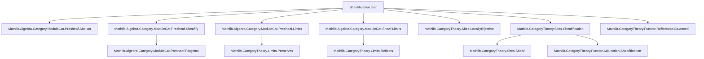
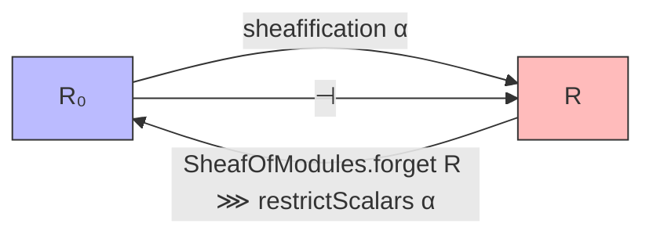

Here is the structured technical brief extracted from `Sheafification.lean`:

---

### **1. Key Definitions & Theorems**

| Name | Type / Purpose |
|------|----------------|
| `sheafification` | `PresheafOfModules.{v} R₀ ⥤ SheafOfModules.{v} R` — the sheafification functor for modules along a locally bijective morphism `α : R₀ ⟶ R.val`. |
| `sheafificationCompToSheaf` | `sheafification α ⋙ SheafOfModules.toSheaf _ ≅ toPresheaf _ ⋙ presheafToSheaf J AddCommGrpCat` — commutativity of sheafification with the forgetful functor to sheaves of abelian groups. |
| `sheafificationCompForgetCompToPresheaf` | `sheafification α ⋙ SheafOfModules.forget _ ⋙ toPresheaf _ ≅ toPresheaf _ ⋙ presheafToSheaf J AddCommGrpCat ⋙ sheafToPresheaf J AddCommGrpCat` — commutativity with further forgetful functor to presheaves of abelian groups. |
| `sheafificationHomEquiv` | `(sheafification α).obj P ⟶ F ≃ P ⟶ (restrictScalars α).obj (SheafOfModules.forget R).obj F` — the hom-set bijection underlying the adjunction. |
| `sheafificationAdjunction` | `sheafification α ⊣ SheafOfModules.forget R ⋙ restrictScalars α` — the adjunction between sheafification and the composite forget-restrict functor. |
| `toPresheaf_map_sheafificationHomEquiv_def` | Explicit description of the underlying presheaf morphism of the adjoint transpose. |
| `toPresheaf_map_sheafificationHomEquiv` | Relates `sheafificationHomEquiv` to the general sheafification adjunction for abelian group-valued presheaves. |
| `toSheaf_map_sheafificationHomEquiv_symm` | Dual description for the inverse direction of the hom equivalence. |
| `sheafificationAdjunction_homEquiv_apply` | Confirms that the constructed adjunction’s hom equivalence coincides with `sheafificationHomEquiv`. |
| `toPresheaf_map_sheafificationAdjunction_unit_app` | Describes the unit of the adjunction at the presheaf level. |
| `PreservesFiniteLimits (sheafification α)` | `sheafification α` preserves finite limits (proven via reflection and preservation properties). |
| `ReflectsFiniteLimits (SheafOfModules.toSheaf R)` | The forgetful functor from sheaves of modules to presheaves reflects finite limits. |

---

### **2. Naming Conventions**

- **Prefixes**:
  - `sheafification_`: for constructions related to the sheafification functor.
  - `sheafificationAdjunction_`: for components of the adjunction (unit, homEquiv, etc.).
  - `toPresheaf_map_`, `toSheaf_map_`: for descriptions of maps after applying forgetful functors.
- **Suffixes**:
  - `_def`: definitional lemmas (e.g., `sheafificationHomEquiv_def`).
  - `_app`: for components of natural transformations at objects (e.g., `unit.app M₀`).
  - `_symm`: for inverses of equivalences or isomorphisms.
- **General patterns**:
  - `comp_`: for compositions of functors.
  - `HomEquiv`: for hom-set bijections in adjunctions.
  - `IsLeftAdjoint`, `ReflectsFiniteLimits`, `PreservesFiniteLimits`: typeclass instances.

---

### **3. Tactic Stack**

- `ext1`: used repeatedly to extend equality of natural transformations/morphisms to underlying components.
- `simp`, `rfl`: for simplification and definitional equalities.
- `apply ..._map_injective`: injectivity arguments for forgetful functors (e.g., `toPresheaf R₀`, `SheafOfModules.toSheaf _`).
- `rw [...]`, `erw [...]`: rewriting using lemmas and equivalences.
- `dsimp`: for definitional simplification.
- `apply ..._injective`, `apply ..._surjective`: for bijectivity arguments in hom equivalences.
- `obtain ⟨f, rfl⟩ := ...`: destructuring surjectivity of equivalences.

---

### **4. Proof Logic**

- **Structure**:
  - **Definition of `sheafification`**: Constructed via `sheafify` on underlying presheaves of abelian groups, using the locally bijective hypothesis `α`.
  - **Functoriality**: Proven by reducing to the underlying presheaf level via `toPresheaf _ .map_injective`.
  - **Adjunction**: Built using `Adjunction.mkOfHomEquiv`, with naturality proven by reduction to the known sheafification adjunction for abelian group-valued presheaves (`sheafificationAdjunction J AddCommGrpCat`).
  - **Limit properties**:
    - Preservation of finite limits for `sheafification α` uses:
      - `preservesFiniteLimits_of_reflects_of_preserves`
      - `comp_preservesFiniteLimits`
      - `reflectsIsomorphisms_of_comp` and `ReflectsFiniteLimits` instances.
    - Reflection of finite limits for `SheafOfModules.toSheaf R` is inherited from `sheafToPresheaf`.

- **Common pattern**:
  - Reduce statements to the level of presheaves of abelian groups using forgetful functors.
  - Use injectivity/surjectivity of forgetful functors to lift equalities or equivalences.
  - Leverage existing sheafification theory for `AddCommGrpCat`-valued presheaves.

---

### **5. Imports**

| Module | Role |
|--------|------|
| `Mathlib.Algebra.Category.ModuleCat.Presheaf.Abelian` | Presheaves of modules over a presheaf of rings form an abelian category. |
| `Mathlib.Algebra.Category.ModuleCat.Presheaf.Sheafify` | Sheafification of presheaves of modules (preliminary). |
| `Mathlib.Algebra.Category.ModuleCat.Presheaf.Limits` | Limits in presheaves of modules. |
| `Mathlib.Algebra.Category.ModuleCat.Sheaf.Limits` | Limits in sheaves of modules. |
| `Mathlib.CategoryTheory.Sites.LocallyBijective` | Locally bijective morphisms of presheaves of rings. |
| `Mathlib.CategoryTheory.Sites.Sheafification` | General sheafification for abelian group-valued presheaves. |
| `Mathlib.CategoryTheory.Functor.ReflectsIso.Balanced` | Tools for reflecting isomorphisms (used for `ReflectsFiniteLimits`). |

---

### **6. Mermaid Diagrams**

#### **Dependency Graph (Module-Level)**



#### **Overview of Theoretical Flow**

```mermaid
flowchart LR
  R0["Presheaf of rings R₀"] -->|α: R₀ → R.val| R["Sheaf of rings R"]
  P["Presheaf of R₀-modules M₀"] -->|sheafify α| F["Sheaf of R-modules"]
  P -->|forget| M["Presheaf of abelian groups"]
  F -->|forget| N["Sheaf of abelian groups"]
  M -->|presheafToSheaf| N
  N -->|sheafToPresheaf| O["Presheaf of abelian groups"]
  
  P -.->|sheafification α| F
  P -.->|unit| (sheafification α).obj P
  F -.->|counit| F
  
  style R fill:#f9f,stroke:#333
  style R0 fill:#bbf,stroke:#333
  style P fill:#bfb,stroke:#333
  style F fill:#fbb,stroke:#333
```

#### **Adjunction Diagram**



---

Let me know if you'd like a formalized summary in Lean syntax or a high-level explanation of the mathematical content.
