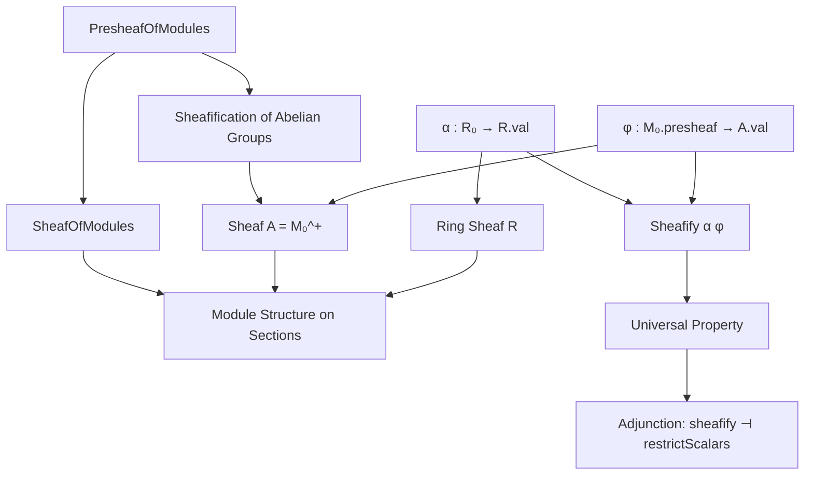
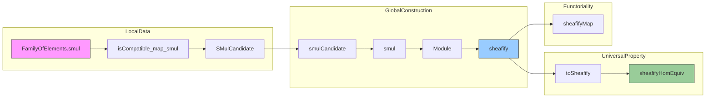

Here is the structured technical brief extracted from `Sheafify.lean`:

---

### **1. Key Definitions & Theorems**

| Name | Type / Signature | Purpose |
|------|------------------|---------|
| `smul` (family) | `FamilyOfElements (R ⋙ forget _) P → FamilyOfElements (M.presheaf ⋙ forget _) P → FamilyOfElements (M.presheaf ⋙ forget _) P` | Defines scalar multiplication on families of elements compatible with a presieve. |
| `Sheafify.app_eq_of_isLocallyInjective` | `φ.app _ (r₀ • m₀) = φ.app _ (r₀' • m₀')` under equalities after applying `α`, `φ` | Ensures scalar multiplication is well-defined on sheafifications (independent of representatives). |
| `Sheafify.isCompatible_map_smul` | `((r₀.smul m₀).map …).Compatible` | Shows that scalar multiplication of compatible families remains compatible — essential for sheaf condition. |
| `SMulCandidate` | `Structure` with `x : A.val.obj X` and a universal property `h` | Encodes the *candidate* for $r \cdot m$ in the sheafification, using local data. |
| `SMulCandidate.mk'` | Constructor using local preimages and amalgamation data | Constructs a `SMulCandidate` from local data satisfying compatibility. |
| `smulCandidate` | `SMulCandidate α φ r m` (unique) | The canonical candidate; existence + uniqueness follow from `IsSeparated` and local surjectivity. |
| `smul` | `A.val.obj X → R.val.obj X → A.val.obj X` | The induced scalar multiplication on sheafified sections. |
| `Sheafify.module` | `Module (R.val.obj X) (A.val.obj X)` | Proves module axioms (unit, distributivity, associativity) for `smul`. |
| `sheafify` | `SheafOfModules R` | The sheaf of modules obtained by sheafifying the underlying abelian group presheaf and equipping it with the scalar action. |
| `toSheafify` | `M₀ ⟶ (restrictScalars α).obj (sheafify α φ).val` | The canonical morphism from the original presheaf of modules to its sheafification. |
| `sheafifyHomEquiv'` / `sheafifyHomEquiv` | `((sheafify α φ) ⟶ F) ≃ (M₀ ⟶ (restrictScalars α).obj F)` | Universal property: sheafification is left adjoint to restriction of scalars + forgetful functor. |
| `sheafifyMap` | `sheafify α φ ⟶ sheafify α φ'` | Functoriality of sheafification w.r.t. morphisms of presheaves of modules. |

---

### **2. Naming Conventions**

- **Prefixes**:
  - `isCompatible_…`: properties about compatibility of families over covers.
  - `app_eq_of_isLocallyInjective`: equality of components under local injectivity.
  - `map_smul_eq`, `map_smul`: behavior of scalar multiplication under morphisms.
  - `smul_…`: scalar multiplication-related lemmas (`one_smul`, `zero_smul`, `smul_add`, `add_smul`, `mul_smul`).
  - `sheafify_…`: constructions and properties of the sheafification functor.

- **Suffixes**:
  - `_aux`: intermediate lemmas used in main proofs.
  - `_eq`: equality lemmas.
  - `_map`: behavior under morphism application.
  - `_hom`: morphism-level constructions (e.g., `sheafifyHomEquiv`).
  - `_candidate`: data encoding a candidate for a construction (e.g., `SMulCandidate`).

- **Notable patterns**:
  - `α`, `φ`: sheafification maps for rings and modules.
  - `r₀`, `m₀`: local representatives in presheaves; `r`, `m`: global sections in sheaves.
  - `hr₀`, `hm₀`: amalgamation hypotheses for local data.

---

### **3. Tactic Stack**

Frequently used tactics in proofs:

| Tactic | Role |
|--------|------|
| `apply hA _ …` | Use `IsSeparated` to reduce to checking on a covering sieve. |
| `rw [← NatTrans.naturality_apply …]` | Naturality of natural transformations (especially `φ`, `α`). |
| `erw` / `rw` | Rewrite using definitional equalities or naturality. |
| `simp` / `simp only` | Simplify using `@[simp]` lemmas (e.g., `map_zero`, `one_smul`). |
| `apply J.intersection_covering` | Build covering sieves via intersections (stable under pullback). |
| `apply A.isSeparated _ _ …` | Prove equality in sheaf by separatedness. |
| `refine` + `?_` | Partial proof construction with holes. |
| `dsimp`, `funext`, `congr` | Definitional simplification and congruence. |
| `infer_instance` | Automatically infer typeclass instances (e.g., `IsLocallyInjective`). |

---

### **4. Proof Logic**

The logical flow of the main constructions and proofs follows this pattern:

1. **Local-to-Global Strategy**:
   - Use local representatives (`r₀`, `m₀`) over a covering sieve.
   - Prove well-definedness via `IsSeparated` and `IsLocallyInjective`.
   - Use `IsLocallySurjective` to ensure existence of local data.

2. **Well-Definedness**:
   - Show independence of representatives using `app_eq_of_isLocallyInjective`.
   - Prove compatibility of scalar multiplication of families (`isCompatible_map_smul`).

3. **Module Axioms**:
   - Reduce each axiom (e.g., `smul_add`, `mul_smul`) to checking on a common refinement sieve.
   - Use `IsSeparated` + naturality + presheaf module axioms.

4. **Universal Property**:
   - Construct equivalence via `sheafifyHomEquiv'`, using:
     - `restrictHomEquivOfIsLocallySurjective` (for rings),
     - `homEquivOfIsLocallyBijective` (for modules).
   - Prove naturality and functoriality of `sheafifyMap`.

5. **Uniqueness**:
   - `Subsingleton` + `Nonempty` ⇒ `Unique` ⇒ define `smulCandidate` as `default`.

---

### **5. Imports**

| Import | Purpose |
|--------|---------|
| `Mathlib.Algebra.Category.ModuleCat.Sheaf.ChangeOfRings` | Change-of-rings and restriction of scalars for sheaves of modules. |
| `Mathlib.CategoryTheory.Sites.LocallySurjective` | Theory of locally surjective/injective natural transformations, essential for sheafification. |

---

### **6. Mermaid Diagrams**

#### **Dependency Graph (High-Level)**

#### **Overview of `Sheafify.lean`**

---

Let me know if you'd like a formalized dependency graph in Lean or a visualization of the `SMulCandidate` construction.
