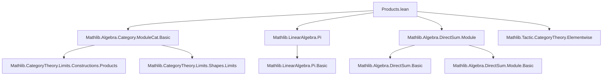
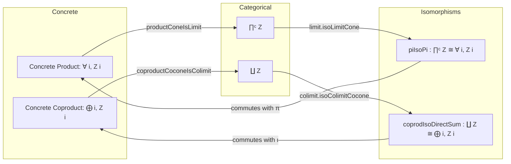

### Technical Brief: `Products.lean` — Categorical Products and Coproducts in `ModuleCat`

---

#### **1. Key Definitions & Theorems**

| Name | Type | Purpose |
|------|------|---------|
| `productCone` | `Fan Z → Fan Z` | Constructs the concrete product cone over a family `Z : ι → ModuleCat R` using the function space `∀ i, Z i` as apex and projections as legs. |
| `productConeIsLimit` | `IsLimit (productCone Z)` | Proves that the concrete product cone is limiting — i.e., satisfies the universal property of a categorical product. |
| `piIsoPi` | `∏ᶜ Z ≅ ModuleCat.of R (∀ i, Z i)` | Shows the categorical product `∏ᶜ Z` is isomorphic to the module-theoretic product (function space). |
| `piIsoPi_inv_kernel_ι` | `∀ i, (piIsoPi Z).inv ≫ Pi.π Z i = ofHom (LinearMap.proj i)` | Commutativity of the iso with projections (i.e., the inverse of the iso commutes with the projection maps). |
| `piIsoPi_hom_ker_subtype` | `∀ i, (piIsoPi Z).hom ≫ ofHom (LinearMap.proj i) = Pi.π Z i` | Commutativity of the iso with projections in the forward direction. |
| `coproductCocone` | `Cofan Z → Cofan Z` | Constructs the concrete coproduct cocone using the direct sum `⨁ i, Z i` as apex and canonical inclusions `lof` as legs. |
| `coproductCoconeIsColimit` | `IsColimit (coproductCocone Z)` | Proves the concrete coproduct cocone is colimiting — satisfies the universal property of a categorical coproduct. |
| `coprodIsoDirectSum` | `∐ Z ≅ ModuleCat.of R (⨁ i, Z i)` | Shows the categorical coproduct `∐ Z` is isomorphic to the direct sum module. |
| `ι_coprodIsoDirectSum_hom` | `∀ i, Sigma.ι Z i ≫ (coprodIsoDirectSum Z).hom = ofHom (DirectSum.lof R ι Z i)` | Commutativity of the iso with coproduct inclusions. |
| `lof_coprodIsoDirectSum_inv` | `∀ i, ofHom (DirectSum.lof R ι Z i) ≫ (coprodIsoDirectSum Z).inv = Sigma.ι Z i` | Commutativity of the iso with coproduct inclusions in the inverse direction. |

---

#### **2. Naming Conventions**

- **Prefixes**:
  - `productCone`, `coproductCocone`: indicate construction of (co)cones from concrete constructions.
  - `piIsoPi`, `coprodIsoDirectSum`: `pi`/`coprod` for categorical (co)limits, `Pi`/`DirectSum` for concrete module constructions.
- **Suffixes**:
  - `IsLimit`, `IsColimit`: denote (co)limit universality.
  - `_hom`, `_inv`: refer to forward/inverse components of isomorphisms.
  - `_ι`, `_π`: refer to canonical inclusion/projection maps.
- **`ofHom`**: used to lift linear maps to `ModuleCat` morphisms.

---

#### **3. Tactic Stack**

- `ext`: extensionality for functions/modules (used repeatedly to prove morphism equality).
- `funext`: functional extensionality to prove equality of functions.
- `simp_rw`, `simp only`: simplification with rewrite rules, especially for cone/cocone components.
- `exact`, `refine`: for constructing morphisms and proving equalities.
- `DFunLike.congr_fun`, `congr_arg`: for reasoning about dependent function spaces and hom components.
- `DirectSum.toModule_lof`, `DirectSum.linearMap_ext`: lemmas for reasoning about direct sum maps.
- `IsLimit.conePointUniqueUpToIso_inv_comp`, `colimit.isoColimitCocone_*`: standard limit/colimit uniqueness lemmas.

---

#### **4. Proof Logic**

- **Products**:
  1. Define the concrete product cone using `∀ i, Z i`.
  2. Prove it is limiting by constructing the unique mediating map via `LinearMap.pi`.
  3. Use `limit.isoLimitCone` to get the isomorphism `∏ᶜ Z ≅ ModuleCat.of R (∀ i, Z i)`.
  4. Verify compatibility with projections using `limit.isoLimitCone_inv_π` and `IsLimit.conePointUniqueUpToIso_inv_comp`.

- **Coproducts**:
  1. Define the concrete coproduct cocone using `⨁ i, Z i`.
  2. Prove it is colimiting by constructing the unique mediating map via `DirectSum.toModule`.
  3. Use `colimit.isoColimitCocone` to get the isomorphism `∐ Z ≅ ModuleCat.of R (⨁ i, Z i)`.
  4. Verify compatibility with inclusions using `colimit.isoColimitCocone_ι_hom` and `comp_coconePointUniqueUpToIso_hom`.

- **Common pattern**:  
  `IsLimit`/`IsColimit` → `isoLimitCone`/`isoColimitCocone` → `simp` + `ext` + `funext` to verify naturality.

---

#### **5. Imports & Dependencies**

| Import | Role |
|--------|------|
| `Mathlib.Algebra.Category.ModuleCat.Basic` | Core definitions of `ModuleCat`, morphisms, etc. |
| `Mathlib.LinearAlgebra.Pi` | Function space `∀ i, Z i` as a module, projections, `pi` map. |
| `Mathlib.Algebra.DirectSum.Module` | Direct sum `⨁ i, Z i`, `lof`, `toModule`, universal property. |
| `Mathlib.Tactic.CategoryTheory.Elementwise` | Enables `elementwise` attribute and `π`, `ι` notation for (co)limit components. |

---

#### **6. Mermaid Diagrams**

##### **Dependency Graph (Module-Level)**

##### **Overview of Theoretical Flow**

---

#### **7. Summary**

This file establishes that in the category of modules over a ring `R`, the **categorical product** of a family of modules coincides with the **module-theoretic product** (function space), and the **categorical coproduct** coincides with the **direct sum**. It does so by constructing explicit (co)cones, proving their (co)limiting property, and then invoking the uniqueness of limits/colimits to obtain canonical isomorphisms. The proofs are constructive and rely heavily on the universal properties of function spaces and direct sums, verified via extensionality and simplification tactics.

The file is a foundational step toward establishing that `ModuleCat R` has all small limits and colimits — though the comment notes this is already covered by `Algebra.Category.ModuleCat.Limits`.
