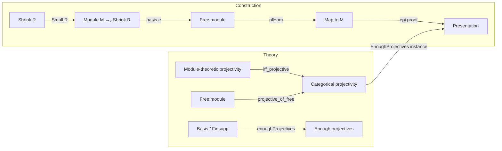

**Technical Brief: `Projective.lean` — Category of Modules Has Enough Projectives**

---

### 1. **Key Definitions & Theorems**

| Name | Type / Signature | Purpose |
|------|------------------|---------|
| `ModuleCat.projective_of_categoryTheory_projective` | `[Module.Projective R P] → Projective P` | Shows that a module-theoretically projective object yields a categorical projective object in `ModuleCat`. |
| `ModuleCat.projective_of_module_projective` | `[Small R] [Projective P] → Module.Projective R P` | Converse: categorical projectivity implies module-theoretic projectivity (under smallness). |
| `IsProjective.iff_projective` | `Module.Projective R P ↔ Projective (of R P)` | Equivalence of categorical and module-theoretic notions of projectivity (for small `R`). |
| `ModuleCat.projective_of_free` | `Basis ι R M → Projective M` | Free modules (with basis) are projective in `ModuleCat`. |
| `enoughProjectives` | `EnoughProjectives (ModuleCat.{v} R)` | Constructs, for any module `M`, an epimorphism from a free (hence projective) module onto `M`. |

---

### 2. **Naming Conventions**

- **Prefixes**:
  - `projective_of_`: constructs categorical/projective instances from module-theoretic data.
  - `of_`: e.g., `ofHom`, `of R _`, used to embed modules into `ModuleCat`.
- **Suffixes**:
  - `_iff_`: bi-implication lemmas (`iff_projective`).
  - `_epi`, `_mono`: used in `epi_iff_surjective`, `mono_iff_injective`.
- **Helper patterns**:
  - `hom_ext`, `hom_ext_iff.mp`: extensionality for module homomorphisms.
  - `constr`, `Basis.constr_apply`: basis extension / universal property.

---

### 3. **Tactic Stack**

| Tactic | Usage |
|--------|-------|
| `refine` | Core proof construction, especially for instance proofs. |
| `obtain ⟨f, h⟩ := ...` | Destructive extraction from existential statements. |
| `rw [epi_iff_range_eq_top, LinearMap.range_eq_top]` | Rewriting epimorphism criteria in terms of surjectivity/range. |
| `simp [e, Basis.constr_apply]` | Simplification using basis definitions and universal property. |
| `exact ⟨…, hom_ext …⟩` | Constructing morphisms and proving equality via hom-ext. |
| `have : Epi (↟f) := ...` | Intermediate lemma introduction for lifting arguments. |
| `Projective.factorThru`, `Projective.factorThru_comp` | Use of categorical projectivity lifting property. |

No heavy automation (e.g., `aesop`, `linarith`) — proofs are mostly constructive and rely on explicit module-theoretic constructions.

---

### 4. **Proof Logic**

- **Structure**:
  1. **Equivalence of notions**:
     - Prove two directions using lifting properties and surjectivity characterizations.
     - Use `Module.projective_lifting_property` and `Projective.factorThru`.
  2. **Free ⇒ projective**:
     - Use `Module.Projective.of_basis` to get module-theoretic projectivity.
     - Transport via `projective_of_categoryTheory_projective`.
  3. **Enough projectives**:
     - For any `M`, construct a free module `M →₀ Shrink R` (finitely supported functions).
     - Use basis `e` to define a map `M →₀ Shrink R → M`.
     - Show this map is epi via `epi_iff_range_eq_top` and explicit preimage construction.

- **Induction**: Not used — all constructions are explicit and non-inductive.

- **Key logical flow**:
  > *Given `M`, build a surjection from a free module `F → M`. Since free ⇒ projective, and projectives lift over epimorphisms, this yields a presentation.*  
  > *Categorical and module-theoretic projectivity coincide under smallness.*

---

### 5. **Imports**

| Import | Role |
|--------|------|
| `Mathlib.Algebra.Category.ModuleCat.EpiMono` | Characterizations of epis/monos in `ModuleCat`. |
| `Mathlib.Algebra.Group.Shrink` | Used for `Shrink.{v} R`, a small version of `R`. |
| `Mathlib.Algebra.Module.Projective` | Module-theoretic projectivity (basis, lifting). |
| `Mathlib.CategoryTheory.Preadditive.Projective.Basic` | Categorical projective objects and lifting properties. |

---

### 6. **Mermaid Diagrams**

#### Dependency Graph (Module Theory → Category Theory)

```mermaid
graph TD
  A[Module.Projective R P] -->|of_basis| B[Module.Projective via basis]
  B -->|projective_of_categoryTheory_projective| C[CategoryTheory.Projective P]

  D[CategoryTheory.Projective P] -->|Projective.factorThru| E[Lifting over epis]
  E -->|epi_iff_surjective| F[Surjective linear maps]

  G[ModuleCat.of R (M →₀ Shrink R)] -->|projective_of_free| H[Projective object in ModuleCat]
  H -->|enoughProjectives| I[Presentation of M]
```

#### Overview of `Projective.lean`



---

### 7. **Summary**

This file establishes the foundational bridge between **module-theoretic** and **categorical** notions of projectivity in `ModuleCat R`. It proves:

- Equivalence of definitions under smallness (`iff_projective`).
- Free modules are categorical projectives (`projective_of_free`).
- `ModuleCat R` has **enough projectives**, via explicit presentations using finitely supported functions into a small copy of `R`.

The proofs are constructive, leveraging basis expansions, lifting properties, and surjectivity characterizations — typical of homological algebra formalizations in Lean.
