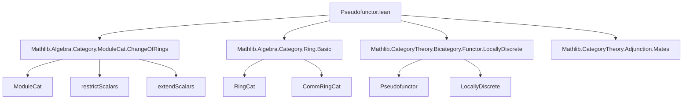

**Technical Brief: `Pseudofunctor.lean`**

---

### 1. **Key Definitions & Theorems**

| Name | Type | Purpose |
|------|------|---------|
| `CommRingCat.moduleCatRestrictScalarsPseudofunctor` | `Pseudofunctor (LocallyDiscrete CommRingCatᵒᵖ) Cat` | Contravariant pseudofunctor sending a commutative ring $R$ to $\text{Mod}_R$, with morphisms given by restriction of scalars along ring homomorphisms. |
| `RingCat.moduleCatRestrictScalarsPseudofunctor` | `Pseudofunctor (LocallyDiscrete RingCatᵒᵖ) Cat` | Same as above, but for (not necessarily commutative) rings. |
| `CommRingCat.moduleCatExtendScalarsPseudofunctor` | `Pseudofunctor (LocallyDiscrete CommRingCat) Cat` | Covariant pseudofunctor sending $R \mapsto \text{Mod}_R$, with morphisms given by extension of scalars (tensor product). |

**Auxiliary lemmas used in coherence proofs** (not definitions per se, but critical for verification):
- `restrictScalarsId R`: natural isomorphism $\mathrm{Res}_R^R \cong \mathrm{id}_{\text{Mod}_R}$
- `restrictScalarsComp g f`: natural isomorphism $\mathrm{Res}_R^S \circ \mathrm{Res}_S^T \cong \mathrm{Res}_R^T$
- `extendScalarsId R`: $\mathrm{Ext}_R^R \cong \mathrm{id}_{\text{Mod}_R}$
- `extendScalarsComp f g`: $\mathrm{Ext}_S^T \circ \mathrm{Ext}_R^S \cong \mathrm{Ext}_R^T$
- `extendScalars_assoc'`, `extendScalars_id_comp`, `extendScalars_comp_id`: coherence conditions for extension of scalars (associativity, unit, and compatibility with composition).

---

### 2. **Naming Conventions**

- **Prefixes**:
  - `moduleCat_`: indicates construction involving module categories.
  - `restrictScalars_`: for restriction-of-scalars functors and associated isos.
  - `extendScalars_`: for extension-of-scalars (tensor) functors and associated isos.
- **Suffixes**:
  - `_Id`: identity coherence isomorphism.
  - `_Comp`: composition coherence isomorphism.
- **`unop`**: used to convert between `R : CommRingCat` and its underlying ring in `RingCat`, since `CommRingCat` is defined as `RingCat` with commutativity constraint.

---

### 3. **Tactic Stack**

- `ext1`: used repeatedly to prove equality of natural transformations by extensionality (pointwise equality on objects/morphisms).
- `apply ...`: to invoke coherence lemmas like `extendScalars_assoc'`, `restrictScalarsComp`, etc.
- `simps!`: used in `@[simps!]` attribute to automatically generate simplification lemmas for `obj`, `map`, `mapId`, `mapComp`.
- `refine`: used in `CommRingCat.moduleCatExtendScalarsPseudofunctor` to construct the pseudofunctor and defer coherence checks.
- `intros; ...`: standard introspection and proof automation in the final three goals.

---

### 4. **Proof Logic**

The construction follows a standard pattern for defining pseudofunctors from locally discrete bicategories:

1. **Object mapping**: $R \mapsto \text{Mod}_R$ (via `Cat.of (ModuleCat R)`).
2. **1-morphism mapping**: For a morphism $f: R \to S$, map to the functor $\mathrm{Res}_f : \text{Mod}_S \to \text{Mod}_R$ (restriction) or $\mathrm{Ext}_f = - \otimes_f S : \text{Mod}_R \to \text{Mod}_S$ (extension).
3. **Identity and composition coherence**:
   - Construct natural isomorphisms:
     - $\eta_R: \mathrm{Id} \Rightarrow F(\mathrm{id}_R)$
     - $\mu_{f,g}: F(f \circ g) \Rightarrow F(g) \circ F(f)$ (contravariant) or $F(f \circ g) \Rightarrow F(f) \circ F(g)$ (covariant).
   - Verify triangle and pentagon identities (in this case, reduced to three lemmas for extension of scalars).
4. **Use of `LocallyDiscrete.mkPseudofunctor`**: leverages the fact that in a locally discrete bicategory, all 2-cells are identities, so only coherence isomorphisms for identities and composition need to be provided.

---

### 5. **Imports**

| Import | Role |
|--------|------|
| `Mathlib.Algebra.Category.ModuleCat.ChangeOfRings` | Provides `restrictScalars`, `extendScalars`, and their coherence laws (`restrictScalarsId`, `restrictScalarsComp`, `extendScalarsId`, `extendScalarsComp`, etc.). |
| `Mathlib.Algebra.Category.Ring.Basic` | Defines `RingCat` and `CommRingCat`. |
| `Mathlib.CategoryTheory.Bicategory.Functor.LocallyDiscrete` | Provides `LocallyDiscrete.mkPseudofunctor`, the main constructor for pseudofunctors from locally discrete bicategories. |
| `Mathlib.CategoryTheory.Adjunction.Mates` | Possibly used indirectly (e.g., for mate calculus in coherence proofs), though not explicitly referenced in this snippet. |

---

### 6. **Mermaid Diagrams**

#### Dependency Graph (Module-Level)



#### Overview of Theory Flow

```mermaid
flowchart LR
  CommRingCat/RingCat -- underlying ring --> ModuleCat R
  ModuleCat R -- restriction/extension --> ModuleCat S
  RingHom f: R → S -- defines --> Functor Res_f / Ext_f
  Res_f / Ext_f -- coherence iso --> Res_g ∘ Res_f ≅ Res_{f∘g}
  Res_f / Ext_f -- identity iso --> Id ≅ Res_id / Ext_id
  LocallyDiscrete CommRingCatᵒᵖ -- via mkPseudofunctor --> Pseudofunctor → Cat
```

---

### Summary

This file formalizes two fundamental *contravariant* and one *covariant* pseudofunctor from (locally discrete versions of) ring categories to `Cat`, encoding the module category construction as a functorial assignment. The proofs rely heavily on coherence lemmas for restriction and extension of scalars, and the structure is streamlined by Lean’s `LocallyDiscrete` machinery, which simplifies pseudofunctor definitions in settings where 2-cells are trivial.
