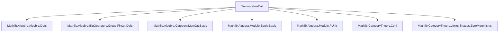

### Technical Brief: `SemimoduleCat` in Lean 4 (from `Semi.lean`)

---

#### **1. Key Definitions & Theorems**

| Name | Type / Structure | Purpose |
|------|------------------|---------|
| `SemimoduleCat.{v} R` | `Type (max (v+1) u)` | Category of bundled `R`-semimodules with carrier in universe `v`. |
| `of R X` | `SemimoduleCat R` | Constructor: given `X : Type v` with `[AddCommMonoid X] [Module R X]`, yields an object. |
| `Hom M N` | `Type (max v u)` | Morphism type: bundled `R`-linear maps `M →ₗ[R] N`. |
| `Hom.hom' f` | `M →ₗ[R] N` | Underlying linear map of a morphism `f : M ⟶ N`. |
| `ofHom f` | `M ⟶ N` | Inclusion of linear maps into category morphisms. |
| `homEquiv` | `(M ⟶ N) ≃ (M →ₗ[R] N)` | Equivalence between morphisms and linear maps. |
| `homAddEquiv` | `(M ⟶ N) ≃+ (M →ₗ[R] N)` | Additive equivalence (used to lift `AddCommMonoid` structure). |
| `homLinearEquiv` | `(M ⟶ N) ≃ₗ[S] (M →ₗ[R] N)` | Linear equivalence when `S` acts compatibly on `M, N`. |
| `LinearEquiv.toModuleIsoₛ` | `X ≃ₗ[R] Y → of R X ≅ of R Y` | Lift linear equivalence to categorical isomorphism. |
| `Iso.toLinearEquivₛ` | `X ≅ Y → X ≃ₗ[R] Y` | Extract linear equivalence from categorical isomorphism. |
| `isZero_of_subsingleton` | `[Subsingleton M] → IsZero M` | Characterizes zero objects via subsingletonness. |
| `isZero_iff_subsingleton` | `IsZero M ↔ Subsingleton M` | Equivalence between zero object and subsingleton carrier. |
| `ofHom₂` / `Hom.hom₂` | Currying/uncurrying for bilinear maps | Enables internal hom in `SemimoduleCat`. |

**Key Theorems**:
- `hom_ext`: Morphisms are equal iff their underlying linear maps are equal.
- `hom_bijective`: `Hom.hom` is bijective ⇒ morphism category is *concrete* and *rigid*.
- `hom_add`, `hom_zero`, `hom_nsmul`: Morphism space inherits `AddCommMonoid` and `ℕ`-module structure.
- `Hom.instModule`: If `S` acts on `N` and commutes with `R`, then `M ⟶ N` is an `S`-module.
- `forget reflects isomorphisms`: The forgetful functor to `Type` reflects isos.

---

#### **2. Naming Conventions**

| Pattern | Meaning | Examples |
|--------|---------|----------|
| `hom_…` | Projection to underlying linear map | `hom`, `hom_id`, `hom_comp`, `hom_add`, `hom_zero`, `hom_nsmul`, `hom_sum`, `hom_smul`, `homLinearEquiv` |
| `ofHom_…` | Inclusion of linear maps into morphisms | `ofHom`, `ofHom_id`, `ofHom_comp`, `ofHom_apply`, `ofHom₂` |
| `…ₛ` suffix | Category-theoretic version (vs. bare linear algebra) | `toModuleIsoₛ`, `toLinearEquivₛ`, `linearEquivIsoModuleIsoₛ` |
| `…₂` suffix | Bilinear / 2-ary version | `ofHom₂`, `hom₂` |
| `…Equiv` / `…Iso` | Equivalences / isomorphisms of structures | `homEquiv`, `homAddEquiv`, `homLinearEquiv`, `linearEquivIsoModuleIsoₛ` |
| `forget_…` | Forgetful functor actions | `forget_obj`, `forget_map`, `forget₂_obj`, `forget₂_map` |

---

#### **3. Tactic Stack**

| Tactic | Frequency | Role |
|--------|-----------|------|
| `rfl` | Very high | Definitional equalities (e.g., `↑(of R M) = M`, `hom_id`, `hom_comp`) |
| `simp` / `simp only` | Very high | Simplifying hom projections, compositions, identities |
| `ext` | High | Proving morphism equality via `hom_ext` (e.g., `ext x`) |
| `aesop` | Medium | Solving simple algebraic goals (e.g., in `toLinearEquivₛ` proofs) |
| `rw` | Medium | Rewriting using `hom_…` lemmas |
| `with_reducible` | Low | Ensuring definitional roundtrips (`of R ↑M = M`) |
| `infer_instance` | Medium | Inferring typeclass instances (e.g., `HasZeroObject`, `Preadditive`) |

---

#### **4. Proof Logic**

- **Structure**: Most proofs follow a *definitional + extensionality* pattern:
  1. Unfold definitions (`hom`, `comp`, `id`, `ofHom`, etc.)
  2. Apply `ext` to reduce to element-wise equality.
  3. Use `simp` with `hom_…` lemmas to simplify.
- **Key idioms**:
  - *Definitional roundtrips*: `↑(of R M) = M` and `of R ↑M = M` are *defeq*, enabling `rw` and `simp`.
  - *Concrete category*: Morphisms are *bijective* to linear maps ⇒ all structure lifts uniquely.
  - *Bundled homs*: Morphism space inherits algebraic structure via injective map `hom : (M ⟶ N) ↪ (M →ₗ[R] N)`.
  - *Currying*: Bilinear maps ↔ morphisms into internal hom via `ofHom₂` / `hom₂`.

---

#### **5. Imports & Dependencies**

| Module | Role |
|--------|------|
| `Mathlib.Algebra.Algebra.Defs` | Base algebraic structures (algebras, scalar actions) |
| `Mathlib.Algebra.BigOperators.Group.Finset.Defs` | Sum notation (`∑ i ∈ s, f i`) |
| `Mathlib.Algebra.Category.MonCat.Basic` | Monoid objects, additive categories |
| `Mathlib.Algebra.Module.Equiv.Basic` | Linear equivalences (`≃ₗ[R]`) |
| `Mathlib.Algebra.Module.PUnit` | Zero object (`PUnit`) and subsingleton modules |
| `Mathlib.CategoryTheory.Conj` | Conjugation in categories (`Iso.conj`) |
| `Mathlib.CategoryTheory.Limits.Shapes.ZeroMorphisms` | Zero morphisms, zero objects (`IsZero`, `HasZeroMorphisms`) |

---

#### **8. Mermaid Diagrams**

##### **Dependency Graph (Module-Level)**



##### **Overview of `SemimoduleCat` Theory**

```mermaid
graph LR
  subgraph Objects
    O1[SemimoduleCat R]
    O2[of R X]
  end

  subgraph Morphisms
    M1[Hom M N]
    M2[ofHom f]
    M3[Hom.hom f]
  end

  subgraph Structure
    S1[AddCommMonoid (M ⟶ N)]
    S2[Module S (M ⟶ N)]
    S3[Preadditive]
  end

  subgraph Equivalences
    E1[homEquiv]
    E2[linearEquivIsoModuleIsoₛ]
  end

  subgraph Functors
    F1[forget]
    F2[forget₂]
  end

  O1 -->|objects| M1
  M1 -->|underlying| M3
  M3 -->|linear maps| E1
  E1 -->|iso to| E2
  O2 -->|coerce| O1
  M2 -->|inclusion| M1
  S1 -->|via hom_injective| M1
  S2 -->|SMulCommClass| S1
  F1 -->|reflects isos| O1
  F2 -->|to AddCommMonCat| F1
```

##### **Key Logical Flow (Morphism Space)**

```mermaid
graph LR
  A[(M ⟶ N)] -->|hom| B[(M →ₗ[R] N)]
  B -->|+| C[(M →ₗ[R] N)]
  A -->|add| C
  A -->|hom_add| B
  B -->|0| D[0 map]
  A -->|zero| D
  B -->|n•| E[n • f]
  A -->|nsmul| E
  A -.Injective hom.->|InjectiveAddCommMonoid| B
```

---

### Summary

`SemimoduleCat R` is a *concrete preadditive category* where:
- Objects are `R`-semimodules (bundled as `AddCommMonoid + Module`).
- Morphisms are *exactly* `R`-linear maps (via `Hom.hom` bijection).
- All algebraic structure on morphisms (`+`, `0`, `ℕ`-smul, `S`-smul) lifts *canonically* from linear maps.
- Isomorphisms ↔ linear equivalences; zero objects ↔ subsingletons.
- The category is *rigid*: no hidden coherence issues (defeq roundtrips are enforced).

This makes it a foundational building block for module-theoretic constructions in `Mathlib`, especially as a stepping stone to `ModuleCat R` (for rings) and sheaf theory.
