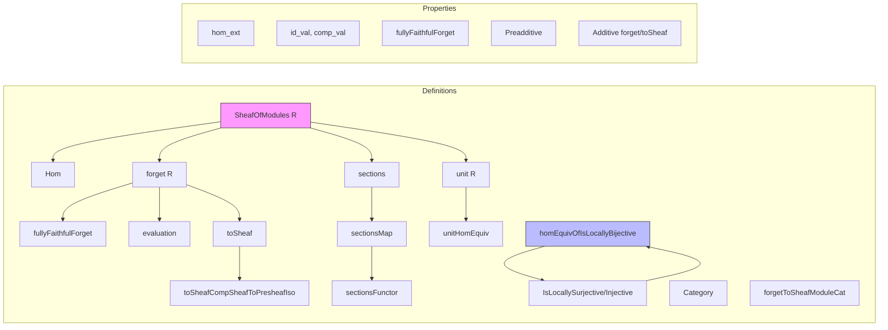

Here is the structured technical brief extracted from `Sheaf.lean`:

---

### **1. Key Definitions & Theorems**

| Name | Type / Structure | Purpose |
|------|------------------|---------|
| `SheafOfModules R` | `structure` | A sheaf of modules over a sheaf of rings `R` is a presheaf of modules whose underlying presheaf of abelian groups is a sheaf. |
| `Hom X Y` | `structure` | Morphisms between sheaves of modules are morphisms of underlying presheaves of modules. |
| `Category SheafOfModules R` | `instance` | Defines the categorical structure on sheaves of modules over `R`. |
| `hom_ext` | `lemma` | Extensionality: morphisms are equal if their underlying maps are equal. |
| `forget R` | `def` | Forgetful functor `SheafOfModules R ⥤ PresheafOfModules R.val`. |
| `fullyFaithfulForget R` | `def` | Shows `forget R` is fully faithful. |
| `evaluation X` | `def` | Evaluation at `X : Cᵒᵖ`: `SheafOfModules R ⥤ ModuleCat (R.val.obj X)`. |
| `toSheaf R` | `def` | Forgetful functor `SheafOfModules R ⥤ Sheaf J AddCommGrpCat`. |
| `forgetToSheafModuleCat X hX` | `def` | Forgetful functor to sheaves of modules over `R(X)` when `X` is initial. |
| `toSheafCompSheafToPresheafIso R` | `noncomputable def` | Canonical isomorphism between two composite forgetful functors. |
| `sections M` | `abbrev` | Type of global sections of a sheaf of modules `M`. |
| `sectionsMap f s` | `abbrev` | Induced map on sections by a morphism `f : M ⟶ N`. |
| `sectionsFunctor R` | `def` | Functor sending `M ↦ M.sections`, `f ↦ sectionsMap f`. |
| `unit R` | `noncomputable def` | Free sheaf of modules of rank 1 (unit object in the category of sheaves of modules). |
| `unitHomEquiv M` | `noncomputable def` | Bijection `(unit R ⟶ M) ≃ M.sections`. |
| `homEquivOfIsLocallyBijective f hN` | `noncomputable def` | Bijection `(M₂ ⟶ N) ≃ (M₁ ⟶ N)` induced by a locally bijective morphism `f : M₁ ⟶ M₂`, when `N` is a sheaf. |

---

### **2. Naming Conventions**

- **Prefixes**:
  - `isSheaf`, `isLocallySurjective`, `isLocallyInjective`: properties of (pre)sheaves/morphisms.
  - `forget`, `toSheaf`, `evaluation`: forgetful or evaluation functors.
  - `unit`, `sections`: canonical constructions.
- **Suffixes**:
  - `_val`: underlying component (e.g., `id_val`, `comp_val`, `hom_ext`).
  - `_equiv`, `_iso`: equivalences or isomorphisms (e.g., `unitHomEquiv`, `toSheafCompSheafToPresheafIso`).
  - `_comp_apply`: behavior under composition (e.g., `unitHomEquiv_comp_apply`).
- **Quantifier-like patterns**:
  - `hom_ext`, `add_val`, `sectionsMap_comp`: standard categorical lemmas.

---

### **3. Tactic Stack**

Frequently used tactics in proofs (inferred from lemmas and instances):

- `rfl`, `simp`, `ext1`, `congr_fun`, `congr_app`: basic equality reasoning.
- `dsimp`, `simp only`, `rw`: simplification and rewriting.
- `tauto`, `intro`, `replace`, `obtain`: logical reasoning.
- `obtain ⟨φ, hφ⟩ := ...`: existential destructuring.
- `CategoryTheory.congr_fun`, `congr_app`: naturality and extensionality for natural transformations.
- `apply`, `change`, `rw [← hφ, ...]`: manipulation of equations in categorical contexts.

No heavy automation like `aesop` or `linarith` appears—proofs are mostly structural and rely on explicit computation.

---

### **4. Proof Logic**

- **Structure-based reasoning**: Most definitions are *structures* with fields; proofs proceed by destructuring and reconstructing using `⟨...⟩`.
- **Functoriality**: Proofs about functors (e.g., `fullyFaithfulForget`) often reduce to verifying component-wise properties.
- **Naturality & sheaf condition**: Key lemmas (e.g., `homEquivOfIsLocallyBijective`) use:
  - The sheaf condition (`isSheaf`) to lift local data.
  - Local bijectivity (`WEqualsLocallyBijective`) to invert morphisms locally.
  - Module structure compatibility (e.g., `map_smul`, `hom.map_smul`).
- **Equivalence of hom-sets**: Many results (e.g., `unitHomEquiv`, `homEquivOfIsLocallyBijective`) construct explicit equivalences using universal properties or sheaf gluing.

---

### **5. Imports**

| Module | Purpose |
|--------|---------|
| `Mathlib.Algebra.Category.ModuleCat.Presheaf` | Presheaves of modules over a presheaf of rings. |
| `Mathlib.Algebra.Category.ModuleCat.Limits` | Limits in module categories (used implicitly via `ModuleCat`). |
| `Mathlib.CategoryTheory.Sites.LocallyBijective` | Theory of locally bijective morphisms of presheaves (for `homEquivOfIsLocallyBijective`). |
| `Mathlib.CategoryTheory.Sites.Whiskering` | Whiskering of natural transformations (used in sheaf theory). |

---

### **6. Mermaid Diagrams**

#### **Dependency Graph (High-Level)**

```mermaid
graph TD
  A[SheafOfModules R] --> B[PresheafOfModules R.val]
  A --> C[Sheaf J AddCommGrpCat]
  B --> D[Presheaf J RingCat]
  C --> E[Sheaf J AddCommGrpCat]
  D --> F[RingCat]
  E --> G[AddCommGrpCat]
  A --> H[ModuleCat (R.val.obj X)]
  H --> G
  style A fill:#f9f,stroke:#333
```

#### **Overview of File Structure**



---

Let me know if you'd like a formalized dependency graph (e.g., for `leanpkg` or `doc-gen`) or a summary of how this file fits into the broader theory of sheaves on sites.
