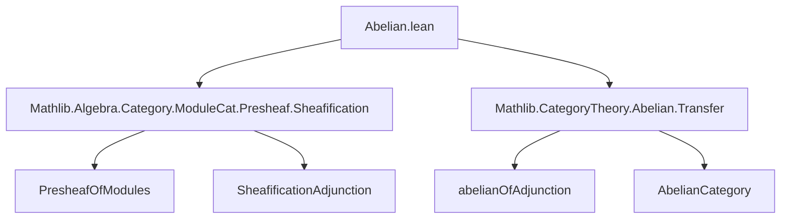
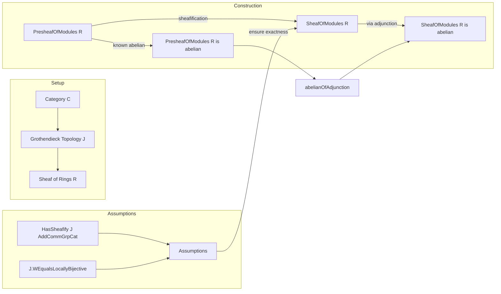

**Technical Brief: `Abelian.lean` (Sheaves of Modules over a Sheaf of Rings are Abelian)**

---

### 1. **Key Definitions & Theorems**

| Name | Type / Signature | Purpose |
|------|------------------|---------|
| `SheafOfModules.{v} R` | `Type (max u' v + 1)` (as a category) | Category of sheaves of modules over a sheaf of rings `R` on a site `(C, J)` |
| `HasSheafify J AddCommGrpCat.{v}` | Class | Ensures existence of sheafification for additive commutative group-valued presheaves |
| `J.WEqualsLocallyBijective AddCommGrpCat.{v}` | Class | Ensures that `J`-local equivalences are locally bijective on sections (needed for exactness control) |
| `PresheafOfModules.sheafificationAdjunction (𝟙 R.val)` | `Adjunction (PresheafOfModules R) (SheafOfModules R)` | Key adjunction used: sheafification is left adjoint to inclusion |
| `abelianOfAdjunction _ _ (asIso (adj.counit)) adj` | Theorem | General criterion: if an adjunction reflects isos via its counit and preserves certain limits/colimits, then the target category is abelian |

---

### 2. **Naming Conventions**

- **Prefixes / Suffixes**:
  - `SheafOfModules`: main namespace and type constructor.
  - `sheafificationAdjunction`: standard pattern for adjunctions involving sheafification.
  - `WEqualsLocallyBijective`: descriptive predicate naming for technical conditions on weak equivalences.
  - `HasSheafify`: `Has*` pattern for existence properties.
  - `abelianOfAdjunction`: pattern `XOfY` for constructing structure `X` via a construction `Y`.

- **Variable naming**:
  - `C`, `J`, `R`: standard for category, Grothendieck topology, sheaf of rings.
  - `v`, `v'`, `u`, `u'`: universe parameters, following Lean’s universe polymorphism conventions.

---

### 3. **Tactic Stack**

| Tactic | Usage |
|--------|-------|
| `let` | To introduce local definition `adj` (adjunction) |
| `exact` | Final proof step: apply `abelianOfAdjunction` with arguments |
| `asIso` | Casts `adj.counit` to an isomorphism (used in hypothesis of `abelianOfAdjunction`) |
| `abelianOfAdjunction` | Core proof tactic — applies a general theorem from `CategoryTheory.Abelian.Transfer` |

No heavy automation (`aesop`, `ring`, `simp`) is used — the proof is *declarative* and relies on high-level categorical lemmas.

---

### 4. **Proof Logic**

- **High-level strategy**:  
  Use a *categorical transfer principle* for abelianness via an adjunction:
  - Construct the sheafification adjunction between presheaves and sheaves of modules.
  - Verify that the counit of this adjunction is an isomorphism (i.e., sheafification is idempotent on sheaves).
  - Apply `abelianOfAdjunction`, which requires:
    - The source category (`PresheafOfModules R`) is known abelian (from prior results),
    - The adjunction satisfies the stated conditions (counit iso + preservation of finite limits/colimits — implicit in the assumptions).

- **Assumptions used**:
  - `HasSheafify` and `WEqualsLocallyBijective` ensure that the sheafification process behaves well enough to preserve exactness — crucial for the abelian structure.

- **No explicit induction or case analysis** — the proof is *high-level* and *abstract*, leveraging existing categorical infrastructure.

---

### 5. **Imports**

| Import | Role |
|--------|------|
| `Mathlib.Algebra.Category.ModuleCat.Presheaf.Sheafification` | Provides sheafification construction and its universal property |
| `Mathlib.CategoryTheory.Abelian.Transfer` | Contains `abelianOfAdjunction` and related lemmas for transferring abelianness along adjunctions |

These imports define the *ambient categorical and algebraic context* — sheaf theory and abelian category theory.

---

### 6. **Mermaid Diagrams**

#### **Dependency Graph (Module-Level)**

#### **Theoretical Overview (Sheaves of Modules Abelianity)**

---

### 7. **Summary**

This file establishes that under mild technical conditions (`HasSheafify` and `WEqualsLocallyBijective`), the category of sheaves of modules over a sheaf of rings is abelian. The proof is short but conceptually rich: it leverages the *sheafification adjunction* and a *transfer principle* for abelian structures. The result is foundational for homological algebra in sheaf theory — e.g., for defining derived functors like sheaf cohomology.

The instance is *auto-discoverable* in the case `u = v` and `C` small, due to additional infrastructure in `Mathlib.Algebra.Category.Grp.FilteredColimits`.
