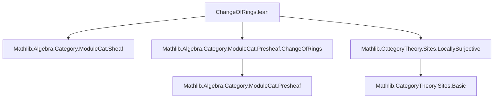
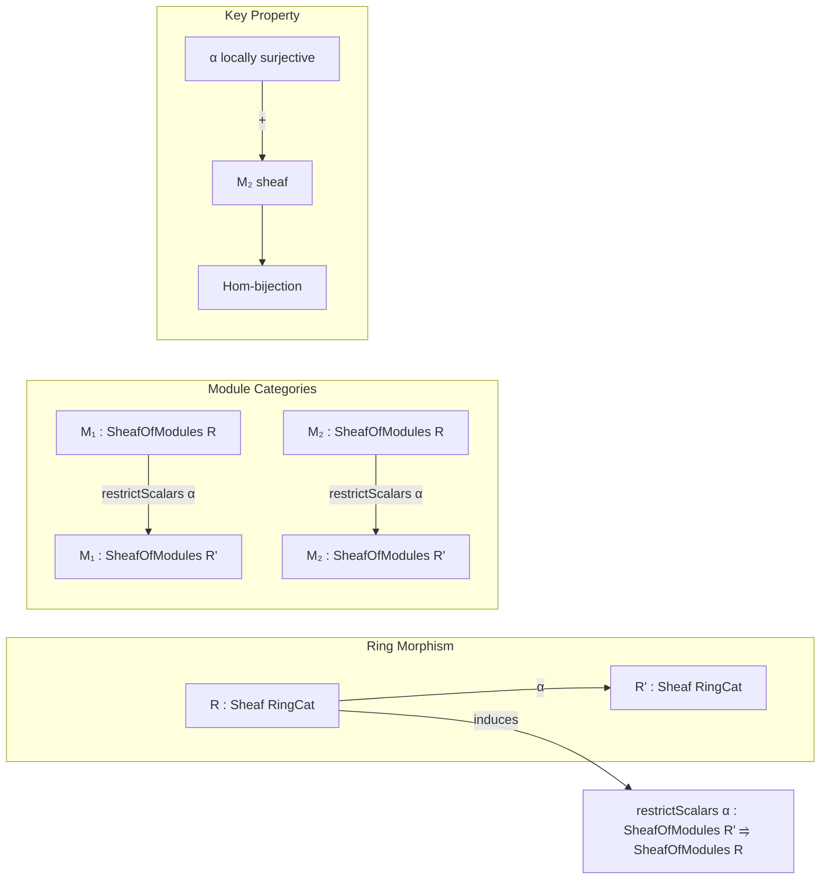

**Technical Brief: `ChangeOfRings.lean` (Lean 4, Mathlib)**  
*Domain: Sheaf Theory, Category Theory, Module Categories*

---

### 1. **Key Definitions & Theorems**

| Name | Type | Purpose |
|------|------|---------|
| `restrictScalars.{v} α` | `SheafOfModules.{v} R' ⥤ SheafOfModules.{v} R` | Functor induced by a morphism of sheaves of rings `α : R ⟶ R'`, sending a sheaf of `R'`-modules to a sheaf of `R`-modules via restriction of scalars. |
| `restrictScalars.obj` | `obj M' = { val := (PresheafOfModules.restrictScalars α.val).obj M'.val; isSheaf := M'.isSheaf }` | Defines action on objects: applies presheaf-level restriction and preserves sheaf condition. |
| `restrictScalars.map` | `map φ = { val := (PresheafOfModules.restrictScalars α.val).map φ.val }` | Defines action on morphisms. |
| `restrictHomEquivOfIsLocallySurjective` | `(M₁ ⟶ M₂) ≃ ((restrictScalars α).obj M₁ ⟶ (restrictScalars α).obj M₂)` | Shows that when `α` is *locally surjective* and `M₂` is a sheaf, the restriction-of-scalars functor induces a bijection on hom-sets (i.e., is fully faithful on such objects). |
| `instance : (restrictScalars α).Additive` | `Additive` instance | Ensures `restrictScalars` is additive (preserves zero morphisms and binary biproducts), crucial for module-categorical structure. |

---

### 2. **Naming Conventions**

- **Prefixes**:
  - `restrictScalars_`: for functors and constructions related to scalar restriction.
  - `homMk`: constructor for morphisms in `PresheafOfModules` (and likely `SheafOfModules`), taking underlying natural transformation + proof of module compatibility.
- **Suffixes**:
  - `OfIsLocallySurjective`: indicates assumptions on `α` (local surjectivity).
  - `isSheaf`, `isSeparated`: properties of (pre)sheaves.
- **Variable naming**:
  - `R`, `R'`: sheaves (or presheaves) of rings.
  - `M`, `M₁`, `M₂`, `M'`: modules (sheaves or presheaves).
  - `α`: ring morphism (of sheaves/presheaves).
  - `φ`, `f`, `g`: module morphisms.

---

### 3. **Tactic Stack**

Frequent tactics used in proofs:
- `rintro`: for structured intros and destructuring existentials/conjunctions.
- `rw`, `erw`: rewriting using equalities or definitional equalities.
- `dsimp`: simplification of definitional content.
- `change`: to replace goal with definitionally equal form.
- `rfl`: reflexivity for definitional equalities.
- `apply`, `have`, `set`: for intermediate constructions.
- `congr_fun`: to extract pointwise equality from natural transformations.

*Note*: No heavy automation (`aesop`, `ring`, `linarith`) appears—proofs are largely manual, leveraging sheaf axioms and naturality.

---

### 4. **Proof Logic**

- **Functor definition**: Directly lifted from presheaf-level `restrictScalars`, with sheaf condition preserved by construction (`isSheaf := M'.isSheaf`).
- **Hom-bijection proof** (`restrictHomEquivOfIsLocallySurjective`):
  - `toFun`: straightforward application of `restrictScalars.map`.
  - `invFun`: constructs a module morphism using:
    - Separatedness of `M₂` (`hM₂.isSeparated`) to glue local data.
    - Local surjectivity of `α` to lift sections `r' : R'.obj X` to `r : R.obj X` locally.
    - Naturality and module compatibility to verify well-definedness and module homomorphism property.
  - Proof of inverse property (not shown here) would use sheaf axioms (gluing + separatedness) and naturality.

---

### 5. **Imports & Dependencies**

| Import | Role |
|--------|------|
| `Mathlib.Algebra.Category.ModuleCat.Sheaf` | Defines `SheafOfModules`, sheaves of modules over a sheaf of rings. |
| `Mathlib.Algebra.Category.ModuleCat.Presheaf.ChangeOfRings` | Provides presheaf-level `restrictScalars` and related constructions. |
| `Mathlib.CategoryTheory.Sites.LocallySurjective` | Defines `IsLocallySurjective` for morphisms of (pre)sheaves of rings—key assumption for hom-bijection. |

---

### 6. **Mermaid Diagrams**

#### **Dependency Graph (Module-Level)**

#### **Conceptual Overview of Theory Flow**

---

### 7. **Summary**

This file formalizes the *restriction of scalars* for sheaves of modules along a morphism of sheaves of rings. It extends the presheaf-level construction to the sheaf setting and proves a key *local surjectivity ⇒ fully faithful* result for the induced functor. The construction is foundational for descent theory, base change, and relative cohomology in algebraic geometry.
