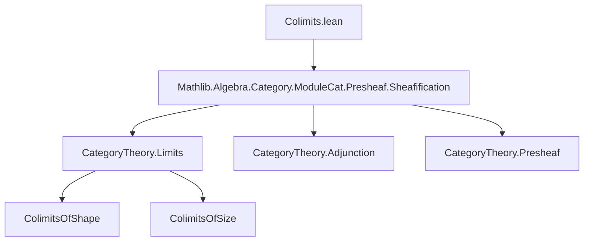

**Technical Brief: Colimits in Categories of Sheaves of Modules**

---

### 1. **Key Definitions & Theorems**

| Name | Type / Signature | Purpose |
|------|------------------|---------|
| `SheafOfModules.has_colimit_of_presheaf_colimit` | `instance [HasColimitsOfShape K (PresheafOfModules.{v} R.val)] : HasColimitsOfShape K (SheafOfModules.{v} R)` | Shows that colimits of shape `K` in `SheafOfModules R` exist if they exist in `PresheafOfModules R`. Constructed via sheafification and an adjunction. |
| `SheafOfModules.has_colimits_of_size` | `instance [HasColimitsOfSize.{w', w} (PresheafOfModules.{v} R.val)] : HasColimitsOfSize.{w', w} (SheafOfModules.{v} R)` | Extends the previous result to colimits of bounded size (i.e., `HasColimitsOfSize`). |

**Auxiliary constructions used in proof:**
- `PresheafOfModules.sheafificationAdjunction (𝟙 R.val)`: The adjunction between sheafification and inclusion `SheafOfModules R ↪ PresheafOfModules R`.
- `asIso (…).counit`: The counit of the adjunction, which is an isomorphism under the assumptions (due to `J.WEqualsLocallyBijective` and `HasWeakSheafify`).
- `Functor.isoWhiskerLeft F e`: Used to transport a diagram `F` along an isomorphism of functor categories.

---

### 2. **Naming Conventions**

- **Prefixes:**
  - `has_…`: Indicates existence of a categorical limit/colimit structure (e.g., `has_colimitsOfShape`, `has_colimitsOfSize`).
  - `SheafOfModules.`: Module category over a sheaf of rings.
  - `PresheafOfModules.`: Presheaf version of the same.
- **Suffixes:**
  - `…Adjunction`: Refers to an adjoint pair (e.g., `sheafificationAdjunction`).
  - `…ofIso`, `…of_iso`: Indicates transport along an isomorphism.
- **Variable naming:**
  - `R`: A sheaf of rings (with additional structure).
  - `K`: Index category for colimits.
  - `F`: Diagram in `SheafOfModules R`.

---

### 3. **Tactic Stack**

- `intro`, `exact`, `apply`, `refine`: Basic proof construction.
- `let e := …`: Local definition of an isomorphism.
- `asIso`: Converts a natural isomorphism (from an adjunction) into an `Iso` in the functor category.
- `.symm`: Inverts an isomorphism.
- `hasColimit_of_iso e`: A lemma (from `CategoryTheory.Limits.Shapes.Colimit`) that transports colimits along isomorphisms of diagrams.

No heavy automation (`aesop`, `ring`, `simp`) is used—proof is mostly structural/categorical.

---

### 4. **Proof Logic**

The proof follows a standard categorical pattern:

1. **Transport structure along an isomorphism of diagram categories.**  
   Given a diagram `F : K ⥤ SheafOfModules R`, compose with the forgetful functor to `PresheafOfModules R.val`, then use the sheafification adjunction to relate it back:
   $$
   F \xrightarrow{\sim} (F \circ \mathrm{forget}) \circ \mathrm{sheafification}
   $$
   via the counit of the adjunction, which is an isomorphism under the hypotheses.

2. **Assume colimits exist in presheaf category.**  
   Then the composed diagram has a colimit in presheaves.

3. **Use `hasColimit_of_iso`** to conclude that `F` itself has a colimit in sheaves, since colimits are preserved under equivalence/iso of diagram shapes.

The second instance (`HasColimitsOfSize`) follows by standard size considerations (using `HasColimitsOfSize` is defined in terms of `HasColimitsOfShape` for all small diagrams).

---

### 5. **Imports**

- `Mathlib.Algebra.Category.ModuleCat.Presheaf.Sheafification`: Core sheafification machinery, including the adjunction and properties like `WEqualsLocallyBijective`, `HasWeakSheafify`.

This file depends on:
- `CategoryTheory.Limits.Shapes.Colimit`
- `CategoryTheory.Functor.IsoWhiskerLeft`
- `CategoryTheory.Adjunction.Properties` (for `asIso`, `counit`, etc.)

---

### 6. **Mermaid Diagrams**

#### Dependency Graph (File-level)



#### Conceptual Proof Flow

```mermaid
graph LR
  D[F : K ⥤ SheafOfModules R] -->|forget| Dp[(F ⋙ forget) : K ⥤ PresheafOfModules R]
  Dp -->|sheafification| Ds[(F ⋙ forget ⋙ sheafification)]
  Ds <-->|iso via counit| D
  Dp -->|colimit exists| Lp
  Lp -->|transport along iso| L
  L --> colim in SheafOfModules R
```

#### Categorical Context

```mermaid
graph LR
  SheafOfModules R["SheafOfModules R"] -->|U = forget| PresheafOfModules R["PresheafOfModules R"]
  PresheafOfModules R -->|S = sheafification| SheafOfModules R
  U <.|> S["S ⊣ U"]
```

Where `S ⊣ U` is the sheafification adjunction, and the counit `SU ⇒ 1` is an isomorphism under the assumptions.

---

### 7. **Summary**

This file formalizes a *reflection-of-colimits* result: under mild hypotheses (ensuring sheafification behaves well), colimits in sheaves of modules are inherited from presheaves via sheafification. The proof is clean and categorical, relying on adjunctions and isomorphism transport—no set-theoretic or cohomological machinery is needed.
