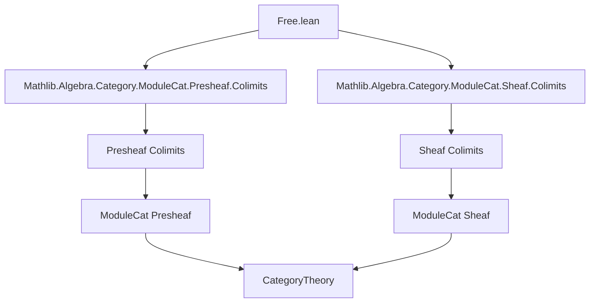
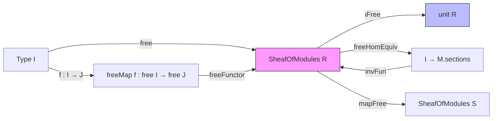

### Technical Brief: `Free.lean` — Free Sheaves of Modules in Lean 4

---

#### **1. Key Definitions & Theorems**

| Name | Type / Signature | Purpose |
|------|------------------|---------|
| `free` | `I : Type u ↦ ∐ (fun (_ : I) ↦ unit R)` | Constructs the *free sheaf of modules* over `R` indexed by a type `I`, as a coproduct of copies of `unit R`. |
| `ιFree` | `i : I ↦ ιFree i : unit R ⟶ free I` | Canonical inclusion morphism from each copy of `unit R` into the coproduct `free I`. |
| `freeCofan` | `Cofan (fun (_ : I) ↦ unit R)` | The tautological cofan (cocone base) with apex `free I`. |
| `freeCofan_inj` | `freeCofan.inj i = ιFree i` | Verifies that the cofan’s structure maps are exactly `ιFree`. |
| `isColimitFreeCofan` | `IsColimit (freeCofan I)` | States that `free I` is the colimit (coproduct) of the diagram indexed by `I`. |
| `freeHomEquiv` | `(free I ⟶ M) ≃ (I → M.sections)` | Hom-set equivalence: morphisms *from* a free sheaf correspond to families of sections indexed by `I`. |
| `freeSection` | `i ↦ (𝟙 (free I)).freeHomEquiv i` | The *tautological section* of `free I` corresponding to `i : I`. |
| `freeMap` | `f : I → J ↦ freeMap f : free I ⟶ free J` | Induced morphism between free sheaves from a function `f : I → J`. |
| `freeFunctor` | `Type u ⥤ SheafOfModules R` | The *free sheaf functor*, sending `I ↦ free I`, `f ↦ freeMap f`. It is proven to be a functor. |
| `mapFree` | `F.obj (free I) ≅ free^S I` | Under suitable assumptions (preserves coproducts, `F(unit R) ≅ unit S`), a functor `F` between sheaf categories preserves free sheaves. |

**Theorems / Lemmas (selected):**
- `freeHomEquiv_comp_apply`: Compatibility of `freeHomEquiv` with post-composition.
- `freeHomEquiv_symm_comp`: Compatibility of inverse `freeHomEquiv` with post-composition.
- `sectionMap_freeMap_freeSection`: `freeMap f` sends tautological section `i` to section `f i`.
- `ιFree_freeMap`: Compatibility of `ιFree` with `freeMap f`.
- `mapFree` lemmas (`ιFree_mapFree_inv`, `map_ιFree_mapFree_hom`): naturality of the isomorphism `mapFree`.

---

#### **2. Naming Conventions**

- **Prefixes:**
  - `free*`: all constructions related to free sheaves (`free`, `freeMap`, `freeSection`, `freeCofan`, `freeFunctor`).
  - `ιFree`: Greek *iota* for inclusion maps (standard categorical notation for coproduct injections).
  - `mapFree`: functorial action on morphisms.
- **Suffixes:**
  - `Equiv`: indicates a equivalence of types (e.g., `freeHomEquiv`).
  - `HomEquiv`: hom-set equivalences involving `unitHomEquiv`.
  - `Map`: morphism-level constructions (`freeMap`, `sectionMap`).
- **`*Section`**: sections of sheaves (e.g., `freeSection`, `sectionsMap`).
- **`*HomEquiv`**: equivalences involving `unitHomEquiv`, often used to translate between module homs and section maps.

---

#### **3. Tactic Stack**

- **`simp` / `dsimp`**: heavily used to simplify using `@[simp]` lemmas (e.g., `freeHomEquiv`, `ιFree_freeMap`).
- **`ext` / `ext1`**: extensionality for morphisms (sheaf morphisms, functions).
- **`rw`**: rewriting using equalities (especially `←` versions for unfolding definitions).
- **`rfl`**: reflexivity for definitional equalities (e.g., `freeCofan_inj`).
- **`simp [← ...]`**: rewriting backwards to expose structure (e.g., `← freeCofan_inj`).
- **`have` + `simp`**: intermediate lemmas to manage complex algebraic manipulations.
- **`CategoryTheory.Equivalence.refl`**: used in `mapFree` to build natural isomorphisms.

No heavy automation (e.g., `aesop`, `linarith`) — proofs are mostly structural and rely on universal properties.

---

#### **4. Proof Logic**

- **Universal property-driven**: proofs rely on the fact that `free I` is a coproduct, hence characterized by its universal property (`IsColimit`).
- **Standard pattern**:
  1. Define candidate morphism via `Cofan.IsColimit.desc`.
  2. Prove equivalence by showing `left_inv` and `right_inv` using `hom_ext` or `injective`.
  3. Use `simp` + `freeHomEquiv` lemmas to reduce to component-wise checks.
- **Functoriality proofs** (`map_id`, `map_comp`) use `freeHomEquiv.injective` to reduce to section-level equalities, then `simp`.
- **Preservation lemmas** (`mapFree`, etc.) use:
   - `PreservesColimitsOfShape` to transport colimits through `F`.
   - `coconePointsIsoOfEquivalence` to build the isomorphism `F(free I) ≅ free^S I`.
   - `simp` + `←` rewriting to verify naturality of the iso.

---

#### **5. Imports**

| Import | Purpose |
|--------|---------|
| `Mathlib.Algebra.Category.ModuleCat.Presheaf.Colimits` | Colimits in presheaf categories of modules (used for coproducts). |
| `Mathlib.Algebra.Category.ModuleCat.Sheaf.Colimits` | Colimits in *sheaf* categories of modules (ensures coproducts exist and behave well). |

These imports provide:
- `unit R` (the structure sheaf, viewed as a sheaf of modules over itself),
- `∐` (coproducts in `SheafOfModules`),
- `IsColimit`, `Cofan`, `sectionsMap`, `unitHomEquiv`, etc.

---

#### **6. Mermaid Diagrams**

##### **Dependency Graph (Module-Level)**



##### **Overview of Theory Flow**



##### **Universal Property Diagram (Free Sheaf)**

```mermaid
graph LR
  subgraph Diagram
    direction TB
    unitR1[unit R] -->|ιFree i| freeI[free I]
    unitR2[unit R] -->|ιFree j| freeI
    unitR3[unit R] -->|…| freeI
  end

  subgraph Cone
    M[M] <-- f_i -- unitR1
    M <-- f_j -- unitR2
    M <-- … -- unitR3
  end

  freeI -.->|∃! u| M
  style freeI fill:#9cf,stroke:#333
  style M fill:#f96,stroke:#333
```

> `free I` is the coproduct: for any cocone `(f_i : unit R → M)`, there exists a unique `u : free I → M` with `ιFree i ≫ u = f_i`.

---

#### **7. Summary**

This file formalizes the *free sheaf of modules* construction in the context of Grothendieck topoi and sheaves of rings/modules. It establishes:
- The existence of free objects in `SheafOfModules R`,
- Their universal property (via coproducts),
- Functoriality (`freeFunctor`),
- Compatibility with colimit-preserving functors (`mapFree`).

It serves as a foundational building block for further developments (e.g., adjunctions, projective resolutions, sheaf cohomology constructions). The TODO item hints at future work on adjointness with evaluation/sections functors.

--- 

Let me know if you'd like a formalized summary in `lean` comment style or a dependency analysis for integration into a larger library.
