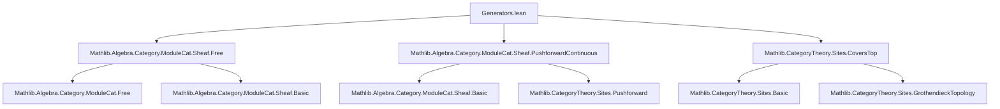
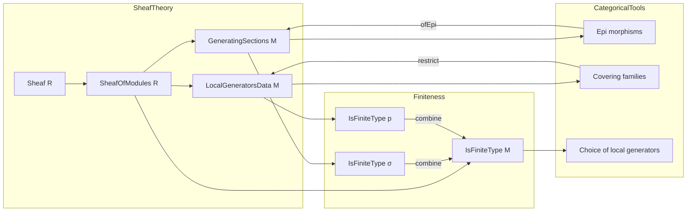

### Technical Brief: `Generators.lean`

---

#### **1. Key Definitions & Theorems**

| Name | Type / Structure | Purpose |
|------|------------------|---------|
| `GeneratingSections` | `Structure` | Encodes a family of global sections `s : I → M.sections` that generate the sheaf of modules `M`. Includes an `Epi` witness that the induced map `free I ⟶ M` is an epimorphism. |
| `π (σ : M.GeneratingSections)` | `free σ.I ⟶ M` | The canonical epimorphism from the free sheaf on the index type to `M`, induced by the generating sections. |
| `ofEpi (σ : M.GeneratingSections) (p : M ⟶ N) [Epi p]` | `N.GeneratingSections` | Pushes forward generating sections along an epimorphism `p`. |
| `equivOfIso (e : M ≅ N)` | `M.GeneratingSections ≃ N.GeneratingSections` | Shows that isomorphic sheaves have equivalent generating sections structures. |
| `IsFiniteType (σ : M.GeneratingSections)` | `Class Prop` | Predicate asserting that the index type `σ.I` is finite (i.e., finitely many generators). |
| `LocalGeneratorsData` | `Structure` | Encodes a covering `X : I → C` of the terminal object, together with generating sections for the restriction of `M` to each `X i`. Used to define finite type sheaves locally. |
| `LocalGeneratorsData.IsFiniteType (p : M.LocalGeneratorsData)` | `Class Prop` | Asserts that each local generating family `p.generators i` is finite type. |
| `IsFiniteType (M : SheafOfModules R)` | `Class Prop` | `M` is of finite type iff it admits a *finite* local generating data (i.e., a covering by objects where `M` is finitely generated over each). |
| `IsFiniteType.exists_localGeneratorsData` | `Lemma` | Guarantees existence of a local generating data for finite type sheaves. |
| `opEpi_id`, `opEpi_comp` | `Lemma` | Algebraic properties of `ofEpi`: identity and composition compatibility. |
| `opEpi_id`, `opEpi_comp` | `Lemma` | Ensure `ofEpi` behaves functorially with respect to composition and identity of epimorphisms. |

---

#### **2. Naming Conventions**

- **Prefixes**:
  - `ofEpi`: indicates construction via pushforward along an epimorphism.
  - `equivOfIso`: indicates equivalence induced by an isomorphism.
  - `localGeneratorsDataOfIsFiniteType`: deprecated constructor name (legacy).
- **Suffixes**:
  - `IsFiniteType`: predicate class for finiteness (on structures or sheaves).
  - `GeneratingSections`: core structure for global generators.
  - `LocalGeneratorsData`: structure for local generators.
- **Variables**:
  - `σ`, `p`, `e`: standard for generating sections, local data, and isomorphisms respectively.
  - `I`, `X`: indexing types for covers and sections.

---

#### **3. Tactic Stack**

Frequent tactics used in proofs and type class inference:

- `infer_instance`: to synthesize type class instances (e.g., `Finite`, `Epi`).
- `simp only [...]`: for precise simplification using lemmas like `opEpi_id`, `opEpi_comp`, `e.hom_inv_id`.
- `rw [...]`: rewriting using `freeHomEquiv_symm_comp`, `← opEpi_comp`, etc.
- `dsimp`: for definitional simplification (e.g., in `equivOfIso` proofs).
- `apply epi_comp`: to prove epimorphism properties after composition.

No heavy automation (e.g., `aesop`, `ring`, `linarith`) is used—proofs are mostly structural and rely on categorical properties.

---

#### **4. Proof Logic**

- **Structure-based reasoning**: Most proofs are definitional (`rfl`) or rely on simple categorical lemmas (e.g., `epi_comp`, `hom_inv_id`).
- **Functoriality checks**: For constructions like `ofEpi` and `equivOfIso`, proofs verify compatibility with identity and composition.
- **Equivalence proofs**: Use `simp` with inverse functors and unit/counit laws (e.g., `e.hom_inv_id`, `e.inv_hom_id`).
- **Inductive/constructive style**: Existence of local generators is assumed via `IsFiniteType`, and choice is made via `.choose` (deprecated in favor of direct use of the lemma).

---

#### **5. Imports**

Core dependencies defining the module’s scope:

```lean
Mathlib.Algebra.Category.ModuleCat.Sheaf.Free
Mathlib.Algebra.Category.ModuleCat.Sheaf.PushforwardContinuous
Mathlib.CategoryTheory.Sites.CoversTop
```

- **Sheaf theory over a site**: `SheafOfModules`, `free`, `pushforward`, `coversTop`.
- **Module sheaves**: Sheaves of modules over a sheaf of rings `R`, with weak sheafification and composition assumptions.
- **Categorical foundations**: `CategoryTheory`, `Limits`, `GrothendieckTopology`, `Sites`.

---

#### **8. Mermaid Diagrams**

##### **Dependency Graph (Module-Level)**



##### **Overview of Theory Flow**



##### **Key Logical Flow**

1. **Global generators** (`GeneratingSections`) → define free module maps and epimorphisms.
2. **Functoriality** (`ofEpi`, `equivOfIso`) → transport structure along epimorphisms and isomorphisms.
3. **Local data** (`LocalGeneratorsData`) → patch global generators over covers.
4. **Finite type** (`IsFiniteType`) → global property defined via existence of *finite* local generators.

---

Let me know if you'd like a formalization roadmap or a comparison with the Stacks Project tag [01B4](https://stacks.math.columbia.edu/tag/01B4).
