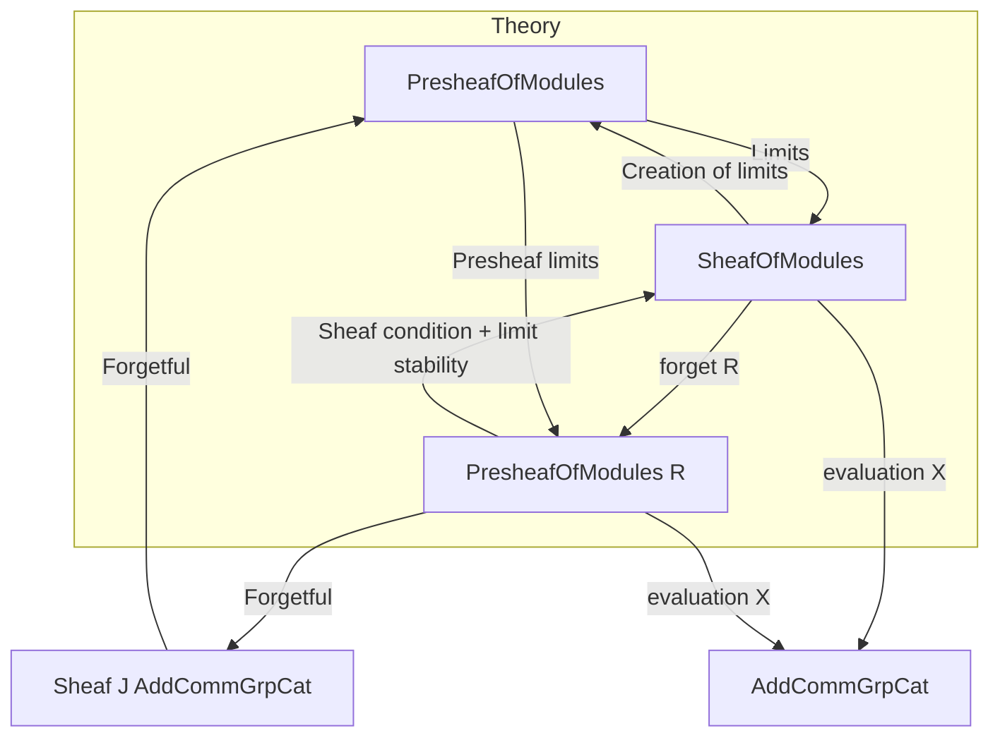
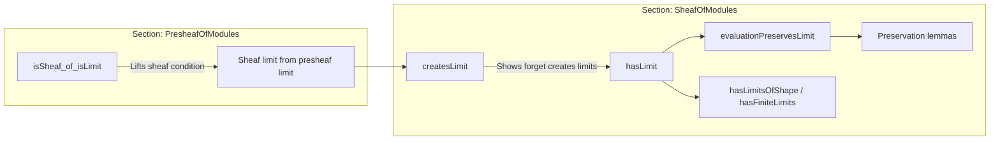

**Technical Brief: Limits in `SheafOfModules R` (from `Limits.lean`)**  
*Compiled by Senior Lean 4 Formalization Expert*

---

### 1. KEY DEFINITIONS & THEOREMS

| Name | Type / Signature | Purpose |
|------|------------------|---------|
| `isSheaf_of_isLimit` | `IsLimit c → (∀ j, Presheaf.IsSheaf J (F.obj j).presheaf) → Presheaf.IsSheaf J (c.pt.presheaf)` | Shows that the limit of a diagram of *sheaves of modules* (viewed as presheaves) is again a sheaf, assuming the diagram’s limit exists in presheaves and each object is a sheaf. |
| `createsLimit` | `CreatesLimit F (forget _)` | Proves that the forgetful functor `forget R : SheafOfModules R ⥤ PresheafOfModules R` creates limits of shape `D`, using the fact that limits in sheaves are constructed as sheafifications of limits in presheaves. |
| `hasLimit` | `HasLimit F` | Consequence of `createsLimit`: limits of shape `D` exist in `SheafOfModules R`. |
| `evaluationPreservesLimit` | `PreservesLimit F (evaluation R X)` | The evaluation functor at an object `X` preserves limits (i.e., evaluating a limit sheaf at `X` gives the limit of the evaluated diagram). |
| `hasLimitsOfShape` | `HasLimitsOfShape D (SheafOfModules.{v} R)` | Under smallness assumption on `D`, all limits of shape `D` exist in `SheafOfModules R`. |
| `hasFiniteLimits` | `HasFiniteLimits (SheafOfModules.{v} R)` | Special case: finite limits exist (e.g., products, equalizers). |
| `preservesFiniteLimits (forget)` / `(evaluation)` | `PreservesFiniteLimits (forget R)` / `PreservesFiniteLimits (evaluation R X)` | Forgetful and evaluation functors preserve finite limits. |
| `preservesLimitsOfSize` | `PreservesLimitsOfSize.{v₂, v} (forget R)` etc. | Generalization to limits of bounded size (controlled by universe levels). |
| `preservesFiniteLimits (toSheaf ⋙ sheafToPresheaf)` | `PreservesFiniteLimits (SheafOfModules.toSheaf R ⋙ sheafToPresheaf _ _)` | The composite `toSheaf` → `sheafToPresheaf` preserves finite limits (used to reflect/compare with presheaves). |

---

### 2. NAMING CONVENTIONS

- **`isSheaf_of_…`**: Theorems showing a presheaf is a sheaf under structural conditions.
- **`createsLimit` / `hasLimit` / `hasLimitsOfShape` / `hasFiniteLimits`**: Standard pattern for existence of limits.
- **`evaluationPreserves_…` / `forgetPreserves_…`**: Functors preserve certain limits.
- **`preservesFiniteLimits` / `preservesLimitsOfSize`**: Prefix `preserves` + limit type.
- **`mk`**: Used to construct sheaves from presheaves + sheaf condition (via `Sheaf.mk`-style).
- **`toPresheaf`, `sheafToPresheaf`, `toSheaf`**: Functors between `SheafOfModules` and `PresheafOfModules`.

---

### 3. TACTIC STACK

| Tactic | Usage Frequency | Role |
|--------|-----------------|------|
| `infer_instance` / `solve_by_elim` | High | Automatically discharge smallness and category-theoretic instances. |
| `dsimp`, `simp_rw` | Medium | Simplify definitions (e.g., unfolding `evaluation`, `forget`). |
| `exact`, `apply`, `refine` | Medium | Direct proof steps, especially for `IsLimit` and sheaf conditions. |
| `hasLimit_of_created` | Medium | Bridge between `CreatesLimit` and `HasLimit`. |
| `preservesFiniteLimits_of_reflects_of_preserves` | Low | A specialized lemma for proving preservation via reflection. |
| `intros`, `cases`, `constructor` | Low | Basic proof structure. |

No heavy automation like `aesop` or `ring` is used—proofs rely on categorical lemmas and instance resolution.

---

### 4. PROOF LOGIC

The logical flow follows a **two-step construction**:

1. **Presheaf-level limit**:  
   Given a diagram `F : D ⥤ SheafOfModules R`, compose with `forget R` to get a diagram in `PresheafOfModules R`.  
   Use `HasLimitsOfShape D AddCommGrpCat` to get a limit cone `c` in presheaves.

2. **Sheafification**:  
   Show `c.pt.presheaf` satisfies the sheaf condition using `isSheaf_of_isLimit`, leveraging:
   - Each `F.obj j` is a sheaf (`(F.obj j).isSheaf`)
   - The limit cone is a limit in presheaves (`IsLimit c`)
   - The sheaf condition is stable under limits (via `Sheaf.isSheaf_of_isLimit`)

3. **Creation of limits**:  
   Prove `forget R` *creates* limits by showing the limit cone in presheaves lifts uniquely to a limit cone in sheaves (via `mk` + `isSheaf_of_isLimit`).  
   Then deduce `HasLimit F` and preservation properties.

4. **Smallness & size control**:  
   For general `D`, assume `Small D` or bound size via `LimitsOfSize`.  
   Use `preservesFiniteLimits_of_reflects_of_preserves` to relate `toSheaf` and `sheafToPresheaf`.

---

### 5. IMPORTS (Primary Dependencies)

| Module | Role |
|--------|------|
| `Mathlib.Algebra.Category.ModuleCat.Presheaf.Limits` | Limits in presheaves of modules (base for construction). |
| `Mathlib.Algebra.Category.ModuleCat.Sheaf` | Sheaves of modules, sheaf condition, `Sheaf.mk`, `forget`, `toSheaf`. |
| `Mathlib.CategoryTheory.Sites.Limits` | General theory of limits on sheaves on a site (`Sheaf J _`), `IsSheaf`, `createsLimit`, etc. |

---

### 6. MERMAID DIAGRAMS

#### Dependency Graph (High-Level)

#### Overview of File Structure

---

### 7. DOMAIN-SPECIFIC INSIGHTS

- **Sheaf condition is stable under limits**: This is the core categorical principle used (`isSheaf_of_isLimit`). It mirrors classical topology: limits of sheaves (e.g., inverse limits) remain sheaves.
- **Forgetful functor is monadic-like**: Though not explicitly stated, `createsLimit` suggests `forget R` behaves like a monadic functor (limits lift uniquely).
- **Size control is critical**: Universe polymorphism (`v`, `v₁`, `v₂`, `u`, `u₁`, `u₂`) is carefully managed to ensure smallness assumptions (e.g., `Small D`, `Small sections`) are satisfied.
- **Sheafification is left exact**: The final instance `preservesFiniteLimits (toSheaf)` confirms that sheafification preserves finite limits (i.e., is left exact), a key property in cohomological algebra.

---

Let me know if you'd like a formalization roadmap for extending this to **colimits** (as hinted in the TODO), or a breakdown of the `Sheaf.isSheaf_of_isLimit` lemma used internally.
