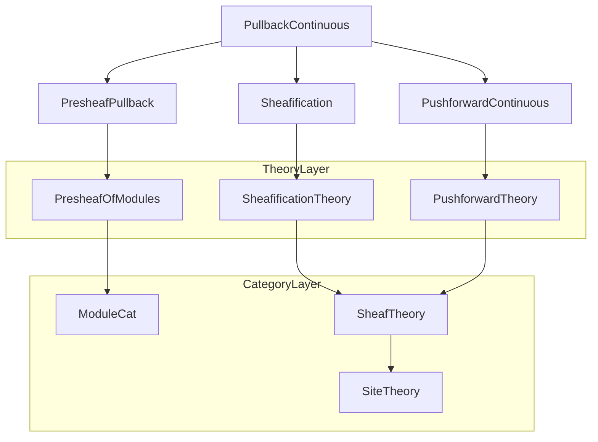

### Technical Brief: `PullbackContinuous.lean`

---

#### **1. Key Definitions & Theorems**

| Name | Type / Signature | Purpose |
|------|------------------|---------|
| `pullback.{v} φ` | `SheafOfModules.{v} S ⥤ SheafOfModules.{v} R` | Left adjoint to `pushforward.{v} φ`, defined when the latter is a right adjoint. |
| `pullbackPushforwardAdjunction φ` | `pullback.{v} φ ⊣ pushforward.{v} φ` | The adjunction between pullback and pushforward for sheaves of modules. |
| `PullbackConstruction.adjunction φ` | `(forget S ⋙ PresheafOfModules.pullback.{v} φ.val ⋙ sheafification) ⊣ pushforward.{v} φ` | Explicit construction of the adjunction using presheaf pullback + sheafification. |
| `pullbackIso φ` | `pullback.{v} φ ≅ forget S ⋙ PresheafOfModules.pullback.{v} φ.val ⋙ sheafification (𝟙 R.val)` | Shows pullback on sheaves is composition of forget, presheaf pullback, and sheafification. |
| `sheafificationCompPullback φ` | `sheafification (𝟙 S.val) ⋙ pullback.{v} φ ≅ pullback.{v} φ.val ⋙ sheafification (𝟙 R.val)` | Pullback commutes with sheafification (up to natural isomorphism). |
| `pullbackId S` | `pullback.{v} (𝟙 S) ≅ 𝭭 _` | Pullback along identity morphism is identity functor. |
| `pullbackComp φ ψ` | `pullback φ ⋙ pullback ψ ≅ pullback (φ ≫ F.map ψ)` | Pullback respects composition of ring morphisms (up to iso). |
| `pullback_assoc φ ψ ψ'` | Associativity of `pullbackComp` up to coherent iso (via `isoWhiskerLeft/right` and `associator`). |
| `pullback_id_comp φ`, `pullback_comp_id φ` | Unit laws for `pullbackComp` with identity morphisms. |

---

#### **2. Naming Conventions**

- **Prefixes**:
  - `pullback_`, `pushforward_`: Core functors and constructions.
  - `sheafification_`: Sheafification-related natural transformations/isos.
  - `conjugateEquiv_`: Relates conjugation via adjunctions.
- **Suffixes**:
  - `_iso`: Natural isomorphisms.
  - `_adjunction`: Adjunction data.
  - `_comp`, `_id`: Composition/unit laws.
- **Variable naming**:
  - `φ`, `ψ`, `ψ'`: Morphisms of sheaves of rings.
  - `F`, `G`, `G'`: Continuous functors between sites.
  - `S`, `R`, `R'`, `R''`: Sheaves of rings.

---

#### **3. Tactic Stack**

| Tactic | Usage Frequency | Purpose |
|--------|-----------------|---------|
| `simp only [...]` | High | Simplify hom-sets, functors, and naturality diagrams. |
| `dsimp` | Medium | Simplify definitional equalities, especially in homEquiv contexts. |
| `rw`, `erw` | Medium | Rewrite using adjunction naturality, whiskering, and iso laws. |
| `tauto` | Low | Prove simple propositional tautologies in naturality proofs. |
| `Adjunction.*` lemmas (e.g., `leftAdjointUniq`, `leftAdjointCompIso`) | High | Construct and manipulate adjunctions and their left adjoints. |
| `Functor.isRightAdjoint_of_iso` | Medium | Transfer adjointness via isomorphisms of functors. |

---

#### **4. Proof Logic**

- **Existence of pullback**: Proven by constructing a left adjoint to `pushforward.{v} φ` via presheaf pullback + sheafification (`PullbackConstruction.adjunction`). This uses:
  - Sheafification adjunction.
  - Presheaf pullback–pushforward adjunction.
  - Fully faithfulness of `forget S`.
- **Uniqueness / description**: Once existence is shown, `pullbackIso` identifies the pullback functor with the composite construction.
- **Compatibility with composition**:
  - Use `Adjunction.leftAdjointCompIso` to lift composition of right adjoints (`pushforward`) to composition of left adjoints (`pullback`).
  - Naturality and coherence (e.g., associativity, unit laws) follow from general adjunction calculus and properties of `pushforwardComp`, `pushforwardId`, etc.
- **Sheafification compatibility**:
  - Both sides of `sheafificationCompPullback` are left adjoints to the same functor (`pushforward`), so uniqueness of left adjoints yields the iso.

---

#### **5. Imports**

| Module | Role |
|--------|------|
| `Mathlib.Algebra.Category.ModuleCat.Presheaf.Pullback` | Presheaf pullback of modules. |
| `Mathlib.Algebra.Category.ModuleCat.Presheaf.Sheafification` | Sheafification functor and its adjunction. |
| `Mathlib.Algebra.Category.ModuleCat.Sheaf.PushforwardContinuous` | Continuous pushforward of sheaves of modules. |

These imports define the building blocks: presheaf-level constructions and the continuous pushforward, which are essential for defining and analyzing the sheaf-level pullback.

---

#### **6. Mermaid Diagrams**

##### **Dependency Graph (Module-Level)**



##### **Overview of File Structure**

```mermaid
flowchart LR
  A[Continuous Functor F: C → D] --> B[Sheaves of Rings S, R]
  B --> C[Morphism of sheaves of rings φ: S → F_* R]
  C --> D[Define pullback φ: ShMod(S) → ShMod(R)]
  D --> E[Existence: via presheaf pullback + sheafification]
  D --> F[Adjunction: pullback φ ⊣ pushforward φ]
  D --> G[Properties: unit, associativity, sheafification compatibility]
  G --> H[Pseudofunctoriality: pullback respects composition & identities]
```

##### **Adjunction Ladder (Key Diagram)**

```mermaid
flowchart LR
  subgraph Sheaves
    ShMod(S) -- pullback φ --> ShMod(R)
    ShMod(R) -- pushforward φ --> ShMod(S)
  end

  subgraph Presheaves
    PShMod(S) -- pullback^p φ --> PShMod(R)
    PShMod(R) -- pushforward^p φ --> PShMod(S)
  end

  ShMod(S) -- forget --> PShMod(S)
  ShMod(R) -- forget --> PShMod(R)
  PShMod(S) -- sheafify --> ShMod(S)
  PShMod(R) -- sheafify --> ShMod(R)

  pullback φ -.->|≈| forget ⋙ pullback^p φ ⋙ sheafify
```

---

#### **7. Summary**

This file formalizes the **pullback functor** for sheaves of modules along a morphism of sheaves of rings induced by a continuous functor between sites. It establishes:

- **Existence** of pullback via explicit construction (presheaf pullback + sheafification).
- **Adjunction** with pushforward.
- **Compatibility** with sheafification.
- **Pseudofunctorial behavior**: identities and composition laws up to coherent isomorphism.

The development leverages the general theory of adjoints, sheafification, and continuity of functors, and is structured to mirror categorical expectations (e.g., left adjoints preserve colimits, uniqueness up to iso).
