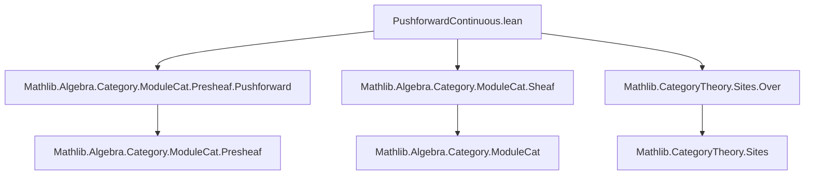

### Technical Brief: `PushforwardContinuous.lean`

---

#### **1. Key Definitions & Theorems**

| Name | Type | Purpose |
|------|------|---------|
| `pushforward` | `SheafOfModules R ⥤ SheafOfModules S` | Constructed from a continuous functor `F : C ⥤ D` and a ring morphism `φ : S → F_* R`, this is the main *pushforward functor* on sheaves of modules. |
| `over` | `SheafOfModules R → D → SheafOfModules (R.over X)` | Restriction of a sheaf of modules along the inclusion `Over X ⥤ D`, using identity morphism pushforward. |
| `pushforwardId` | `pushforward (𝟙 R) ≅ 𝟭 _` | Identity morphism induces identity functor (up to iso). |
| `pushforwardCongr` | `φ = ψ → pushforward φ ≅ pushforward ψ` | Equal morphisms of sheaves of rings induce isomorphic pushforwards. |
| `pushforwardComp` | `pushforward ψ ⋙ pushforward φ ≅ pushforward (φ ≫ F_* ψ)` | Compatibility of pushforwards with composition of ring morphisms and functors. |
| `pushforward_assoc` | `… = …` | Associativity constraint for pushforward composition isomorphisms (pseudofunctoriality). |
| `pushforward_comp_id`, `pushforward_id_comp` | `pushforwardComp (𝟙 S) φ = …`, `pushforwardComp φ (𝟙 R) = …` | Unit laws for pseudofunctorial composition. |
| `pushforwardNatTrans` | `F ⟶ G → pushforward φ ⟶ pushforward (φ ≫ F_* α_G)` | Natural transformation between functors induces natural transformation between pushforwards. |
| `pushforwardNatIso` | `F ≅ G → pushforward φ ≅ pushforward (φ ≫ F_* α_G)` | Natural isomorphism lifts to isomorphism of pushforward functors. |
| `pushforwardPushforwardAdj` | `F ⊣ G ⇒ pushforward φ ⊣ pushforward ψ` | If `F ⊣ G`, then induced pushforward functors on sheaves of modules are adjoint (under coherence conditions `H₁`, `H₂`). |

---

#### **2. Naming Conventions**

- **Prefixes**:
  - `pushforward*`: All core constructions related to the pushforward of sheaves of modules.
  - `over*`: Localizations over objects in the base category.
  - `NatTrans*`, `NatIso*`: Natural transformations/isomorphisms induced by categorical data.
- **Suffixes**:
  - `Id`, `Comp`, `Congr`, `Assoc`: Denote structural properties (identity, composition, congruence, associativity).
  - `app_val_app`: Refers to component-wise action on underlying presheaf sections (`x : M.val.app U`).
- **`_hom`, `_inv`**: For components of isomorphisms.
- **`_val_app`**: Accesses underlying presheaf morphism and its action on sections.

---

#### **3. Tactic Stack**

| Tactic | Frequency | Purpose |
|--------|-----------|---------|
| `ext` | Very high | Extensionality for morphisms, natural transformations, and sections. |
| `rfl` / `congr` | High | Proving equality of morphisms/sections by unfolding definitions. |
| `simp` / `simpa` | High | Simplification using `@[simps]` lemmas and definitional equalities. |
| `subst` | Medium | Substituting equalities (e.g., in `pushforwardCongr`). |
| `cat_disch` | Medium | Category-theoretic discharge tactic (likely custom or from `Mathlib.Tactic`). |
| `change`, `rw`, `simp only` | Medium | Rewriting and simplifying under specific hypotheses. |
| `dsimp` | Low | Deep simplification (used to expose hidden structure). |

---

#### **4. Proof Logic**

- **Structure**: Most proofs are *definitionally trivial* after unfolding definitions (e.g., `pushforward`, `pushforwardNatTrans`, `pushforwardComp`), and rely on:
  - **Unfolding** of `pushforward`, `over`, `NatTrans.app`, etc.
  - **Extensionality** (`ext`) to reduce to equality on sections.
  - **Simplification** (`simp`, `simpa`) using `@[simps]` attributes and known naturality/compatibility lemmas.
- **Inductive/structural reasoning**: Not used; all arguments are *pointwise* on sections and morphisms.
- **Coherence checks**: Associativity/unit laws verified by `ext; rfl`, confirming pseudofunctorial behavior.
- **Adjunction construction**: Uses whiskering, naturality of unit/counit, and coherence conditions (`H₁`, `H₂`) to define unit/counit of adjunction.

---

#### **5. Imports**

| Module | Role |
|--------|------|
| `Mathlib.Algebra.Category.ModuleCat.Presheaf.Pushforward` | Underlies `PresheafOfModules.pushforward`, used in `SheafOfModules.pushforward`. |
| `Mathlib.Algebra.Category.ModuleCat.Sheaf` | Defines `SheafOfModules`, the category of sheaves of modules over a sheaf of rings. |
| `Mathlib.CategoryTheory.Sites.Over` | Provides `Over X`, used in `over` construction. |

---

#### **6. Theory Scope**

This file formalizes the **functoriality and coherence of pushforward operations** on sheaves of modules in the context of:
- Grothendieck topologies on categories `C`, `D`, `D'`, `D''`.
- Continuous functors `F : C ⥤ D`, `G : D ⥤ D'`, etc.
- Morphisms of sheaves of rings `φ : S → F_* R`.
- Natural transformations and isomorphisms between such functors.
- Adjunctions `F ⊣ G`, leading to adjunctions between induced pushforwards.

It serves as a foundational layer for descent theory, base change, and Grothendieck six operations formalism in the setting of sheaves of modules.

---

#### **7. Mermaid Diagrams**

##### **Dependency Graph (Module-Level)**



##### **Overview of Theoretical Flow**

```mermaid
graph LR
  subgraph Setup
    C[C: Category w/ topology J]
    D[D: Category w/ topology K]
    F[F: C ⥤ D (continuous)]
    S[S: Sheaf J RingCat]
    R[R: Sheaf K RingCat]
    φ[φ: S → F_* R]
  end

  subgraph Construction
    P[pushforward φ : SheafOfModules R ⥤ SheafOfModules S]
    O[over X : SheafOfModules (R.over X)]
  end

  subgraph Coherence
    I[pushforwardId]
    C1[pushforwardCongr]
    C2[pushforwardComp]
    A[pushforward_assoc]
    U[pushforward_comp_id / id_comp]
  end

  subgraph Naturality
    NT[pushforwardNatTrans]
    NI[pushforwardNatIso]
  end

  subgraph Adjunction
    Adj[pushforwardPushforwardAdj]
  end

  Setup --> Construction
  Construction --> Coherence
  Construction --> Naturality
  Setup --> Adjunction
  Coherence --> Adjunction
```

--- 

This file is a *coherence-theoretic* treatment of pushforwards in derived/sheaf-theoretic contexts, emphasizing structural properties over homological algebra.
