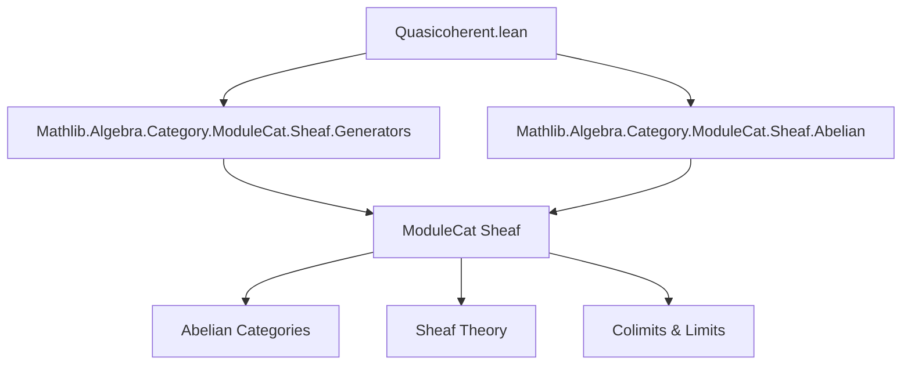
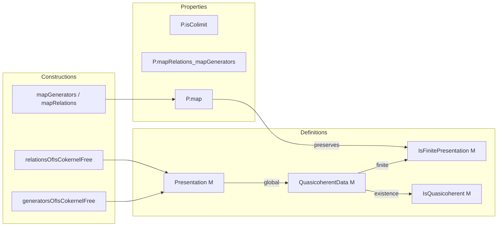
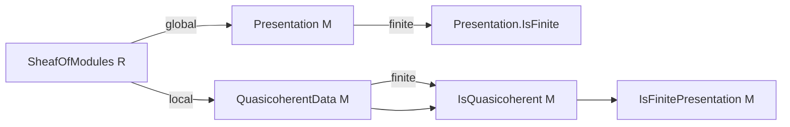

Here is the structured technical brief extracted from `Quasicoherent.lean`:

---

### **1. KEY DEFINITIONS & THEOREMS**

| Name | Type / Structure | Purpose |
|------|------------------|---------|
| `Presentation M` | `Structure` | Encodes a *global* presentation of a sheaf of modules `M`: a generating family of sections (`generators`) and a generating family of relations (`relations`) for the kernel of the evaluation map. |
| `Presentation.IsFinite p` | `Class` | States that both the index types of generators and relations are finite (i.e., `p.generators.IsFiniteType` and `Finite p.relations.I`). |
| `generatorsOfIsCokernelFree f g H H'` | `def` | Constructs generators of a presentation from a cokernel colimit diagram `free ι → free σ → M`. |
| `relationsOfIsCokernelFree f g H H'` | `def` | Constructs relations of a presentation from the same cokernel diagram, using the image factorization and properties of cokernels. |
| `presentationOfIsCokernelFree f g H H'` | `def` | Packages the above into a full `Presentation M`. |
| `Presentation.isColimit P` | `def` | Given a presentation `P`, constructs the colimit witness for the cokernel diagram associated to `P`. |
| `Presentation.mapRelations F η` | `def` | Maps relations along a colimit-preserving functor `F` with unit isomorphism `η : F(R) ≅ S`. |
| `Presentation.mapGenerators F η` | `def` | Maps generators along `F`. |
| `Presentation.mapRelations_mapGenerators` | `thm` | Proves that the mapped relations kill the mapped generators: `relations ∘ generators = 0`. |
| `Presentation.map F η` | `def` | Induces a presentation of `F(M)` from a presentation of `M`, using the above and colimit preservation. |
| `QuasicoherentData M` | `Structure` | Encodes a *local* presentation: a covering family `X : I → C`, a covering condition `J.CoversTop X`, and for each `i`, a presentation of `M.over (X i)`. |
| `QuasicoherentData.IsFinitePresentation q` | `Class` | Requires each local presentation `q.presentation i` to be finite (`IsFinite`). |
| `IsQuasicoherent M` | `Class` | `M` is quasi-coherent if it admits *some* `QuasicoherentData`. |
| `IsFinitePresentation M` | `Class` | `M` is of finite presentation if it admits a `QuasicoherentData` that is finite (`IsFinitePresentation`). |
| `quasicoherentDataOfIsFinitePresentation` | `def` *(deprecated)* | Deprecated choice of a finite presentation data; superseded by `IsFinitePresentation.exists_quasicoherentData`. |

---

### **2. NAMING CONVENTIONS**

- **Prefixes**:
  - `generatorsOf_`, `relationsOf_`: Extract data from a cokernel colimit diagram.
  - `map_`: Action of a functor on presentation data.
  - `localGeneratorsData`: Derived local data from a global/local presentation.
- **Suffixes**:
  - `_Data`: Structure holding local data (e.g., `QuasicoherentData`, `LocalGeneratorsData`).
  - `_Presentation`: Refers to finite presentation or presentation class/structure.
  - `IsFinite`, `IsQuasicoherent`: Property classes.
- **Morphisms**:
  - `π`: Canonical map from free module on generators to the sheaf.
  - `ι`: Kernel inclusion (standard notation in abelian categories).
  - `freeHomEquiv`: Equivalence between module maps and families of sections.

---

### **3. TACTIC STACK**

Frequently used tactics in proofs:
- `simp` / `simp only` / `simp_rw`: Simplification, especially with `freeHomEquiv`, `kernel.condition`, `comp_zero`.
- `rw`: Rewriting using isomorphisms, naturality, and universal properties.
- `infer_instance`: Automatic typeclass resolution for finiteness and presentation properties.
- `exact`, `refine`, `intro`: Basic proof construction.
- `cases`, `obtain`: For destructuring existential or product types.
- `rfl`, `congr'`: For definitional equalities.
- `epi_of_isColimit_cofork`, `isCokernelEpiComp`, `Abelian.epiIsCokernelOfKernel`: Category-theoretic lemmas from `Abelian` and `Limits`.

---

### **4. PROOF LOGIC**

- **Structure of proofs**:
  - Most constructions are *definition-first*, with proofs of properties (e.g., `f ≫ g = 0`) done via `simp` and universal properties.
  - When constructing presentations from colimits, the key step is verifying the colimit condition (`IsColimit`) using:
    - `isColimitOfPreserves` (for functoriality),
    - `equivOfNatIsoOfIso` (for equivalence of colimit cones),
    - `Cocones.ext` (to extend over coproducts).
  - Finiteness properties are mostly handled by typeclass inference (`infer_instance`, `dsimp; infer_instance`).
  - Local-to-global arguments use covering families and sheaf restriction (`M.over X i`).

- **Typical proof flow**:
  1. Construct candidate morphisms using universal properties (`freeHomEquiv`, `kernel.lift`, `cokernel.π`).
  2. Verify commutativity/zero-composition via `simp` and axioms.
  3. Show colimit property using preservation and isomorphisms.
  4. Use `presentationOfIsCokernelFree` to package into a presentation.
  5. For finite presentation, check finiteness via `infer_instance`.

---

### **5. IMPORTS**

- `Mathlib.Algebra.Category.ModuleCat.Sheaf.Generators`: Defines `GeneratingSections`, `LocalGeneratorsData`, `free`, `freeHomEquiv`.
- `Mathlib.Algebra.Category.ModuleCat.Sheaf.Abelian`: Provides abelian category structure on sheaves of modules, including kernels, cokernels, images, and properties like `Abelian.epiIsCokernelOfKernel`.

---

### **6. MERMAID DIAGRAMS**

#### **Dependency Graph (Module-Level)**

#### **Overview of Theory Flow**

#### **Sheaf Presentation Hierarchy**

---

Let me know if you'd like a formalized summary in Lean or a diagram for the functoriality of `Presentation.map`.
