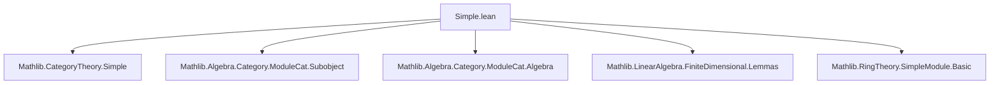
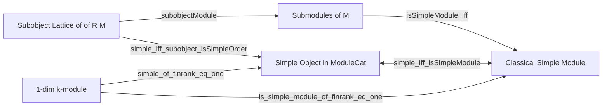

**Technical Brief: `Simple.lean` — Simple Objects in `ModuleCat R`**

---

### 1. **Key Definitions & Theorems**

| Name | Type | Purpose |
|------|------|---------|
| `simple_iff_isSimpleModule` | `Simple (of R M) ↔ IsSimpleModule R M` | Equivalence between a module being a simple object in `ModuleCat R` and being a simple module in the classical algebraic sense. |
| `simple_iff_isSimpleModule'` | `Simple M ↔ IsSimpleModule R M` (for `M : ModuleCat R`) | Variant of the above, stated for an arbitrary object `M` in `ModuleCat R`. |
| `simple_of_isSimpleModule` | `[IsSimpleModule R M] → Simple (of R M)` | Instance: classical simple module ⇒ simple object. |
| `isSimpleModule_of_simple` | `[Simple M] → IsSimpleModule R M` | Instance: simple object ⇒ classical simple module. |
| `simple_of_finrank_eq_one` | `{V : ModuleCat R} → finrank k V = 1 → Simple V` | If a `k`-algebra module is 1-dimensional over a field `k`, then it is simple. |

---

### 2. **Naming Conventions**

- **Prefixes**:
  - `simple_`: relates to `Simple` objects in category theory.
  - `isSimpleModule_`: relates to the algebraic notion of simple modules.
- **Suffixes**:
  - `_iff_`: bi-implication theorems.
  - `_of_`: constructing one notion from another (e.g., `simple_of_isSimpleModule`).
- **Notable patterns**:
  - `of R M`: embedding a module `M` into `ModuleCat R`.
  - `moduleOfAlgebraModule`, `isScalarTower_of_algebra_moduleCat`: helper instances for scalar tower reasoning.

---

### 3. **Tactic Stack**

- `rw`: used repeatedly to rewrite using equivalences and definitions.
- `mpr` / `mp`: used to apply `↔` eliminations (forward/backward).
- `simp` (implicit via `simp_rw`-like usage via `rw` + `simp` lemmas like `subobjectModule`).
- `isSimpleModule_iff` is used to reduce to submodule lattice conditions.
- `finrank`-based reasoning via `is_simple_module_of_finrank_eq_one`.

No heavy automation (e.g., `aesop`, `linarith`) is used—proofs are mostly definitional and rely on library lemmas.

---

### 4. **Proof Logic**

- **Core equivalence proof** (`simple_iff_isSimpleModule`):
  1. Unfold `simple` as `Simple` object: `simple_iff_subobject_isSimpleOrder`.
  2. Use `subobjectModule` to identify subobjects of `of R M` with submodules of `M`.
  3. Apply `isSimpleOrder_iff` to reduce to lattice-theoretic simplicity.
  4. Use `isSimpleModule_iff` to match the classical definition.

- **Instance proofs**:
  - Directly use `simple_iff_isSimpleModule`.mp/mpr to lift/lower between categorical and algebraic notions.

- **Dimension-based simplicity**:
  - Reduce to algebraic simplicity via `simple_iff_isSimpleModule'`.
  - Apply `is_simple_module_of_finrank_eq_one`, a known lemma for 1-dimensional modules over a field.

---

### 5. **Imports & Scope**

**Primary Dependencies**:
- `Mathlib.Algebra.Category.ModuleCat.Algebra`: scalar restriction & algebra-module interactions.
- `Mathlib.Algebra.Category.ModuleCat.Subobject`: subobject lattice of modules.
- `Mathlib.CategoryTheory.Simple`: definition of simple objects in a category.
- `Mathlib.LinearAlgebra.FiniteDimensional.Lemmas`: finite-dimensional lemmas (e.g., `is_simple_module_of_finrank_eq_one`).
- `Mathlib.RingTheory.SimpleModule.Basic`: classical simple module theory.

**Scope**:
- Focuses on the bridge between categorical simplicity and module-theoretic simplicity.
- Extends to modules over algebras, especially in finite-dimensional settings.

---

### 6. **Mermaid Diagrams**

#### Dependency Graph (Module-Level)

#### Conceptual Overview

---

### 7. **Summary**

This file formalizes the foundational equivalence between categorical simplicity (in `ModuleCat R`) and classical algebraic simplicity of modules. It provides bidirectional instances and a useful corollary for 1-dimensional modules over fields. The proofs are mostly definitional, leveraging existing library infrastructure for subobjects, module lattices, and finite-dimensional vector spaces.
