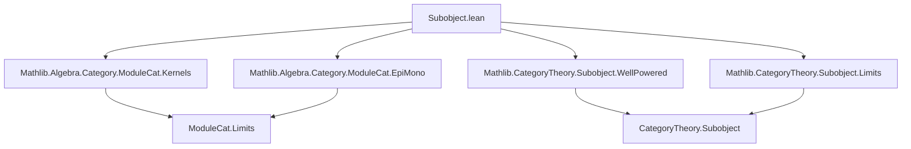
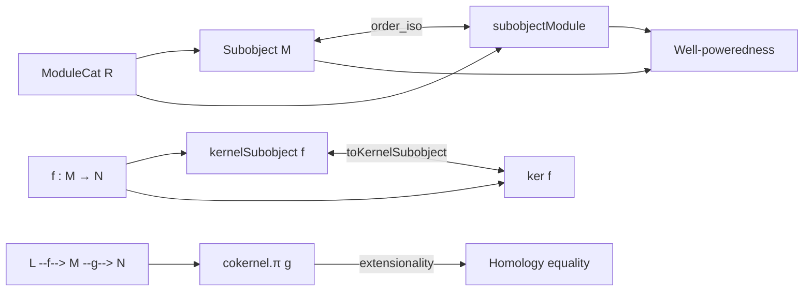

**Technical Brief: `Subobject.lean` — Subobjects in `ModuleCat`**

---

### 1. Key Definitions & Theorems

| Name | Type / Signature | Purpose |
|------|------------------|---------|
| `subobjectModule` | `Subobject M ≃o Submodule R M` | Constructs an **order isomorphism** between categorical subobjects of `M` and its submodules. |
| `wellPowered_moduleCat` | `WellPowered.{v} (ModuleCat.{v} R)` | Proves `ModuleCat` is **well-powered**, using `subobjectModule` to witness smallness of subobject lattices. |
| `toKernelSubobject` | `LinearMap.ker f.hom →ₗ[R] kernelSubobject f` | Bundles kernel elements into the categorical kernel subobject via the canonical iso `kernelSubobjectIso ≪≫ ModuleCat.kernelIsoKer`. |
| `toKernelSubobject_arrow` | `∀ x, (kernelSubobject f).arrow (toKernelSubobject x) = x.1` | Verifies that the inclusion of the kernel subobject agrees with the underlying linear map. |
| `cokernel_π_imageSubobject_ext` | `x = y + g (factorThruImageSubobject f l) → cokernel.π g x = cokernel.π g y` | Extensionality lemma for cokernel elements modulo image — used for homology equality. |

---

### 2. Naming Conventions

- **Prefixes**:
  - `subobject_`: for constructions involving categorical subobjects (`subobjectModule`, `kernelSubobject`, `imageSubobject`).
  - `to_`: for canonical maps *into* a subobject (`toKernelSubobject`).
  - `factorThru_`: for universal factorizations through limits/colimits (`factorThruImageSubobject`).
- **Suffixes**:
  - `_subobject`: denotes subobjects defined categorically (`kernelSubobject`, `imageSubobject`).
  - `_iso`: for isomorphisms between categorical and concrete constructions (`kernelSubobjectIso`, `ModuleCat.kernelIsoKer`).
- **`ofHom`, `ofMkLEMk`, `mk_le_mk_of_comm`**: standard `Subobject`-related constructors/lemmas.

---

### 3. Tactic Stack

Frequent tactics used in proofs:

- `simp` / `simp only` / `simp [*, -...]`: for simplifying hom-sets, subobject arrows, and linear maps.
- `ext`: extensionality for linear maps and submodules.
- `convert`: to reduce proof goals by congruence up to definitional equality.
- `rw [← hom_comp, hom_ofHom, ...]`: rewriting using definitions of `hom` and `ofHom`.
- `fapply`, `apply`, `exact`: standard proof construction.
- `have` + `rw`: intermediate lemmas (e.g., about `underlyingIso`).
- ` rfl`: for definitional equalities (e.g., on underlying functions).

No heavy automation (`aesop`, `linarith`, `ring`) — proofs are mostly structural and rely on module-theoretic identities.

---

### 4. Proof Logic

- **Main proof strategy** for `subobjectModule`:
  1. Define forward map: `N ↦ Subobject.mk (ofHom N.subtype)` (submodule → subobject).
  2. Define inverse: `S ↦ LinearMap.range S.arrow.hom` (subobject → submodule).
  3. Prove `right_inv`: show `range (ofHom N.subtype).arrow = N` using `range_subtype` and bijectivity of the inclusion.
  4. Prove `left_inv`: show `Subobject.mk (range S.arrow.hom) ≅ S` via `eq_mk_of_comm`, using `LinearEquiv.ofBijective` and kernel-range facts.
  5. Show order-preservation via `map_rel_iff'`, reducing to `range_comp_le_range`.

- **`toKernelSubobject` proof**: immediate from definition + `simp` (post-8959 fix).
- **`cokernel_π_imageSubobject_ext`**: substitution + `simp` using `factorThruImageSubobject` and cokernel universal property.

Induction is *not* used — proofs are mostly algebraic and rely on universal properties and module-theoretic lemmas.

---

### 5. Imports (Primary Dependencies)

| Module | Role |
|--------|------|
| `Mathlib.Algebra.Category.ModuleCat.EpiMono` | Epis/monos in `ModuleCat`. |
| `Mathlib.Algebra.Category.ModuleCat.Kernels` | Kernels, image factorization, `kernelSubobject`, `imageSubobject`. |
| `Mathlib.CategoryTheory.Subobject.WellPowered` | General theory of well-powered categories. |
| `Mathlib.CategoryTheory.Subobject.Limits` | Subobjects and limits (e.g., `Subobject.mk`, `hom`, `arrow`). |

Also uses:
- `CategoryTheory.Subobject` (core)
- `CategoryTheory.Limits` (for `HasImage`, `HasCokernel`, etc.)
- `ModuleCat` (module category infrastructure)

---

### 6. Mermaid Diagrams

#### Dependency Graph (Top-Level)

#### Overview of `Subobject.lean`

---

### 7. Theory Context

This file sits at the intersection of:
- **Category theory** (subobjects, limits, well-poweredness),
- **Homological algebra** (kernels, cokernels, homology),
- **Module theory** (submodules, images, kernels).

It bridges categorical constructions (`Subobject`, `kernelSubobject`) with concrete module-theoretic objects (`Submodule`, `LinearMap.ker`), enabling transfer of categorical results (e.g., existence of limits, well-poweredness) to concrete algebraic settings.

The `subobjectModule` isomorphism is foundational for:
- Defining subobject lattices in `ModuleCat`,
- Constructing quotient modules and homology,
- Proving that `ModuleCat` is an abelian category (后续 steps).

--- 

Let me know if you'd like a formalized summary in Lean syntax or a proof sketch for `subobjectModule`.
